## Democratização

> **Esta aula foi construída para mostrar que o R vai muito além da
> análise estatística. Ele se conecta, ele escala, ele vai para
> produção.**

{fig-align="center" width="515"}

------------------------------------------------------------------------

## Acompanhe o Café com R

[{fig-align="center"
style="border: 3px solid #6B4F4F; border-radius: 12px; padding: 6px;"
width="422"}](https://jenniferlopes.quarto.pub/portifolio/)

## EM BREVE - NO YOUTUBE

{fig-align="center" width="568"}

**Inscreva-se já no
[Link](https://www.youtube.com/@jennifercafecomr/featured).**

## O que você vai aprender

**Módulo 1 - Fundamentos**

-   O que é **`Git`** e o que é **`GitHub`**
-   Diferenças e complementaridade entre as duas ferramentas
-   Benefícios do controle de versão em projetos analíticos

------------------------------------------------------------------------

## O que você vai aprender

**Módulo 2 - Instalação e Configuração**

-   Instalação do **`Git`**
-   Registro de conta no **`GitHub`**
-   Configuração do **Git** e do **Personal Access Token no RStudio**

------------------------------------------------------------------------

## O que você vai aprender

**Módulo 3 - Compartilhando e Versionando Projetos**

-   **Método 1:** Criar repositório no GitHub e clonar no RStudio
-   **Método 2:** Clonar repositório existente no RStudio
-   **Método 3:** Criar repositório novo direto do RStudio

------------------------------------------------------------------------

## O que você vai aprender

**Módulo 4 - Fluxo de Trabalho com Git no RStudio**

-   **Conceitos essenciais**: commit, push, pull, stage, branch
-   **Painel Git** e primeiro **commit** passo a passo
-   Boas práticas e erros comuns

------------------------------------------------------------------------

::: {style="text-align: center; padding-top: 180px;"}
# Módulo 1
:::

------------------------------------------------------------------------

## Contexto de uso - Versionamento de Código

-   O versionamento com **Git e GitHub** deixou de ser uma prática
    exclusiva de desenvolvedores de software e tornou-se uma competência
    essencial em ambientes corporativos, acadêmicos e de uso p

1.  **Em equipes de trabalho**, a capacidade de rastrear quem alterou o
    quê, quando e por qual motivo transforma projetos analíticos em
    ativos auditáveis e colaborativos, eliminando o caos de arquivos
    duplicados, versões conflitantes enviadas por e-mail e retrabalho
    causado por alterações não documentadas.

## Contexto de uso - Versionamento de Código

2.  **Na academia**, o versionamento é um pilar da ciência reprodutível:
    ao publicar o repositório junto ao artigo ou relatório, o
    pesquisador permite que qualquer pessoa verifique, reproduza e
    expanda a análise com precisão, o que aumenta a credibilidade do
    trabalho e facilita a colaboração entre grupos de pesquisa
    geograficamente distribuídos.

## Contexto de uso - Versionamento de Código

3.  **No uso pessoal,** o Git funciona como uma memória técnica
    estruturada do próprio desenvolvimento profissional. Cada projeto
    versionado no GitHub é um registro público do raciocínio analítico,
    das decisões de código e da evolução das habilidades ao longo do
    tempo, funcionando simultaneamente como portfólio técnico e como
    proteção contra perda de trabalho.

## Contexto de uso - Versionamento de Código

> Para quem está construindo carreira em ciência de dados, estatística
> ou áreas correlatas, manter projetos bem organizados e versionados no
> GitHub é hoje um diferencial concreto em processos seletivos, pois
> permite que recrutadores e gestores avaliem não apenas o resultado
> final, mas a qualidade do processo que o gerou.

## Git

-   Git é um sistema de controle de versão desenvolvido originalmente
    para permitir que equipes de desenvolvimento trabalhassem de forma
    colaborativa em grandes projetos de software.

-   Sua principal função é gerenciar a evolução de um conjunto de
    arquivos - chamado de **repositório** - de forma organizada e
    segura.

{fig-align="center"}

------------------------------------------------------------------------

## Git

-   Para fins didáticos, o Git pode ser comparado ao recurso de
    "controlar alterações" de editores como o Microsoft Word, porém com
    funcionalidades significativamente mais avançadas.

-   Na ciência de dados, o Git gerencia não apenas código-fonte, mas
    também bases de dados, documentos, relatórios e scripts - com
    rastreabilidade completa de cada mudança.

-   Os verdadeiros ganhos surgem na **colaboração em equipe**: o Git
    reduz a complexidade da comunicação entre membros, tornando o
    processo mais fluido e integrado ao cotidiano de análise.

------------------------------------------------------------------------

## GitHub

-   Plataformas como **GitHub**, **GitLab** e **Bitbucket** atuam como
    serviços de hospedagem para projetos baseados em Git.

-   Elas permitem armazenar repositórios remotamente, compartilhar
    projetos e colaborar em tempo real - como uma "nuvem inteligente"
    para projetos versionados.

{fig-align="center"}

------------------------------------------------------------------------

## GitHub

-   Esses serviços oferecem interfaces amigáveis, facilitando o uso do
    Git mesmo para usuários menos experientes.

-   Diferentes membros da equipe podem sincronizar alterações e propor
    melhorias com segurança e rastreabilidade.

-   Mesmo em projetos individuais, a hospedagem remota é recomendada: em
    caso de conflito ou erro local, a cópia remota permite restaurar
    versões estáveis rapidamente.

------------------------------------------------------------------------

## GitHub

-   O foco deste material será o uso do **GitHub**, por ser a plataforma
    mais popular e amplamente suportada. Os conceitos apresentados
    também se aplicam ao GitLab, Bitbucket e soluções similares.

-   A distinção entre repositórios **públicos** e **privados** pode ser
    ajustada conforme a necessidade. O GitHub permite a criação de
    repositórios privados gratuitamente.

------------------------------------------------------------------------

## Benefícios do uso do Git e GitHub

O uso combinado proporciona **acesso facilitado ao código e maior
colaboração**. Projetos no GitHub podem ser explorados publicamente,
clonados ou baixados - qualquer pessoa pode visualizar os arquivos
diretamente pela interface web, sem conhecimento prévio em Git.

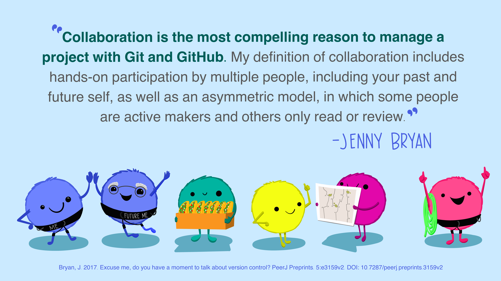{fig-align="center" width="65%"}

------------------------------------------------------------------------

## Benefícios do uso do Git e GitHub

Usuários mais experientes podem acompanhar o desenvolvimento de
projetos, propor melhorias por meio de *forks* e *pull requests*, e
participar ativamente da evolução de pacotes e análises.

::: callout-note
> **"A colaboração é a razão mais convincente para gerenciar um projeto
> com Git e GitHub.** Minha definição de colaboração inclui a
> participação prática de várias pessoas, incluindo o seu 'eu' do
> passado e do futuro."
>
> **Jenny Bryan**
:::

------------------------------------------------------------------------

::: {style="text-align: center; padding-top: 180px;"}
# Módulo 2

## Instalação e Configuração
:::

------------------------------------------------------------------------

## 1. Instalação ou atualização do R e RStudio

**Mantenha seus softwares atualizados.**

-   Utilizar versões desatualizadas pode gerar dificuldades evitáveis,
    especialmente na integração entre R, RStudio, Git e GitHub.

-   Caso os softwares ainda não tenham sido instalados, siga os
    procedimentos descritos no Módulo de Instalação do R e do RStudio.

------------------------------------------------------------------------

## 2. Registro de uma conta no GitHub

-   O processo é simples e gratuito. Acesse <https://github.com> e
    clique em **Sign up**.

-   O GitHub solicitará nome de usuário, e-mail e senha. Após o
    registro, é possível criar repositórios públicos e privados
    imediatamente.

------------------------------------------------------------------------

## 2. Registro - Boas práticas para o nome de usuário

**Recomendado:**

-   Incorporar o nome real quando possível
-   Reutilizar nomes já usados em outras plataformas
-   Usar letras minúsculas e hífen para separar palavras
-   Escolher um nome curto, único e atemporal

------------------------------------------------------------------------

## 2. Registro - Boas práticas para o nome de usuário

**O que evitar:**

-   Nomes genéricos ou reservados como `admin`, `user`, `null`, `na`
-   Letras maiúsculas para separar palavras
-   Referências temporárias a universidades, empresas ou localizações

> **O nome de usuário é sua identidade pública no GitHub.** Uma vez
> escolhido, alterá-lo pode gerar inconsistências em links e
> referências.

------------------------------------------------------------------------

## 3. Instalação do Git

1.  Você precisa do Git instalado para que o RStudio possa utilizá-lo.
    Caso já esteja instalado, considere atualizar para uma versão
    recente.

2.  Acesse <https://git-scm.com/downloads>, escolha o sistema
    operacional e realize o download.

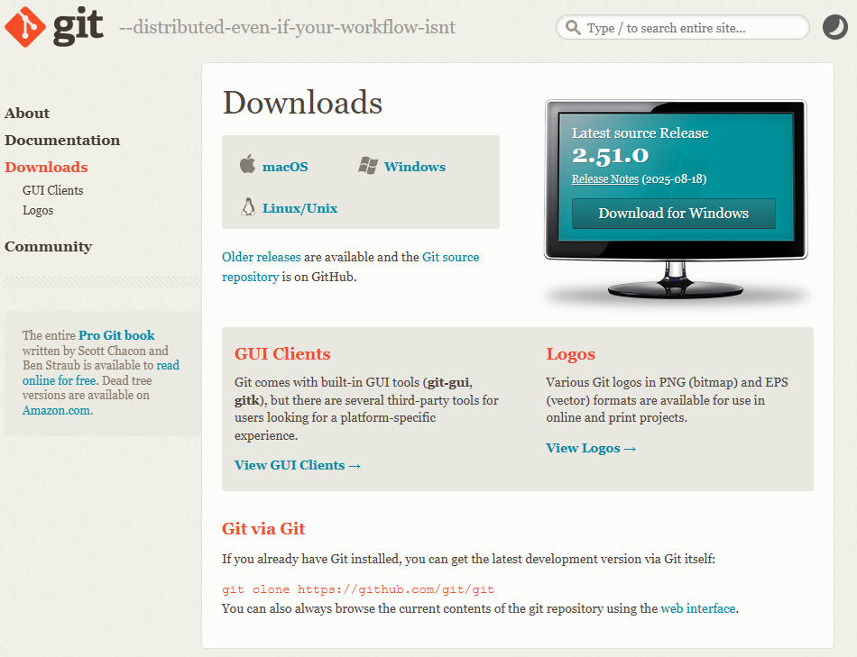{fig-align="center" width="65%"}

------------------------------------------------------------------------

## 3. Instalação do Git - Por sistema operacional

**Windows:** execute o instalador baixado com as opções padrão.

**macOS:**

``` bash
xcode-select --install
```

**Linux (Ubuntu/Debian):**

``` bash
sudo apt-get update && sudo apt-get install git
```

------------------------------------------------------------------------

## 4. Configuração do Git no RStudio

A configuração precisa ser feita **uma única vez por computador**. Use o
pacote `{usethis}` para definir as informações globais:

``` r
# Instale o pacote se necessário
# install.packages("usethis")
# library(usethis)
```

``` r
# usethis::use_git_config(
#   user.name  = "seu_nome_de_usuario",
#   user.email = "seu_email@exemplo.com")
```

::: callout-caution
**O e-mail deve ser obrigatoriamente o mesmo cadastrado na conta
GitHub.**
:::

------------------------------------------------------------------------

## 5. Configuração do GitHub no RStudio - PAT

1.  Para que os comandos do R acessem sua conta no GitHub, é necessário
    criar um **Personal Access Token (PAT)**.

2.  **Após logar no GitHub, acesse:**

3.  **Settings \> Developer settings \> Personal access tokens \> Tokens
    (classic) \> Generate new token**

4.  Descreva o uso do token, selecione os escopos necessários, gere e
    copie a sequência de caracteres gerada.

------------------------------------------------------------------------

## 5. PAT - Passo 1

Acesse o menu da sua foto na lateral direita e selecione **Settings**.

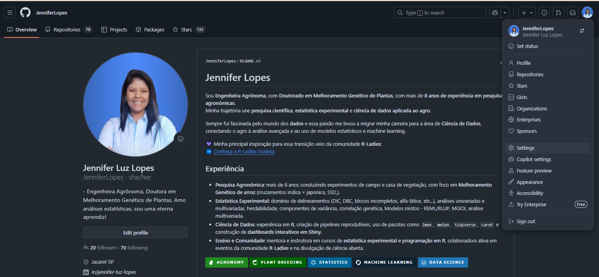{fig-align="center" width="65%"}

------------------------------------------------------------------------

## 5. PAT - Passo 2

No menu lateral esquerdo, ao final, selecione **Developer settings**.

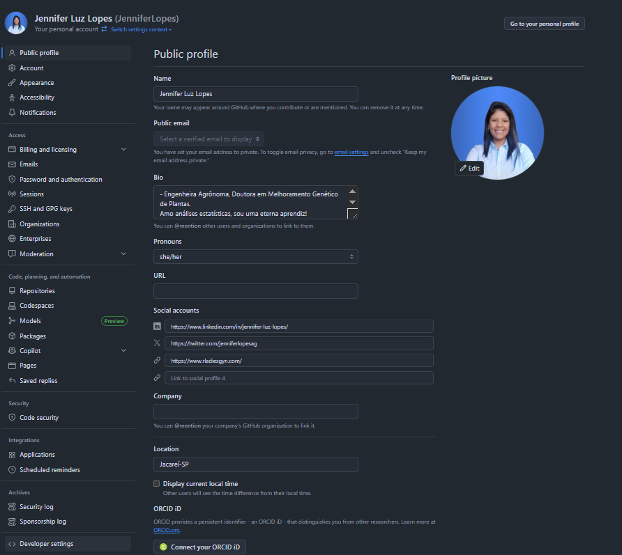{fig-align="center" width="65%"}

------------------------------------------------------------------------

## 5. PAT - Passos 3 e 4

Selecione **Personal access tokens \> Tokens (classic)** e, no menu
superior direito, **Generate new token (classic)**.

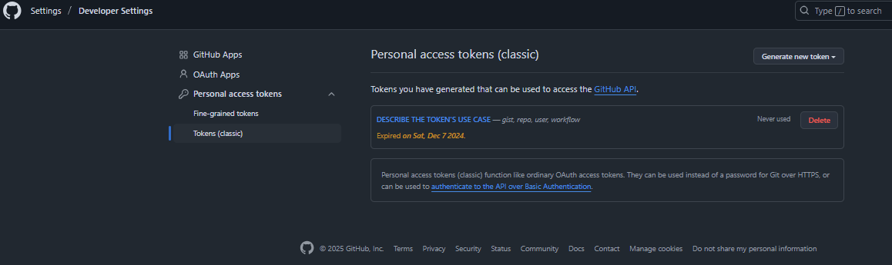{fig-align="center"}

## 5. PAT - Passos 3 e 4

Selecione **Personal access tokens \> Tokens (classic)** e, no menu
superior direito, **Generate new token (classic)**.

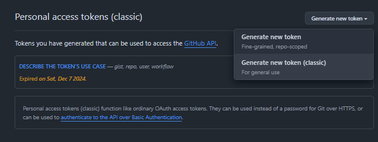{fig-align="center" width="675"}

------------------------------------------------------------------------

## 5. PAT - Passo 5

Personalize com o nome do token e marque as opções necessárias (mínimo:
`repo` e `workflow`).

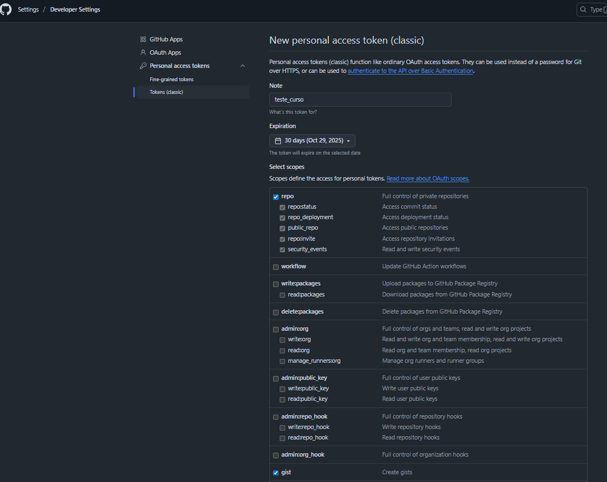{fig-align="center"}

------------------------------------------------------------------------

## 5. PAT - Passo 6 e 7

Clique em **Generate token**. O token será exibido **apenas uma vez** -
copie-o imediatamente.

{fig-align="center"}

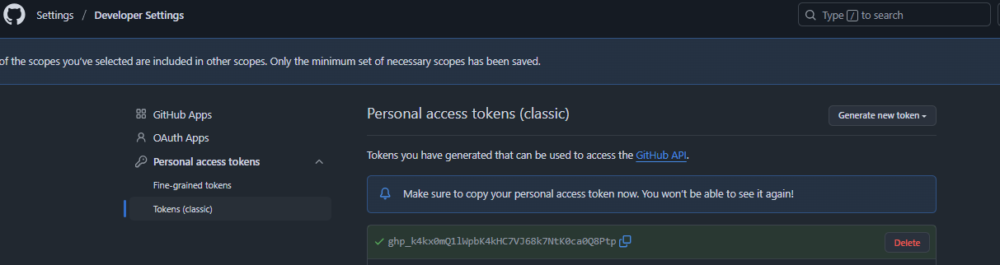{fig-align="center"}

------------------------------------------------------------------------

## 5. PAT - Passo 8

Com o token copiado, retorne ao RStudio para registrá-lo.

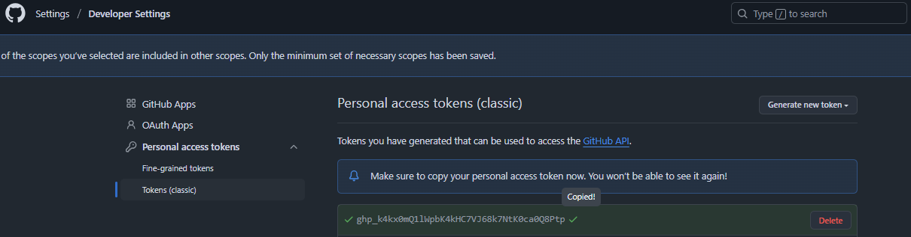{fig-align="center"}

------------------------------------------------------------------------

## 5. PAT - Registrando no RStudio

**Opção automática** - gera e abre a página do GitHub diretamente:

``` r
# usethis::create_github_token()
```

**Registrando manualmente** - abre o arquivo `.Renviron`:

``` r
# usethis::edit_r_environ()
```

> `.Renviron`: arquivo que guarda **informações sensíveis** como tokens,
> senhas e chaves de API - fora do código versionado.

------------------------------------------------------------------------

## 5. PAT - Passo 9

No arquivo `.Renviron` que se abrir, adicione a linha abaixo, pule uma
linha e salve.

```         
GITHUB_PAT=COLE_SEU_TOKEN_AQUI
```

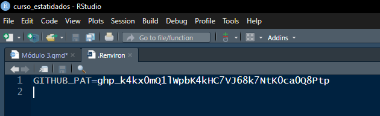{fig-align="center"}

------------------------------------------------------------------------

## 5. PAT - Passo 10

Salve o arquivo e reinicie o RStudio com **CTRL + SHIFT + F10**.

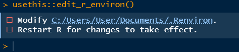{fig-align="center"}

Após esse passo, nenhuma outra configuração de autenticação será
necessária neste computador.

------------------------------------------------------------------------

##  {background-color="#E5D3B3"}

::: {style="text-align: center; padding-top: 180px;"}
# Módulo 3

## Compartilhando e Versionando Projetos
:::

------------------------------------------------------------------------

## Três métodos de integração

Existem três formas de conectar RStudio e GitHub:

**Método 1** - Criar um repositório no GitHub e clonar no RStudio

**Método 2** - Clonar um repositório existente do GitHub no RStudio

**Método 3** - Criar um repositório novo diretamente do RStudio

------------------------------------------------------------------------

## Método 1 - Criando o repositório no GitHub

Antes de clonar um repositório no RStudio, é necessário que ele exista
no GitHub.

**Passo 1:** Acesse <https://github.com> e faça login.

**Passo 2:** Clique no botão **"+"** no canto superior direito e
selecione **"New repository"**.

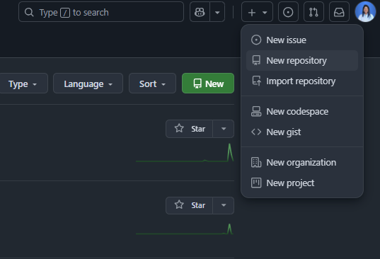{fig-align="center"}

------------------------------------------------------------------------

## Método 1 - Configurando o repositório

| Campo               | Descrição                                |
|---------------------|------------------------------------------|
| **Repository name** | Nome curto e claro (ex: `meu_projeto`)   |
| **Description**     | Breve descrição do propósito do projeto  |
| **Visibility**      | Public (qualquer um pode ver) ou Private |

------------------------------------------------------------------------

## Método 1 - Configurando o repositório

| Campo                 | Descrição                                 |
|-----------------------|-------------------------------------------|
| **Add a README file** | Marque para iniciar com um arquivo base   |
| **.gitignore**        | Pode ser deixado desmarcado neste momento |
| **Choose a license**  | Pode ser adicionado posteriormente        |

------------------------------------------------------------------------

## Método 1 - Criando o repositório

Preencha os campos e clique em **"Create repository"**.

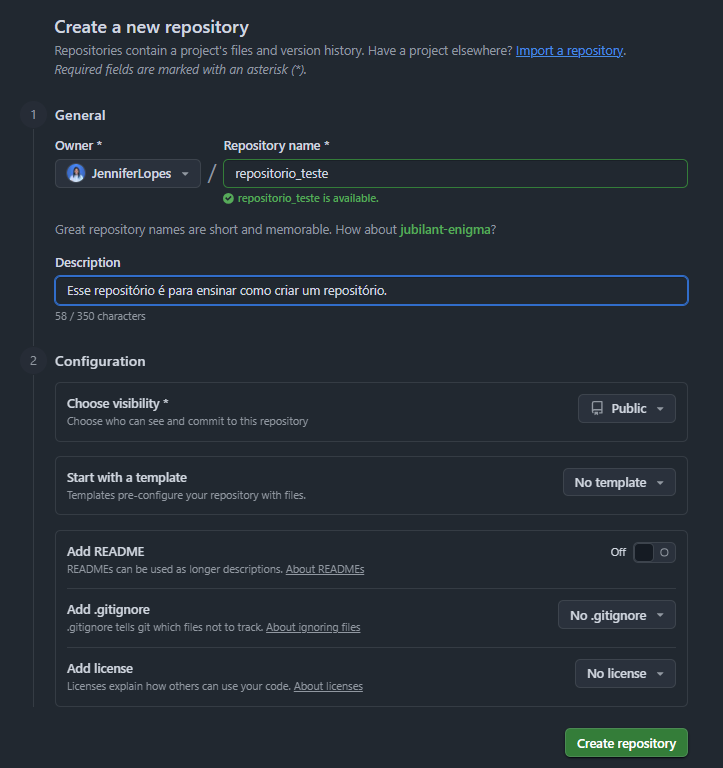{fig-align="center" width="70%"}

------------------------------------------------------------------------

## Método 1 - Repositório criado

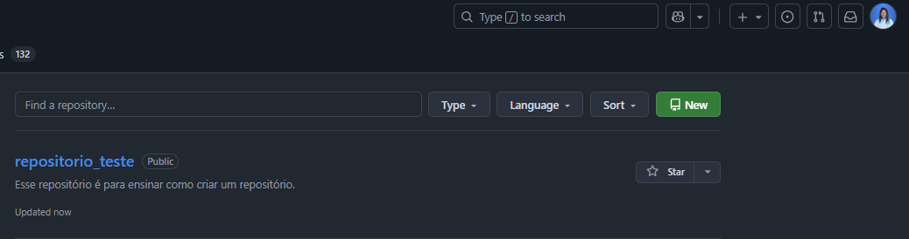{fig-align="center"}

------------------------------------------------------------------------

## Método 1 - Repositório aberto

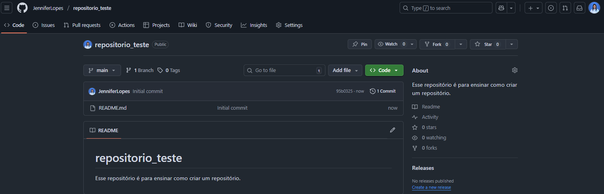{fig-align="center"}

------------------------------------------------------------------------

## Método 2 - Clonando um repositório existente

Este método é utilizado quando o repositório já existe no GitHub e você
deseja trabalhar com ele localmente no RStudio.

**Passo 1:** Acesse o repositório no GitHub.

**Passo 2:** Clique em **"\<\> Code"** e copie o link **HTTPS**.

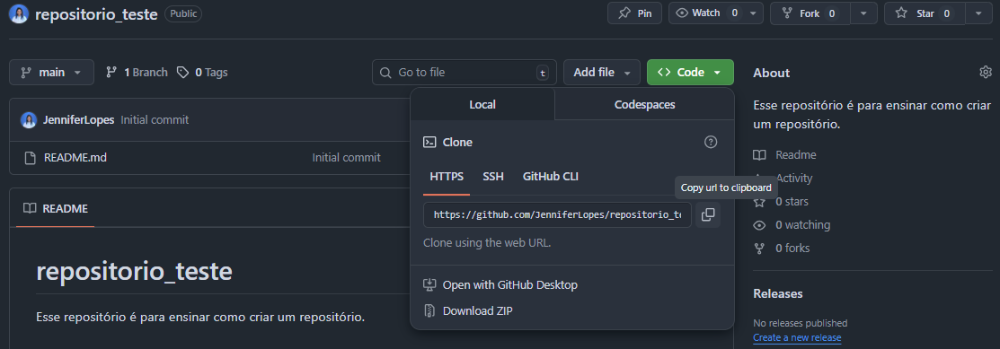{fig-align="center"}

------------------------------------------------------------------------

## Método 2 - Configurando o projeto no RStudio

No RStudio: **File \> New Project \> Version Control**

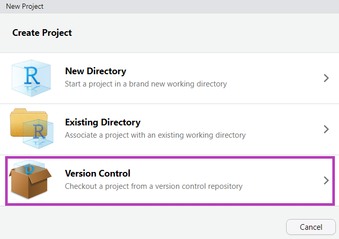{fig-align="center"}

------------------------------------------------------------------------

## Método 2 - Selecionando Git

Na aba "Create Project from Version Control", selecione **Git**.

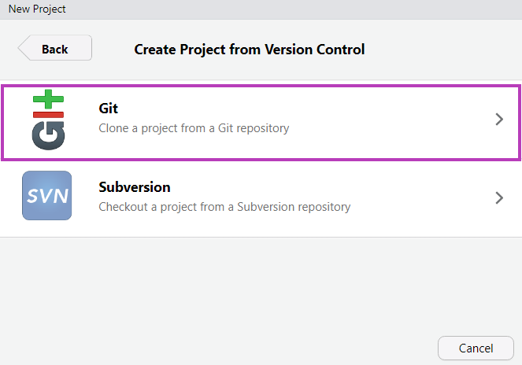{fig-align="center"}

------------------------------------------------------------------------

## Método 2 - Preenchendo os dados

Na aba "Clone Git Repository":

-   **Repository URL:** cole o link copiado do GitHub
-   **Project directory name:** preenchido automaticamente
-   **Create project as subdirectory of:** escolha o diretório local

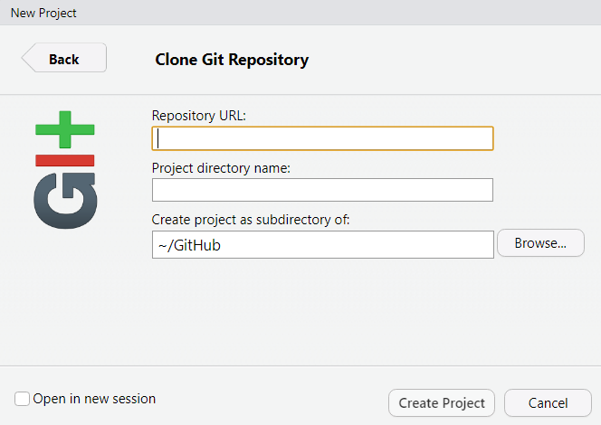{fig-align="center"}

O RStudio clona o repositório e cria um `.Rproj` automaticamente.

------------------------------------------------------------------------

## Método 3 - Criando direto do RStudio

Ideal para iniciar um novo projeto em R com controle de versão desde o
início e publicá-lo no GitHub.

No RStudio: **File \> New Project \> New Directory \> New Project**

Nomeie o projeto, escolha o local e marque **"Create a git
repository"**.

{fig-align="center"}

------------------------------------------------------------------------

## Método 3 - Ativando o Git

Com o projeto aberto, ative o Git com o pacote `{usethis}`:

``` r
# usethis::use_git()
```

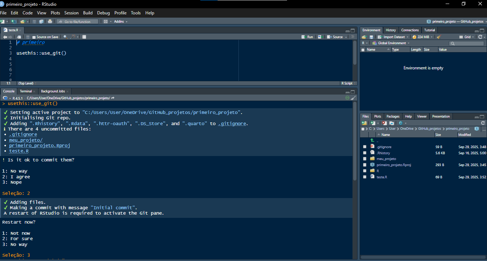{fig-align="center"}

------------------------------------------------------------------------

## Método 3 - Publicando no GitHub

Em seguida, publique o projeto diretamente no GitHub:

``` r
# usethis::use_github()
```

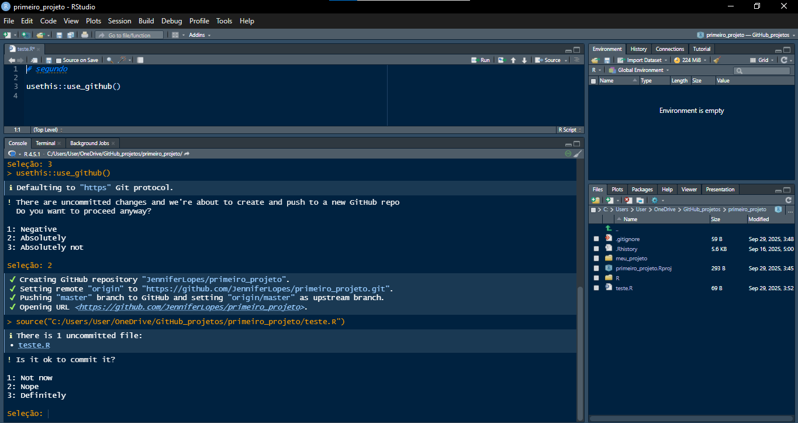{fig-align="center"}

------------------------------------------------------------------------

## Método 3 - Repositório criado no GitHub

O repositório é criado automaticamente e fica disponível no GitHub.

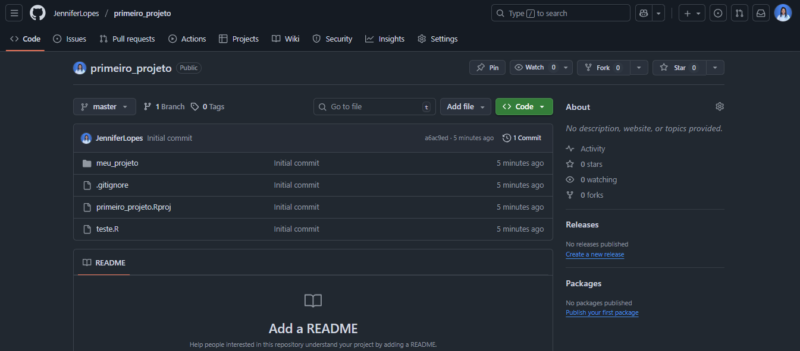{fig-align="center"}

------------------------------------------------------------------------

##  {background-color="#E5D3B3"}

::: {style="text-align: center; padding-top: 180px;"}
# Módulo 4

## Fluxo de Trabalho com Git no RStudio
:::

------------------------------------------------------------------------

## Versionamento de código no RStudio

-   O RStudio oferece uma interface gráfica integrada ao Git que
    facilita o versionamento de arquivos **sem o uso do terminal**.

-   Essa funcionalidade pode ser ativada em projetos existentes por meio
    do caminho:

> **Tools \> Project Options \> Git/SVN**

------------------------------------------------------------------------

## Configurações do painel Git/SVN

**Enable version control interface for RStudio projects**

-   Quando marcado, ativa a aba **Git** dentro do RStudio sempre que
    você abrir um projeto versionado. É por essa aba que você vai
    executar commit, push, pull, visualizar diferenças e gerenciar
    arquivos.

**Sign git commits**

-   Permite assinar commits com uma chave GPG - recurso avançado, usado
    em ambientes de segurança. Para uso padrão, pode ser deixado
    desmarcado.

------------------------------------------------------------------------

## Configurações do painel Git/SVN

**Git executable**

-   Indica o caminho do executável do Git no computador (ex:
    `C:/Program Files/Git/bin/git.exe`). Se estiver vazio, clique em
    **Browse** e localize manualmente.

**SSH key**

-   Mostra se existe uma chave SSH configurada - alternativa ao uso de
    token via `.Renviron` para autenticar com o GitHub.

------------------------------------------------------------------------

## O Painel Git no RStudio

Após ativar o Git, o painel aparece no canto superior direito do
RStudio.

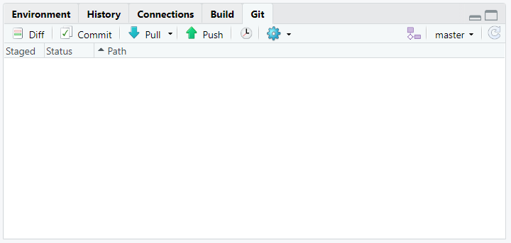{fig-align="center"}

------------------------------------------------------------------------

## Elementos do Painel Git - Parte 1

| Elemento | Função |
|----|----|
| **Staged** | Checkbox para selecionar arquivos para o commit |
| **Status** | M (modificado), A (adicionado), D (deletado), ? (não rastreado) |
| **Diff** | Visualiza as alterações linha por linha |

------------------------------------------------------------------------

## Elementos do Painel Git - Parte 2

| Elemento   | Função                                |
|------------|---------------------------------------|
| **Commit** | Abre a janela para registrar o commit |
| **Pull**   | Baixa commits do repositório remoto   |
| **Push**   | Envia commits para o GitHub           |

------------------------------------------------------------------------

## Elementos do Painel Git - Parte 3

| Elemento    | Função                                    |
|-------------|-------------------------------------------|
| **History** | Exibe o histórico visual de commits       |
| **Branch**  | Lista e permite criar branches            |
| **More**    | Opções avançadas e acesso ao terminal Git |

------------------------------------------------------------------------

## Conceitos importantes - Commit

Um **commit** é como tirar uma fotografia do estado atual do projeto.
Ele registra uma versão dos arquivos naquele momento, com uma mensagem
descritiva que explica o que foi feito.

-   Cada commit tem um identificador único
-   É possível voltar a qualquer versão anterior com base nos commits
-   Um commit é **local** - ainda não está no GitHub

------------------------------------------------------------------------

## Conceitos importantes - Push

O **push** envia os commits locais para o repositório remoto no GitHub.

-   É como sincronizar o projeto local com o servidor
-   Outros colaboradores só terão acesso ao seu trabalho após o push
-   Necessário ter o repositório remoto configurado corretamente

> Commit salva localmente. Push envia ao GitHub.

------------------------------------------------------------------------

## Conceitos importantes - Pull

O **pull** baixa as alterações do repositório remoto para a máquina
local.

-   Deve ser executado **antes de começar a trabalhar**, garantindo que
    você está na versão mais atualizada
-   Evita conflitos e sobreposição de alterações feitas por outras
    pessoas

> Pense no pull como: *quero as atualizações do meu time antes de
> começar a editar.*

------------------------------------------------------------------------

## Conceitos importantes - Stage

Antes de fazer um commit, os arquivos precisam ser adicionados à
**staging area** (área de preparação).

-   Permite selecionar **quais arquivos** farão parte do próximo commit
-   Você pode preparar apenas parte das alterações antes de salvar
    definitivamente
-   No RStudio, isso é feito marcando o checkbox ao lado do arquivo na
    aba **Git**

------------------------------------------------------------------------

## Conceitos importantes - Repositório

Um **repositório** é o local onde o histórico completo do projeto é
armazenado, incluindo todos os commits, arquivos e ramificações.

-   Pode ser **local** (na sua máquina) ou **remoto** (no GitHub)
-   Contém toda a evolução do projeto, permitindo rastrear e comparar
    versões ao longo do tempo

------------------------------------------------------------------------

## Conceitos importantes - Branch

Uma **branch** (ramificação) permite trabalhar em uma nova
funcionalidade ou correção **sem afetar o código principal**.

-   A branch principal normalmente se chama `main` ou `master`
-   Outras branches podem ser criadas para testar ideias ou desenvolver
    recursos
-   Após o trabalho concluído, as alterações podem ser integradas à
    `main` por meio de um *merge*

------------------------------------------------------------------------

## Folha de dicas - Interface Git no RStudio

{fig-align="center"}

------------------------------------------------------------------------

## Primeiro commit - Passo 1

-   Após criar o projeto com Git ativo, vá até a aba **Git** no RStudio.
    Você verá os arquivos com o símbolo `?` (untracked), indicando que
    ainda não estão versionados.

-   Marque o checkbox ao lado dos arquivos que deseja incluir - isso é
    chamado de **adicionar ao stage**.

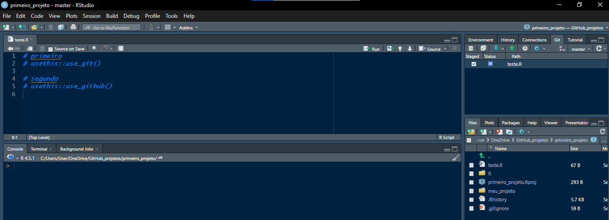{fig-align="center"}

------------------------------------------------------------------------

## Primeiro commit - Passo 2

Clique em **Diff** para comparar o conteúdo atual dos arquivos com o que
está salvo. Linhas em verde foram adicionadas; linhas em vermelho foram
removidas.

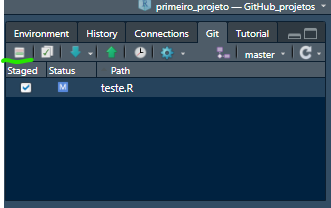{fig-align="center"}

------------------------------------------------------------------------

## Primeiro commit - Passo 3

Clique em **Commit**. Uma nova janela será aberta. No campo de mensagem,
insira um texto descritivo sobre o que foi feito.

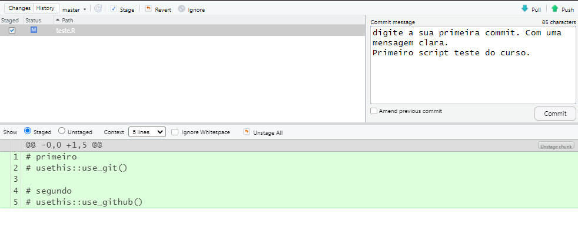{fig-align="center"}

------------------------------------------------------------------------

## Primeiro commit - Passo 4

Clique em **Commit** para confirmar. Uma janela de log será exibida
indicando que o commit foi realizado com sucesso.

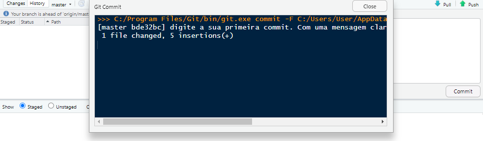{fig-align="center"}

------------------------------------------------------------------------

## Primeiro commit - Passo 5

Clique em **Push** (seta para cima) para enviar as alterações ao
repositório no GitHub.

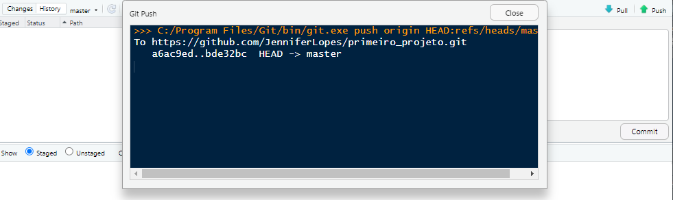{fig-align="center"}

------------------------------------------------------------------------

## Primeiro commit - Passo 6

Abra o repositório no GitHub e confira as alterações. O arquivo enviado
aparecerá com a mensagem de commit registrada.

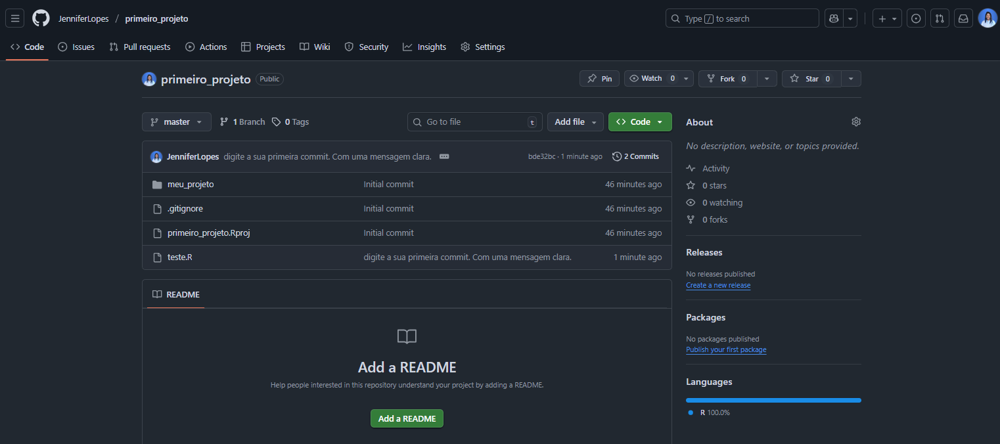{fig-align="center"}

------------------------------------------------------------------------

## Boas práticas - Mensagens de commit

**Mensagens corretas:**

```         
Adiciona função de limpeza de dados ausentes
Corrige bug no cálculo de média ponderada
Refatora script de visualização por região
```

**Mensagens incorretas:**

```         
Update
Correções
asdf
Mudanças
```

------------------------------------------------------------------------

## Boas práticas - Estrutura recomendada

```         
tipo: descrição curta (até 50 caracteres)

Descrição detalhada do que foi feito e por que.
Pode conter múltiplas linhas quando necessário.
```

**Tipos comuns:** `feat` (nova funcionalidade), `fix` (correção), `docs`
(documentação), `refactor` (refatoração), `test` (testes)

------------------------------------------------------------------------

## Boas práticas - Arquivo .gitignore

O `.gitignore` define quais arquivos o Git deve ignorar. O RStudio cria
automaticamente com padrões R:

```         
.Rproj.user
.Rhistory
.RData
.Ruserdata
```

------------------------------------------------------------------------

## Boas práticas - Customizando o .gitignore

Adicione conforme a necessidade do projeto:

```         
# Dados sensíveis
dados_privados/
.Renviron

# Arquivos grandes
*.zip
*.rds

# Outputs gerados automaticamente
outputs/
figures/
```

------------------------------------------------------------------------

## Segurança - O que nunca versionar

Nunca inclua no repositório:

-   Senhas e tokens de API
-   Arquivos `.Renviron` com credenciais
-   Dados pessoais ou sensíveis
-   Chaves privadas (`.pem`, `.key`)

------------------------------------------------------------------------

## Segurança - Variáveis de ambiente

``` r
# ERRADO: credencial exposta no código
api_key <- "abc123xyz456"

# CORRETO: credencial em variável de ambiente
api_key <- Sys.getenv("API_KEY")
```

Armazene no `.Renviron` (nunca versionado):

```         
API_KEY=abc123xyz456
GITHUB_PAT=ghp_seu_token_aqui
```

------------------------------------------------------------------------

## Erros comuns - Parte 1

| Erro | Causa | Solução |
|----|----|----|
| `Permission denied` | PAT não configurado | `usethis::edit_r_environ()` |
| `Updates were rejected` | Repositório remoto à frente do local | `git pull` antes do push |
| `Nothing to commit` | Arquivos não adicionados ao staging | Marcar checkbox na aba Git |

------------------------------------------------------------------------

## Erros comuns - Parte 2

| Erro | Causa | Solução |
|----|----|----|
| `Detached HEAD` | Checkout em commit específico | Voltar para `main` no dropdown |
| `Merge conflict` | Duas alterações na mesma linha | Resolver manualmente no editor |
| `Repository not found` | URL incorreta ou sem acesso | Verificar URL e permissões |

------------------------------------------------------------------------

## Fluxo de trabalho diário recomendado

**Antes de começar:**

-   Abra o projeto no RStudio (`File > Open Project`)
-   Execute **Pull** para baixar atualizações do GitHub

**Durante o trabalho:**

-   Edite e salve os arquivos normalmente
-   Realize commits com frequência e em unidades lógicas

## Fluxo de trabalho diário recomendado

**Ao encerrar:**

-   Revise as alterações no painel Git
-   Escreva mensagem descritiva, execute commit e push

------------------------------------------------------------------------

## Referências técnicas

-   **Happy Git and GitHub for the useR:** <https://happygitwithr.com> -
    referência essencial para usuários R
-   **Pro Git Book:** <https://git-scm.com/book> - documentação completa
    e gratuita
-   **GitHub Docs:** <https://docs.github.com> - documentação oficial
-   **usethis:** <https://usethis.r-lib.org> - automação de workflows R
    com Git

------------------------------------------------------------------------

##  {background-color="#6B4F4F"}

::: {style="text-align: center; color: white; padding-top: 180px;"}
# Pratique agora

### Crie seu repositório, faça seu primeiro commit e publique no GitHub.
:::

## Acompanhe o Café com R

[{fig-align="center"
style="border: 3px solid #6B4F4F; border-radius: 12px; padding: 6px;"
width="422"}](https://jenniferlopes.quarto.pub/portifolio/)

## EM BREVE - NO YOUTUBE

{fig-align="center" width="568"}

**Inscreva-se já no
[Link](https://www.youtube.com/@jennifercafecomr/featured).**
