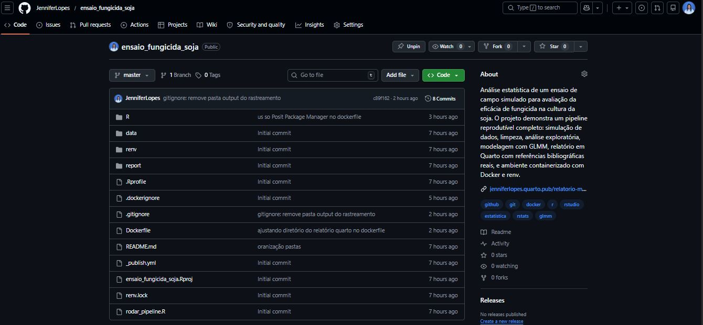
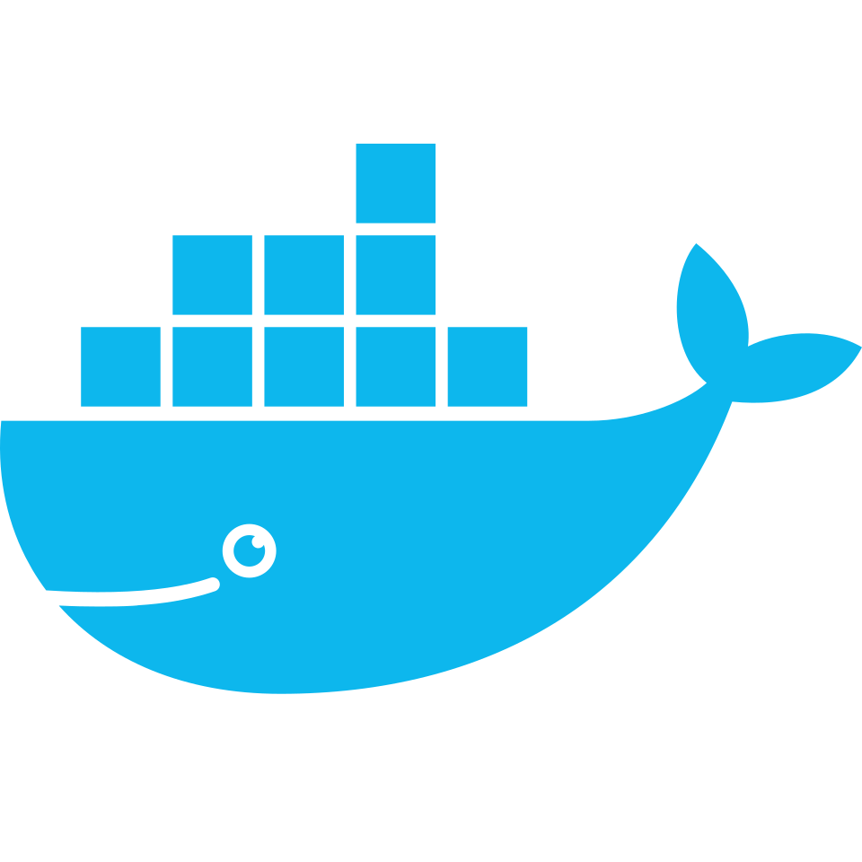
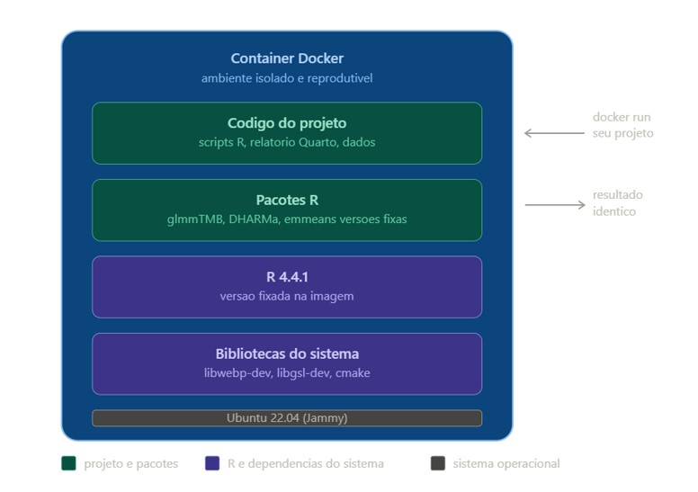
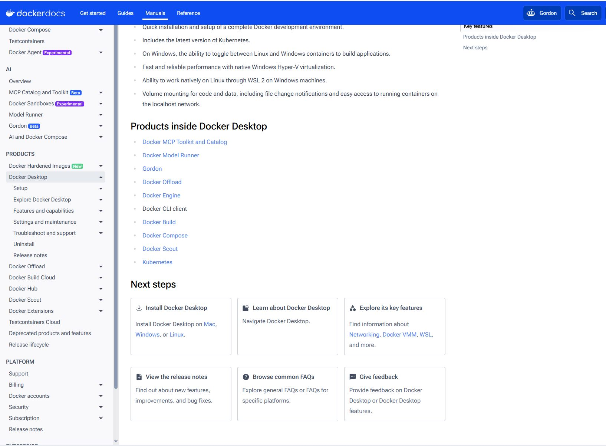
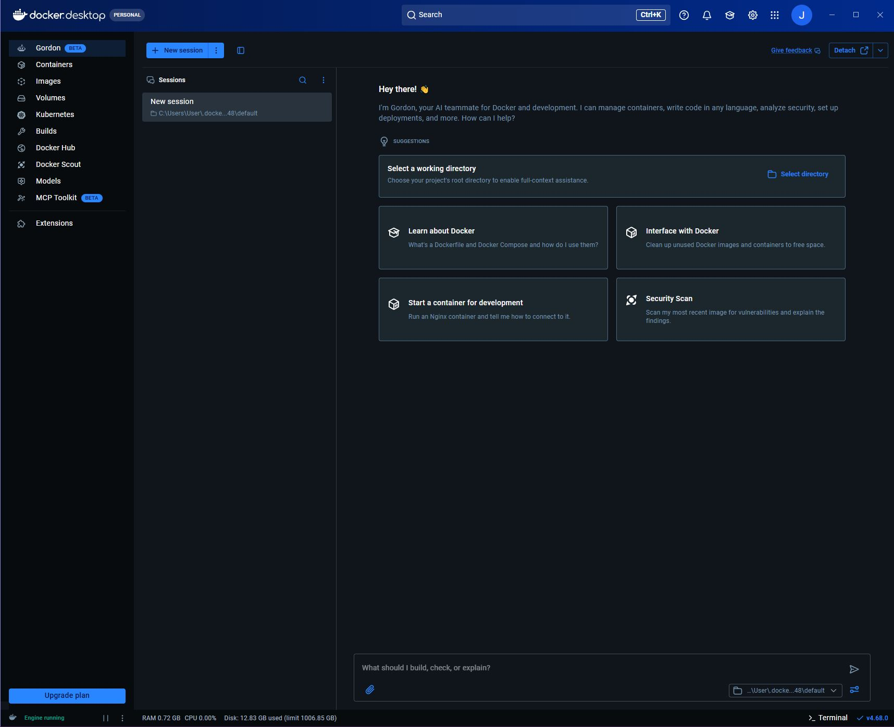
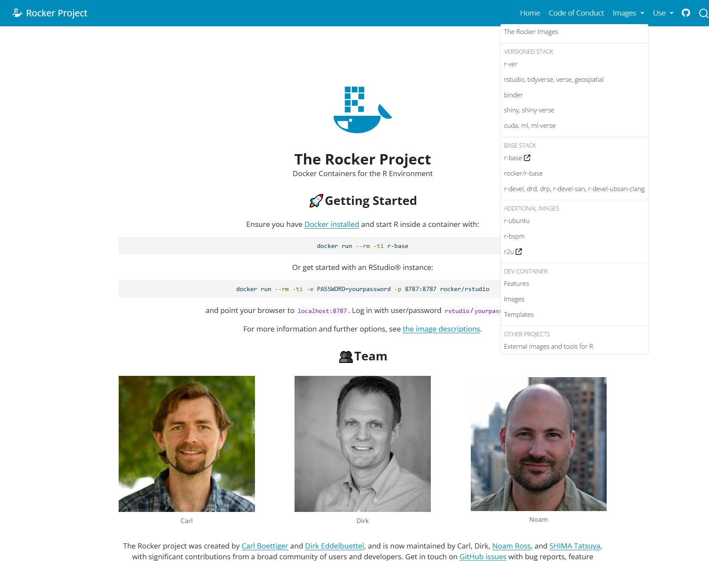

## Acompanhe o Café com R

{fig-align="center" style="border: 3px solid #6B4F4F; border-radius: 12px; padding: 6px;" width="422"}

## EM BREVE - NO YOUTUBE

{fig-align="center" width="568"}

**Inscreva-se já no [Link](https://www.youtube.com/@jennifercafecomr/featured).**

## Antes de começar:

1.  Projeto para usar essa aula está no meu repositório do [**`GitHub`**](https://github.com/JenniferLopes/ensaio_fungicida_soja).
2.  No final da apresentação tem uma lista de conceitos, para fixar o conhecimento.
3.  Essa aula foi feita com **R** + **RStudio** utilizando o [**Quarto**](https://quarto.org/). 💜

{fig-align="center" width="572"}

> **Todos as mensagens, avisos e dicas foram documentadas por mim, por alguns erros que já cometi por aqui.**

# Só mais uma ressalva antes do conteúdo: Docker não é só para Engenheiro de Dados

{fig-align="center" width="357"}

## Se você já passou por alguma dessas situações, Docker é para você:

-   Seu código parou de funcionar depois de uma atualização de pacote

-   Um colega não conseguiu rodar sua análise na máquina dele

-   Você trocou de computador e perdeu horas reconfigurando o ambiente

-   Seu orientador pediu para replicar uma análise feita meses atrás e os resultados eram diferentes

Pesquisadores, analistas, cientistas e estudantes lidam diariamente com o risco de perder reprodutibilidade. Docker elimina esse risco empacotando o R, os pacotes e o ambiente junto com o projeto.

> O código que você compartilha sem o ambiente não é totalmente reproduzível. Docker fecha essa lacuna.

# O que é Docker

{fig-align="center" width="354"}

## Conceito

-   **`Docker`** é uma plataforma de código aberto que permite **empacotar**, **distribuir** e **executar** aplicações em ambientes isolados chamados **containers**.

**Um container reúne tudo o que uma aplicação precisa para funcionar:**

-   O sistema operacional base, as dependências do sistema, as bibliotecas, os pacotes e o código.

-   Isso garante que o ambiente de execução seja sempre idêntico, independente da máquina onde o container é rodado.

## O problema que o Docker resolve

-   Você desenvolveu uma análise com R 4.4.1, `glmmTMB` 1.1.14 e `ggplot2` 4.0.2.

-   Envia para um colega. Ele abre com R 4.3.0 e versões diferentes dos pacotes. O código quebra.

-   O **`{renv}`** registra as versões dos pacotes R

-   Mas não controla a versão do R em si

-   Nem as dependências do sistema operacional

-   Nem as bibliotecas C instaladas no Linux

> **O Docker resolve tudo isso de uma vez.**

## O que é um container

Um **container** é um ambiente isolado e completo que empacota:

-   o sistema operacional base
-   a versão do R
-   todos os pacotes R com suas versões exatas
-   as bibliotecas do sistema operacional necessárias
-   o código do projeto

## O que é um container

{fig-align="center" width="494"}

**Quando você roda um container Docker, o resultado é sempre idêntico, independente de qual máquina está sendo usada.**

## **Container x máquina virtual**

-   Um container **não é o mesmo** que uma máquina virtual.

-   Uma **máquina virtual** emula um computador inteiro, incluindo hardware, e consome recursos pesados de CPU e memória.

-   Um **container compartilha o kernel** do sistema operacional da máquina host e isola apenas o que é necessário para a aplicação.

-   **O resultado é um ambiente isolado muito mais leve, que inicia em segundos e ocupa menos espaço em disco.**

> Um container **`Docker`** empacota o **`R`**, os pacotes, as versões e o código juntos. Qualquer pessoa que rodar esse **container** terá exatamente o **mesmo ambiente**, independente do sistema operacional da máquina dela. É reprodutibilidade garantida sem depender de instalação manual.

## **O pacote `renv` - O que é e para que serve?**

O **`renv`** é um pacote de gerenciamento de ambientes em R. Ele registra e isola as versões exatas dos pacotes utilizados em um projeto, garantindo que o ambiente seja reproduzível por qualquer pessoa, em qualquer máquina.

**Por que isso importa?**

-   Pacotes do R são atualizados com frequência
-   Uma função que funciona hoje pode se comportar de forma diferente em uma versão futura
-   Sem controle de versão de pacotes, a análise deixa de ser reproduzível

**O que o `renv` faz na prática:**

-   Cria uma biblioteca de pacotes isolada por projeto
-   Registra as versões exatas em um arquivo `renv.lock`
-   Permite restaurar o ambiente completo com um único comando

> O `renv.lock` é o equivalente do `requirements.txt` do Python para o R.

## **`renv` - Exemplo mínimo e uso em projetos**

**Instalação e inicialização**

``` r
# Instalar o renv
install.packages("renv")

# Inicializar o renv no projeto atual
renv::init()
```

**Fluxo de trabalho em um projeto**

``` r
# Após instalar ou atualizar pacotes, registrar o estado atual
renv::snapshot()

# Em outra máquina ou colaborador: restaurar o ambiente exato
renv::restore()

# Verificar diferenças entre o ambiente atual e o renv.lock
renv::status()
```

## **Arquivos gerados pelo `renv` no projeto**

| Arquivo / Pasta | Função                                            |
|-----------------|---------------------------------------------------|
| `renv.lock`     | Registra versões exatas dos pacotes               |
| `renv/`         | Biblioteca isolada do projeto                     |
| `.Rprofile`     | Ativa o `renv` automaticamente ao abrir o projeto |

> Commitar o **`renv.lock`** no GitHub garante que qualquer pessoa consiga restaurar o ambiente exato do projeto com **`renv::restore()`**.

## Docker x renv: quando usar cada um

| Situação                                 | Ferramenta |
|------------------------------------------|------------|
| Controlar versões de pacotes R           | `{renv}`   |
| Reprodutibilidade total do ambiente      | Docker     |
| Compartilhar análise com qualquer pessoa | Docker     |
| Desenvolvimento do dia a dia             | `{renv}`   |
| Entrega final do pipeline                | Docker     |

::: callout-tip
O ideal é usar os dois juntos: `{renv}` no desenvolvimento e Docker na entrega final.
:::

## Docker no Windows x Linux

| Aspecto | Windows | Linux |
|----|----|----|
| Camada de virtualização | WSL2 (overhead) | Nenhuma |
| Velocidade de compilação | Mais lenta | Mais rápida |
| Instalação | Docker Desktop obrigatório | Serviço do sistema |
| Estabilidade em builds longos | Instável | Estável |

::: callout-important
Builds que levam 60 minutos no Windows podem levar 10 a 20 minutos no Linux. Para uso profissional contínuo, Linux é o ambiente mais adequado.
:::

# Instalação

## Como instalar o Docker Desktop

1.  Acesse <https://docs.docker.com/desktop/> e baixe a versão para o seu sistema operacional.

{fig-align="center" width="630"}

## Como instalar o Docker Desktop

2.  Após instalar, abra o **Docker Desktop**.
3.  Ele precisa estar aberto e rodando em segundo plano sempre que você for usar o Docker pelo terminal.

**Para confirmar que a instalação funcionou, abra o terminal e rode:**

``` bash
docker --version
```

**A saída deve ser algo como:**

```         
Docker version 27.0.3, build 7d4bcd8
```

## O que é o Docker Desktop

O Docker Desktop é a **interface gráfica** do Docker. Os comandos vão no terminal, não aqui. O Docker Desktop serve para:

-   Iniciar e parar o engine do Docker
-   Monitorar imagens e containers
-   Ver logs de execução
-   Configurar recursos de memória e CPU
-   Verificar se o engine está rodando

::: callout-tip
O indicador mais importante é o status no canto inferior esquerdo. **Engine running** em verde significa que o Docker está pronto para uso.
:::

## Docker Desktop

{fig-align="center"}

## Abas do Docker Desktop

1.  **Images**

-   Lista todas as imagens que você já baixou ou construiu. Cada imagem tem um nome, tag de versão e tamanho em disco. A imagem `rocker/tidyverse:4.4.1` ocupa cerca de 2 GB.

2.  **Containers**

-   Lista os containers que estão rodando ou que já rodaram. Com `--rm` no `docker run`, o container é removido automaticamente após terminar.

3.  **Volumes**

-   Lista os volumes persistentes criados. Volumes temporários via `-v` no `docker run` não aparecem aqui.

## Configuração importante: Resource Saver

O **Resource Saver** reduz o uso de CPU e memória quando nenhum container está rodando.

::: callout-warning
Na configuração padrão, o Resource Saver entra em modo de economia em apenas **30 segundos**. Durante um build longo, isso cancela o processo no meio com o erro `context canceled`.
:::

**Para desativar:**

1.  Abra o Docker Desktop
2.  Vá em Settings \> Resources \> Advanced
3.  Desmarque **Enable Resource Saver**
4.  Clique em Apply

# A imagem base: rocker/tidyverse

## O que é uma imagem base

-   Uma **imagem Docker** é como um molde. Ela contém um sistema operacional e um conjunto de softwares pré-instalados.

-   Quando você constrói uma imagem para o seu projeto, você parte de uma imagem base e adiciona o que precisa.

-   O **Docker Hub** é o repositório público de imagens. É de lá que o Docker baixa a imagem base quando você roda `docker pull` ou quando o build começa.

## O que é o rocker/tidyverse

-   O projeto [**Rocker**](https://rocker-project.org/) mantém imagens Docker oficiais para **`R`**, construídas sobre **`Ubuntu`** **`Linux`**.

{fig-align="center" width="629"}

## rocker/tidyverse

**A imagem `rocker/tidyverse:4.4.1` inclui:**

-   Ubuntu 22.04 (Jammy)
-   R 4.4.1
-   RStudio Server
-   Tidyverse completo pré-instalado
-   Pandoc e Quarto CLI
-   Dependências de sistema para os principais pacotes R

::: callout-important
A tag `:4.4.1` é obrigatória. Sem ela, o Docker usa `latest`, que muda com o tempo e quebra a reprodutibilidade.
:::

## Comparação entre imagens Rocker

| Imagem              | Conteúdo                          | Indicada para      |
|---------------------|-----------------------------------|--------------------|
| `rocker/r-base`     | Apenas R                          | Projetos mínimos   |
| `rocker/tidyverse`  | R + Tidyverse + Quarto            | Análise de dados   |
| `rocker/verse`      | Tidyverse + LaTeX                 | Projetos com PDF   |
| `rocker/geospatial` | Tidyverse + bibliotecas espaciais | Análises espaciais |

::: callout-tip
Para projetos de análise estatística com relatório em Quarto, o `rocker/tidyverse` é a escolha mais adequada.
:::

# O Dockerfile

## O que é o Dockerfile

O **Dockerfile** é um arquivo de texto simples, sem extensão, com as instruções para construir a imagem do projeto.

-   O Docker lê de cima para baixo
-   Cria uma **camada** para cada instrução
-   Se você alterar uma instrução, só as camadas a partir daquele ponto são reconstruídas
-   As camadas anteriores ficam em **cache**

::: callout-tip
A ordem das instruções importa. Coloque o que muda menos no início e o que muda com frequência no final.
:::

## Estrutura completa do Dockerfile

``` dockerfile
FROM rocker/tidyverse:4.4.1

LABEL maintainer="Jennifer Luz Lopes"
LABEL description="Ensaio de eficacia de fungicida em soja"

RUN apt-get update && apt-get install -y \
    libgsl-dev libglpk-dev libxml2-dev \
    libcurl4-openssl-dev libssl-dev \
    libwebp-dev libnode-dev cmake pandoc \
    && apt-get clean \
    && rm -rf /var/lib/apt/lists/*

RUN Rscript -e " \
  options(repos = c(CRAN = 'https://packagemanager.posit.co/cran/__linux__/jammy/latest')); \
  install.packages(c('glmmTMB','DHARMa','emmeans','multcomp','broom.mixed','gt','DT','renv'), Ncpus = 4)"

WORKDIR /project
COPY . /project
RUN mkdir -p output/figuras output/tabelas output/modelos
RUN Rscript R/01_simular_dados.R && Rscript R/02_limpar_dados.R && \
    Rscript R/03_eda.R && Rscript R/04_analise_glmm.R
RUN quarto render report/relatorio.qmd --output-dir output/ --execute-dir /project
CMD ["bash"]
```

## Instrução FROM

``` dockerfile
FROM rocker/tidyverse:4.4.1
```

Define a imagem base. Toda imagem Docker parte de outra imagem.

::: callout-warning
Nunca use `FROM rocker/tidyverse` sem a tag de versão. Sem a tag, o Docker usa `latest`, que muda com o tempo e quebra a reprodutibilidade.
:::

## Instrução LABEL

``` dockerfile
LABEL maintainer="Jennifer Luz Lopes"
LABEL description="Ensaio de eficacia de fungicida em soja"
```

-   Metadados da imagem. Não afetam o funcionamento, servem apenas para documentação.

**Aparecem quando você roda:**

``` bash
docker inspect ensaio-fungicida
```

## Instrução RUN para dependências do sistema

``` dockerfile
RUN apt-get update && apt-get install -y \
    libgsl-dev libwebp-dev libnode-dev cmake \
    && apt-get clean \
    && rm -rf /var/lib/apt/lists/*
```

-   Instala **bibliotecas do sistema operacional** (Ubuntu).

-   Muitos pacotes **`R`** dependem de bibliotecas **`C`** para compilar. Sem elas, a instalação do pacote R falha.

::: callout-tip
O `apt-get clean` e o `rm -rf /var/lib/apt/lists/*` removem o cache do apt para reduzir o tamanho final da imagem.
:::

## Por que encadear os comandos com &&

Cada instrução `RUN` cria uma camada na imagem.

``` dockerfile
# Ruim: três camadas separadas
RUN apt-get update
RUN apt-get install -y libgsl-dev
RUN apt-get clean

# Bom: uma única camada
RUN apt-get update && apt-get install -y \
    libgsl-dev \
    && apt-get clean \
    && rm -rf /var/lib/apt/lists/*
```

::: callout-tip
Encadear com `&&` mantém tudo em uma única camada, reduzindo o tamanho da imagem.
:::

## Instrução RUN para pacotes R

``` dockerfile
RUN Rscript -e " \
  options(repos = c(CRAN = 'https://packagemanager.posit.co/cran/__linux__/jammy/latest')); \
  install.packages(c('glmmTMB','DHARMa','emmeans'), Ncpus = 4)"
```

-   **`options(repos = ...)`** define o repositório do Posit Package Manager
-   O Posit Package Manager fornece **binários pré-compilados** para Ubuntu Jammy
-   Sem ele, o R compila do código fonte em C++, o que pode levar mais de 60 minutos
-   Com ele, a instalação de 167 pacotes leva cerca de **2 minutos**

::: callout-warning
Nunca inclua `'quarto'` nessa lista. O pacote R `quarto` tenta compilar TypeScript e trava o build. O Quarto CLI já vem pré-instalado na imagem `rocker/tidyverse`.
:::

## Instruções WORKDIR, COPY e mkdir

``` dockerfile
WORKDIR /project

COPY . /project

RUN mkdir -p output/figuras output/tabelas output/modelos
```

-   **`WORKDIR:`** define o diretório de trabalho dentro do container
-   **`COPY . /project:`** copia os arquivos do seu computador para dentro do container
-   **`mkdir -p:`** cria as pastas de saída antes de rodar os scripts

::: callout-tip
O `.dockerignore` controla quais arquivos o `COPY` inclui. Sem ele, a pasta `renv/library/` inteira seria copiada, causando o erro `context canceled`.
:::

## Instrução RUN para rodar o pipeline

``` dockerfile
RUN Rscript R/01_simular_dados.R && \
    Rscript R/02_limpar_dados.R  && \
    Rscript R/03_eda.R           && \
    Rscript R/04_analise_glmm.R
```

Executa os scripts R em sequência. Se qualquer script falhar, o build para.

## Instrução RUN para renderizar o relatório

``` dockerfile
RUN quarto render report/relatorio.qmd \
    --output-dir output/ \
    --execute-dir /project
```

-   **`--output-dir output/:`** define onde o HTML será salvo
-   **`--execute-dir /project:`** define o diretório de trabalho durante a execução do R

::: callout-important
O parâmetro `--execute-dir` é obrigatório quando o `.qmd` está em uma subpasta. Sem ele, o R procura os arquivos de dados relativos à pasta `report/` e não encontra `data/processed/dados_limpos.csv`.
:::

## Instrução CMD

``` dockerfile
CMD ["bash"]
```

-   Define o comando padrão executado quando o container inicia.

-   `bash` abre um terminal interativo dentro do container, útil para depuração.

::: callout-tip
Para copiar arquivos gerados dentro do container para sua máquina, use `docker cp` em vez de tentar usar o terminal interativo com `CMD`.
:::

# O arquivo .dockerignore

## O que é o .dockerignore

-   O `.dockerignore` funciona igual ao `.gitignore`, mas para o Docker.

-   Lista arquivos e pastas que não devem ser copiados para dentro do container.

```         
renv/library/
renv/local/
renv/cellar/
renv/staging/
data/
output/
.git/
.Rproj.user/
*.Rproj
```

::: callout-warning
A pasta `renv/library/` é a mais crítica. Ela contém os pacotes instalados localmente e pode ter mais de 500 MB. Sem o `.dockerignore`, o Docker tenta copiar tudo e cancela com o erro `context canceled`.
:::

# Comandos essenciais

## docker pull

``` bash
docker pull rocker/tidyverse:4.4.1
```

Baixa uma imagem do Docker Hub sem construir nada.

::: callout-tip
Faça o `docker pull` da imagem base antes do `docker build` em conexões instáveis. O Docker retoma de onde parou se o download for interrompido. Quando a imagem já está baixada, o comando retorna `Status: Image is up to date`.
:::

## docker build

``` bash
docker build -t ensaio-fungicida .
```

Constrói a imagem a partir do Dockerfile na pasta atual.

-   **`-t ensaio-fungicida`** define o nome da imagem
-   **`.`** indica que o Dockerfile está no diretório atual

::: callout-tip
O build pode demorar entre 5 e 15 minutos usando o Posit Package Manager com binários pré-compilados. Nas próximas vezes é mais rápido porque as camadas ficam em cache.
:::

## docker run

``` bash
# Linux e Mac
docker run --rm -v $(pwd)/output:/project/output ensaio-fungicida

# Windows PowerShell
docker run --rm -v ${PWD}/output:/project/output ensaio-fungicida

# Windows com caminho explícito
docker run --rm -v "C:/caminho/do/projeto/output":/project/output ensaio-fungicida
```

-   **`--rm`** remove o container automaticamente após terminar
-   **`-v`** conecta uma pasta do seu computador com uma pasta dentro do container

## docker create e docker cp

-   Quando o volume `-v` não funcionar corretamente, use este método para copiar os arquivos gerados:

``` bash
# Criar container sem rodar
docker create --name temp ensaio-fungicida

# Copiar arquivos do container para a máquina
docker cp temp:/project/output .

# Remover o container temporário
docker rm temp
```

::: callout-tip
Para copiar um arquivo específico, informe o caminho completo dentro do container. Use `docker run --rm ensaio-fungicida find //project -name "*.html"` para localizar o arquivo antes de copiar.
:::

## docker images, ps e rmi

``` bash
# Listar imagens disponíveis
docker images

# Containers rodando agora
docker ps

# Todos os containers, incluindo os parados
docker ps -a

# Remover uma imagem
docker rmi ensaio-fungicida

# Remover todas as imagens sem uso
docker image prune
```

# Usando um projeto Docker em outra máquina

## Passo a passo completo

**1.** Instalar o Docker Desktop e verificar **Engine running**

**2.** Clonar o repositório:

``` bash
git clone https://github.com/JenniferLopes/ensaio_fungicida_soja
cd ensaio_fungicida_soja
```

**3.** Baixar a imagem base:

``` bash
docker pull rocker/tidyverse:4.4.1
```

**4.** Construir a imagem:

``` bash
docker build -t ensaio-fungicida .
```

**5.** Copiar os arquivos gerados:

``` bash
docker create --name temp ensaio-fungicida
docker cp temp:/project/report/output/relatorio.html ./output/
docker rm temp
```

## O que acontece em cada etapa do build

**Quando você roda `docker build`, o Docker executa estas etapas na ordem:**

1.  Lê o Dockerfile linha a linha
2.  Baixa a imagem base se ainda não estiver na máquina
3.  Instala as dependências do sistema com `apt-get`
4.  Instala os pacotes R com `install.packages`
5.  Copia os arquivos do projeto para dentro do container
6.  Cria as pastas de saída
7.  Executa os scripts R em sequência
8.  Renderiza o relatório Quarto
9.  Exporta e salva a imagem final

# Erros comuns e como resolver

## Erro 1: context canceled (Resource Saver)

**Mensagem:**

```         
ERROR: failed to build: failed to solve: Canceled: context canceled
```

**Causa:** O Resource Saver do Docker Desktop entrou em modo de economia durante o build.

**Solução:**

1.  Abra Docker Desktop
2.  Vá em Settings \> Resources \> Advanced
3.  Desmarque **Enable Resource Saver**
4.  Clique em Apply e rode o build novamente

## Erro 1: context canceled (renv/library/)

**Causa:** A pasta `renv/library/` está sendo copiada para o container por falta do `.dockerignore`.

**Solução:** Criar o arquivo `.dockerignore` na raiz do projeto com o conteúdo:

```         
renv/library/
renv/local/
renv/cellar/
renv/staging/
data/
output/
.git/
.Rproj.user/
*.Rproj
```

::: callout-tip
No terminal do RStudio, crie o arquivo com `usethis::use_git_ignore()` ou crie manualmente na raiz do projeto.
:::

## Erro 2: biblioteca do sistema ausente

**Mensagem:**

```         
libwebpmux.so.3: cannot open shared object file: No such file or directory
Error: error testing if 'ragg' can be loaded
```

**Causa:** Um pacote R depende de uma biblioteca do sistema que não está instalada na imagem.

**Solução:** Adicionar a biblioteca no bloco `apt-get install` do Dockerfile.

| Pacote R       | Biblioteca necessária |
|----------------|-----------------------|
| `ragg`         | `libwebp-dev`         |
| `V8`           | `libnode-dev`         |
| `nloptr`, `fs` | `cmake`               |
| `xml2`         | `libxml2-dev`         |
| `openssl`      | `libssl-dev`          |

## Erro 3: pacote quarto travando o build

**Mensagem:**

```         
make: *** [Makefile:239: quarto.ts] Error 1
```

**Causa:** O pacote R `quarto` tenta compilar TypeScript durante a instalação, o que falha na imagem `rocker/tidyverse`.

**Solução:** Remover `'quarto'` da lista do `install.packages` no Dockerfile.

::: callout-important
O Quarto CLI já vem pré-instalado na imagem `rocker/tidyverse` e pode ser chamado diretamente com `quarto render` no Dockerfile. O pacote R `quarto` não é necessário dentro do container.
:::

## Erro 4: build longo com compilação do código fonte

**Sintoma:** O build fica parado por 40 a 60 minutos na etapa de instalação de pacotes, especialmente `glmmTMB` e `TMB`, mostrando mensagens de compilação C++ como:

```         
../inst/include/Eigen/src/Core/ProductEvaluators.h:380:62
[output clipped, log limit 2MiB reached]
```

**Causa:** O repositório CRAN padrão não fornece binários para Linux, forçando compilação do código fonte.

**Solução:** Usar o Posit Package Manager no Dockerfile:

``` dockerfile
RUN Rscript -e " \
  options(repos = c(CRAN = 'https://packagemanager.posit.co/cran/__linux__/jammy/latest')); \
  install.packages(c('glmmTMB', 'DHARMa', ...), Ncpus = 4)"
```

## Erro 5: Docker Desktop travado

**Mensagem:**

```         
ERROR: request returned 500 Internal Server Error for API route
http://%2F%2F.%2Fpipe%2FdockerDesktopLinuxEngine/_ping
```

**Causa:** O Docker Desktop travou após um build muito longo ou após ser interrompido forçadamente.

**Solução:**

1.  Clique com o botão direito no ícone do Docker Desktop na barra de tarefas
2.  Escolha **Quit Docker Desktop**
3.  Aguarde 30 segundos
4.  Abra o Docker Desktop novamente
5.  Aguarde **Engine running** e rode o build novamente

## Erro 6: arquivo HTML gerado no caminho errado

**Mensagem:**

```         
Error: 'data/processed/dados_limpos.csv' does not exist in current
working directory: '/project/report'
```

**Causa:** O Quarto executa o `.qmd` a partir da pasta onde ele está (`report/`), e os caminhos relativos como `data/processed/` ficam incorretos.

**Solução:** Adicionar `--execute-dir` no comando de renderização do Dockerfile:

``` dockerfile
RUN quarto render report/relatorio.qmd \
    --output-dir output/ \
    --execute-dir /project
```

::: callout-tip
Para encontrar onde o HTML foi gerado dentro do container, use: `docker run --rm ensaio-fungicida find //project -name "*.html"`
:::

## Erro 7: volume não mapeado corretamente no Windows

**Sintoma:** Uma pasta estranha como `output;C` é criada no projeto, ou o relatório não aparece na pasta `output/`.

**Causa:** O Git Bash no Windows converte automaticamente caminhos como `/project` para `C:/Program Files/Git/project`.

**Solução:** Use o caminho completo entre aspas ou use `docker cp`:

``` bash
# Com caminho explícito
docker run --rm -v "C:/Users/User/Documents/GitHub/projeto/output":/project/output ensaio-fungicida

# Ou use docker cp
docker create --name temp ensaio-fungicida
docker cp temp:/project/report/output/relatorio.html ./output/
docker rm temp
```

# Boas práticas

## Sequência recomendada antes de dockerizar

::: callout-important
Sempre teste o pipeline localmente antes de criar o Dockerfile. O Docker não facilita a depuração de erros nos scripts R. É muito mais rápido encontrar e corrigir um erro no RStudio do que dentro de um build.
:::

1.  Desenvolver e testar todos os scripts localmente
2.  Garantir que o relatório renderiza sem erros
3.  Rodar `renv::snapshot()` para registrar os pacotes
4.  Criar o `.dockerignore`
5.  Criar o Dockerfile
6.  Rodar o `docker pull` da imagem base
7.  Rodar o `docker build`

## Estratégia para builds mais rápidos

Organize as instruções do Dockerfile da menos para a mais frequente:

``` dockerfile
# Muda raramente: fica no início
FROM rocker/tidyverse:4.4.1
RUN apt-get install ...

# Muda às vezes: fica no meio
RUN install.packages(...)

# Muda com frequência: fica no final
COPY . /project
RUN Rscript ...
```

::: callout-tip
Se você só mudar um script R, o Docker usa o cache das etapas anteriores e só reexecuta a partir do `COPY`. O build fica muito mais rápido.
:::

## Checklist antes do docker build

Antes de rodar o build, confirme cada item:

-   O Docker Desktop está aberto e com status **Engine running**
-   O **Resource Saver** está desativado
-   O `.dockerignore` existe e inclui `renv/library/`
-   O pipeline roda sem erros localmente
-   O `renv.lock` está atualizado com `renv::snapshot()`
-   O Dockerfile usa o **Posit Package Manager** como repositório
-   O Dockerfile **não inclui `'quarto'`** na lista do `install.packages`
-   O comando `quarto render` inclui `--execute-dir /project`

## Conceitos

**1. Ambiente de execução:** O conjunto de tudo que um código precisa para rodar: sistema operacional, linguagem instalada, pacotes e suas versões. Dois ambientes diferentes podem produzir resultados diferentes com o mesmo código.

**2. Reprodutibilidade:** Capacidade de replicar exatamente uma análise em qualquer máquina, por qualquer pessoa, em qualquer momento. É o princípio que justifica o uso do Docker em projetos de dados.

**3. Dependência:** Qualquer pacote, biblioteca ou ferramenta que o código precisa para funcionar. Dependências têm versões, e versões diferentes podem gerar comportamentos diferentes.

**4. Imagem Docker:** Um arquivo estático que contém o sistema operacional, o R, os pacotes e o código do projeto. É o molde a partir do qual os containers são criados. Uma imagem não executa nada, ela define o ambiente.

## Conceitos

**5. Container:** Uma instância em execução de uma imagem. É o ambiente isolado onde o código de fato roda. Leve, rápido e descartável. Vários containers podem ser criados a partir da mesma imagem.

**6. Dockerfile:** O arquivo de texto com as instruções para construir uma imagem. Define qual sistema operacional usar, quais pacotes instalar, quais arquivos copiar e qual comando executar ao iniciar o container.

**7. Docker Hub:** Repositório público de imagens Docker. É onde ficam imagens prontas, incluindo imagens oficiais do R como o `rocker/r-ver`, que são amplamente usadas em projetos de dados.

**8. Volume**: Mecanismo que conecta uma pasta do computador local a uma pasta dentro do container. Permite que os arquivos do projeto sejam acessados e salvos fora do container, evitando perda de dados quando o container é encerrado.

## Conceitos

**9. Build:** O processo de construir uma imagem a partir do Dockerfile. É executado uma vez e gera a imagem que será usada para criar containers.

**10. rocker**: Projeto que mantém imagens Docker oficiais para R. Oferece variantes como `rocker/r-ver`, `rocker/tidyverse` e `rocker/rstudio`, que são pontos de partida para projetos de dados em R sem precisar configurar tudo do zero.

**11. `renv` + Docker:** Combinação recomendada para máxima reprodutibilidade. O Docker garante o sistema operacional e a versão do R. O `renv` garante as versões dos pacotes dentro do container. Juntos, eliminam a variável de ambiente da equação.

## Conceitos

**12.Kernel:** É o núcleo do sistema operacional. Faz a ponte entre o hardware da máquina e os programas que rodam nela. O Docker compartilha o kernel do sistema operacional do host com os containers, o que o torna muito mais leve que uma máquina virtual.

**13.Sistema operacional host:** É o sistema operacional instalado na sua máquina, seja Windows, macOS ou Linux. O Docker roda sobre ele e compartilha seus recursos.

**14.Ubuntu**: Distribuição Linux amplamente utilizada em servidores e containers. A maioria das imagens Docker para R, incluindo as do projeto Rocker, é baseada em Ubuntu. Você não precisa saber Linux para usar Docker, mas reconhecer o nome é importante.

**15.Máquina virtual:** Simula um computador completo com sistema operacional próprio. É pesada, consome muita memória e leva minutos para iniciar. Docker resolve o mesmo problema de isolamento de forma muito mais leve.

## Acompanhe o Café com R

{fig-align="center" style="border: 3px solid #6B4F4F; border-radius: 12px; padding: 6px;" width="422"}

## EM BREVE - NO YOUTUBE

{fig-align="center" width="568"}

**Inscreva-se já no [Link](https://www.youtube.com/@jennifercafecomr/featured).**
