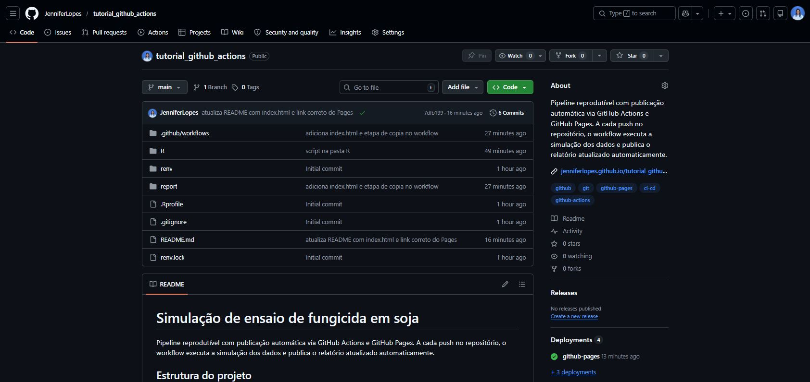
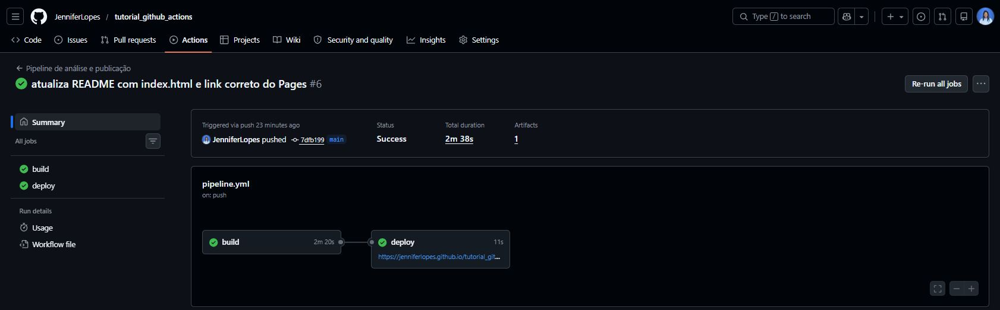
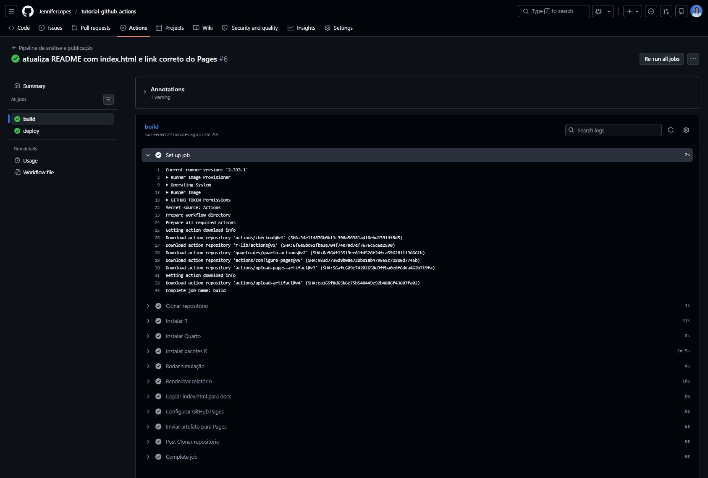

## Acompanhe o Café com R

{fig-align="center" style="border: 3px solid #6B4F4F; border-radius: 12px; padding: 6px;" width="422"}

## EM BREVE - NO YOUTUBE

{fig-align="center" width="568"}

**Inscreva-se já no [Link](https://www.youtube.com/@jennifercafecomr/featured).**

## Antes de começar

1.  O projeto utilizado nessa aula está no repositório do [**`GitHub`**](https://github.com/JenniferLopes/tutorial_github_actions).

{fig-align="center"}

1.  O relatório publicado está disponível em [**GitHub Pages**](https://jenniferlopes.github.io/tutorial_github_actions/).

> **Todos os erros, avisos e dicas foram documentados a partir de situações reais vividas durante o desenvolvimento deste e de outros projetos.**

# O que é GitHub Actions

{fig-align="center" width="177"}

## Conceito

-   **`GitHub Actions`** é uma plataforma de automação integrada ao GitHub que permite executar tarefas automaticamente em resposta a eventos no repositório.

-   Em projetos de dados, isso significa que a cada atualização do código, o pipeline executa sozinho: instala pacotes, roda scripts, renderiza relatórios e publica resultados.

-   **Tudo isso sem abrir o RStudio, sem rodar nada manualmente.**

## O que é CI/CD

-   **CI (Continuous Integration):** integração contínua. Cada atualização de código é testada e validada automaticamente.

-   **CD (Continuous Deployment):** entrega contínua. O resultado validado é publicado automaticamente para o ambiente final.

-   Em ciência de dados: a análise roda automaticamente e o relatório é publicado sem intervenção manual.

## Por que usar GitHub Actions em dados

-   O relatório fica sempre atualizado sem precisar rodar manualmente
-   Qualquer pessoa que clonar o repositório pode reproduzir o pipeline
-   Os logs ficam registrados para auditoria
-   É a mesma infraestrutura usada em produção em empresas de dados
-   Demonstra maturidade técnica no portfólio

::: callout-tip
**Para projetos de análise estatística com relatório em Quarto, o GitHub Actions é a forma mais simples de garantir que o resultado publicado sempre corresponde ao código do repositório.**
:::

## GitHub Actions x outras ferramentas

| Ferramenta      | Onde roda        | Indicada para                     |
|-----------------|------------------|-----------------------------------|
| GitHub Actions  | Nuvem GitHub     | Projetos no GitHub                |
| GitLab CI       | Nuvem GitLab     | Projetos no GitLab                |
| Jenkins         | Servidor próprio | Empresas com infraestrutura local |
| Azure Pipelines | Nuvem Microsoft  | Integração com Azure              |

::: callout-tip
**Para portfólio e projetos acadêmicos, o GitHub Actions é a escolha mais simples pois não exige nenhuma infraestrutura adicional.**
:::

# Conceitos fundamentais

## O que é um workflow

-   Um **workflow** é o arquivo que define toda a automação. Ele fica em `.github/workflows/` e é escrito em formato **YAML**.

-   Cada repositório pode ter vários workflows para finalidades diferentes.

-   O nome do arquivo pode ser qualquer um com extensão `.yml`.

```         
.github/
└── workflows/
    ├── pipeline.yml       # roda a análise e publica
    └── verificar.yml      # verifica o código a cada PR
```

## O que é um trigger (gatilho)

Um **trigger** define quando o workflow dispara. Os mais comuns são:

-   **`push`:** dispara quando há um push em uma branch específica
-   **`pull_request`:** dispara quando um pull request é aberto
-   **`schedule`:** dispara em horários definidos (cron)
-   **`workflow_dispatch`:** dispara manualmente pela interface do GitHub

``` yaml
on:
  push:
    branches: [main]
  workflow_dispatch:
```

::: callout-tip
**Durante o desenvolvimento, use `workflow_dispatch` para rodar o workflow manualmente sem precisar fazer um push a cada teste.**
:::

## O que é um runner

-   Um **runner** é a máquina virtual onde o workflow executa. O GitHub fornece runners gratuitos com Ubuntu, Windows e macOS.

-   Para projetos de dados em R, sempre use **`ubuntu-22.04`** pois é o mesmo sistema da imagem `rocker/tidyverse` e do Posit Package Manager.

``` yaml
jobs:
  build:
    runs-on: ubuntu-22.04
```

::: callout-important
Nunca use `ubuntu-latest` em projetos de dados em R. A versão exata do Ubuntu afeta quais binários o Posit Package Manager entrega. Com `ubuntu-22.04` (Jammy) os pacotes instalam como binários pré-compilados. Com versões diferentes, o R compila do código fonte e o workflow trava.
:::

## O que é um job

-   Um **job** é um conjunto de steps que roda em um runner. Por padrão, jobs diferentes rodam em paralelo.

-   Para publicar no GitHub Pages, precisamos de dois jobs em sequência: **build** e **deploy**.

``` yaml
jobs:
  build:
    runs-on: ubuntu-22.04
    steps:
      - ...

  deploy:
    needs: build
    runs-on: ubuntu-22.04
    steps:
      - ...
```

## O que é um step

-   Um **step** é uma etapa dentro de um job. Pode ser um comando shell ou uma **action** reutilizável.

``` yaml
steps:
  - name: Clonar repositório
    uses: actions/checkout@v4

  - name: Instalar pacotes R
    run: Rscript -e "install.packages('tidyverse')"
```

-   **`uses`:** usa uma action pronta do marketplace do GitHub
-   **`run`:** executa um comando diretamente no terminal do runner

## O que são actions

-   **Actions** são blocos reutilizáveis criados pela comunidade. Em vez de escrever scripts longos, você usa actions prontas para tarefas comuns.

-   As mais usadas em projetos de dados em R:

| Action                               | Função                         |
|--------------------------------------|--------------------------------|
| `actions/checkout@v4`                | Clona o repositório no runner  |
| `r-lib/actions/setup-r@v2`           | Instala R no runner            |
| `quarto-dev/quarto-actions/setup@v2` | Instala Quarto no runner       |
| `actions/configure-pages@v5`         | Configura o GitHub Pages       |
| `actions/upload-pages-artifact@v3`   | Envia os arquivos para o Pages |
| `actions/deploy-pages@v4`            | Publica no GitHub Pages        |

# Estrutura do arquivo .yml

## Onde fica o arquivo

O arquivo de workflow deve estar exatamente neste caminho dentro do repositório:

```         
.github/
└── workflows/
    └── pipeline.yml
```

::: callout-warning
**A pasta `.github` começa com ponto e pode ser invisível no Windows. No terminal do RStudio, confirme que ela foi criada com `ls -la` antes de fazer o push.**
:::

## Anatomia completa do workflow

``` yaml
name: Pipeline de análise e publicação

on:
  push:
    branches: [main, master]
  workflow_dispatch:

permissions:
  contents: read
  pages: write
  id-token: write

concurrency:
  group: pages
  cancel-in-progress: false

jobs:
  build:
    runs-on: ubuntu-22.04
    steps:
      - ...

  deploy:
    needs: build
    runs-on: ubuntu-22.04
    steps:
      - ...
```

## Explicação do cabeçalho

**`name`:** nome do workflow que aparece na aba Actions do GitHub.

**`on`:** define os gatilhos. `push` dispara ao fazer push no repositório. `workflow_dispatch` permite rodar manualmente.

**`permissions`:** define o que o workflow pode fazer no repositório. Para publicar no Pages são necessárias as permissões `pages: write` e `id-token: write`.

**`concurrency`:** garante que apenas uma execução do workflow roda por vez. Evita conflitos quando há vários pushes em sequência.

## O job build

``` yaml
jobs:
  build:
    runs-on: ubuntu-22.04
    steps:
      - name: Clonar repositório
        uses: actions/checkout@v4

      - name: Instalar R
        uses: r-lib/actions/setup-r@v2
        with:
          r-version: '4.4.1'
          use-public-rspm: true

      - name: Instalar Quarto
        uses: quarto-dev/quarto-actions/setup@v2

      - name: Instalar pacotes R
        run: |
          Rscript -e "
          options(repos = c(CRAN = 'https://packagemanager.posit.co/cran/__linux__/jammy/latest'));
          install.packages(c('tidyverse', 'knitr', 'rmarkdown'))
          "
```

## O job build (continuação)

``` yaml
      - name: Rodar simulação
        run: Rscript R/01_simular_dados.R

      - name: Renderizar relatório
        run: |
          quarto render report/relatorio_simulacao.qmd \
            --output-dir ../docs \
            --execute-dir .

      - name: Copiar index.html para docs
        run: cp report/index.html docs/index.html

      - name: Configurar GitHub Pages
        uses: actions/configure-pages@v5

      - name: Enviar artefato para Pages
        uses: actions/upload-pages-artifact@v3
        with:
          path: docs
```

## O job deploy

``` yaml
  deploy:
    needs: build
    runs-on: ubuntu-22.04
    environment:
      name: github-pages
      url: ${{ steps.deployment.outputs.page_url }}

    steps:
      - name: Publicar no GitHub Pages
        id: deployment
        uses: actions/deploy-pages@v4
```

-   **`needs: build`** garante que o deploy só roda após o build terminar com sucesso
-   **`environment`** define o ambiente de publicação e expõe o link do Pages no summary
-   **`url`** captura o link gerado automaticamente pelo Pages e exibe no summary do workflow

# Configurando o ambiente R

## Por que usar r-lib/actions/setup-r

A action `r-lib/actions/setup-r` instala R no runner com configurações otimizadas para CI/CD:

``` yaml
- name: Instalar R
  uses: r-lib/actions/setup-r@v2
  with:
    r-version: '4.4.1'
    use-public-rspm: true
```

-   **`r-version`:** fixa a versão do R, garantindo reprodutibilidade
-   **`use-public-rspm: true`:** ativa automaticamente o Posit Package Manager como repositório padrão

::: callout-important
Sempre fixe a versão do R com `r-version`. Sem isso, o runner instala a versão mais recente, que pode mudar entre execuções e quebrar a reprodutibilidade.
:::

## Por que o Posit Package Manager é essencial

**No GitHub Actions, o runner usa Ubuntu. O CRAN padrão não fornece binários para Linux, o que força o R a compilar cada pacote do código fonte em C++.**

-   **Com CRAN padrão:** instalação de 10 pacotes pode levar 30 a 60 minutos e frequentemente excede o tempo limite do workflow
-   **Com Posit Package Manager:** os mesmos pacotes instalam em menos de 2 minutos como binários pré-compilados

``` r
options(repos = c(CRAN = 'https://packagemanager.posit.co/cran/__linux__/jammy/latest'))
install.packages(c('tidyverse', 'knitr', 'rmarkdown'))
```

::: callout-warning
**O endereço `jammy` no URL corresponde ao Ubuntu 22.04. Se mudar o runner para outra versão do Ubuntu, o endereço do Posit Package Manager também muda.**
:::

## Instalando pacotes de forma eficiente

``` yaml
- name: Instalar pacotes R
  run: |
    Rscript -e "
    options(repos = c(CRAN = 'https://packagemanager.posit.co/cran/__linux__/jammy/latest'));
    install.packages(c('tidyverse', 'knitr', 'rmarkdown'))
    "
```

::: callout-tip
Mantenha a lista de pacotes no workflow enxuta. Instale apenas o necessário para o relatório rodar. Cada pacote adicional aumenta o tempo de execução mesmo com binários pré-compilados.
:::

# Renderizando o relatório Quarto

## Instalando o Quarto no runner

``` yaml
- name: Instalar Quarto
  uses: quarto-dev/quarto-actions/setup@v2
```

A action `quarto-dev/quarto-actions/setup` instala a versão mais recente do Quarto CLI no runner. Não é necessário especificar a versão para a maioria dos projetos.

## O comando quarto render

``` yaml
- name: Renderizar relatório
  run: |
    quarto render report/relatorio_simulacao.qmd \
      --output-dir ../docs \
      --execute-dir .
```

-   **`report/relatorio_simulacao.qmd`:** caminho para o arquivo a renderizar
-   **`--output-dir ../docs`:** pasta onde o HTML será salvo. A pasta `docs/` fica na raiz do projeto
-   **`--execute-dir .`:** define o diretório de trabalho do R durante a execução

::: callout-important
**O parâmetro `--execute-dir` é obrigatório quando o `.qmd` está em uma subpasta. Sem ele, o R executa a partir da pasta `report/` e não encontra os arquivos em `data/` ou `R/`, gerando erro de arquivo não encontrado.**
:::

# Publicando no GitHub Pages

{fig-align="center" width="597"}

## O que é o GitHub Pages

-   [**GitHub Pages**](https://docs.github.com/pt/pages) é um serviço gratuito do GitHub que hospeda sites estáticos diretamente a partir de um repositório.

-   Para projetos de dados, é a forma mais simples de publicar um relatório HTML com um link público permanente.

-   O link segue o padrão:

```         
https://seu-usuario.github.io/nome-do-repositorio/
```

## Como ativar o GitHub Pages

1.  Abra o repositório no GitHub
2.  Clique em **Settings**
3.  No menu lateral clique em **Pages**
4.  Em **Source** selecione **GitHub Actions**
5.  Clique em **Save**

::: callout-warning
**O GitHub Pages precisa ser ativado antes da primeira execução do workflow. Se o Pages não estiver configurado, o step `configure-pages` falha com o erro `Get Pages site failed. Not Found`.**
:::

## O que é o index.html e por que é necessário

Quando alguém acessa a raiz do site, por exemplo `https://seu-usuario.github.io/projeto/`, o GitHub Pages procura por um arquivo `index.html`. Se não encontrar, retorna erro 404.

O `index.html` que usamos redireciona automaticamente para o relatório:

``` html
<meta http-equiv="refresh" content="0; url=relatorio_simulacao.html">
```

Sem ele o visitante precisa digitar o nome completo do arquivo no link. Com ele, o link raiz já abre o relatório direto.

## O arquivo index.html completo

``` html
<!DOCTYPE html>
<html lang="pt">
<head>
  <meta charset="UTF-8">
  <meta http-equiv="refresh" content="0; url=relatorio_simulacao.html">
  <title>Redirecionando...</title>
</head>
<body>
  <p>Redirecionando para o relatório...</p>
</body>
</html>
```

Esse arquivo fica em `report/index.html` e é copiado para a pasta `docs/` pelo workflow antes do deploy.

## Os steps de publicação

``` yaml
- name: Configurar GitHub Pages
  uses: actions/configure-pages@v5

- name: Enviar artefato para Pages
  uses: actions/upload-pages-artifact@v3
  with:
    path: docs

- name: Publicar no GitHub Pages
  id: deployment
  uses: actions/deploy-pages@v4
```

-   **`configure-pages`:** verifica se o Pages está ativado e configura o ambiente
-   **`upload-pages-artifact`:** empacota a pasta `docs/` e envia para o GitHub
-   **`deploy-pages`:** publica o pacote enviado e gera o link público

# Passo a passo completo

## Estrutura do projeto

```         
soja_actions/
├── .github/
│   └── workflows/
│       └── pipeline.yml
├── R/
│   └── 01_simular_dados.R
├── report/
│   ├── relatorio_simulacao.qmd
│   └── index.html
├── data/
└── README.md
```

## Passo 1: criar o repositório

1.  Acesse [github.com](https://github.com) e clique em **New repository**
2.  Defina o nome do repositório
3.  Deixe como **Public**
4.  Clique em **Create repository**

## Passo 2: criar o projeto local e subir os arquivos

No terminal do RStudio, dentro da pasta do projeto:

``` bash
git init
git add .
git commit -m "projeto: pipeline GitHub Actions com simulacao de ensaio"
git branch -M main
git remote add origin https://github.com/seu-usuario/soja_actions.git
git push -u origin main
```

## Passo 3: ativar o GitHub Pages

1.  Abra o repositório no GitHub
2.  Clique em **Settings \> Pages**
3.  Em **Source** selecione **GitHub Actions**
4.  Clique em **Save**

## Passo 4: acompanhar o workflow

1.  Clique na aba **Actions** do repositório
2.  Clique na execução mais recente
3.  Acompanhe cada step em tempo real
4.  Quando aparecer o círculo verde, o workflow terminou com sucesso

## Passo 5: acessar o relatório publicado

O link aparece no summary do workflow abaixo do job **deploy**:

```         
https://seu-usuario.github.io/soja_actions/
```

Esse link é público e pode ser compartilhado diretamente no LinkedIn e colocado no README do projeto.

# O que aparece na aba Actions

## Lendo o summary do workflow

{fig-align="center"}

-   **Círculo verde:** workflow terminou com sucesso
-   **Círculo vermelho:** workflow falhou em algum step
-   **Círculo amarelo:** workflow está em execução
-   **Círculo cinza com i:** workflow foi cancelado

## O que são artifacts

-   **Artifacts** são arquivos gerados durante o workflow e salvos temporariamente pelo GitHub.
-   No summary, o artifact `github-pages` contém o HTML do relatório empacotado antes do deploy.
-   O tamanho do artifact aparece em KB. Para relatórios simples, fica em torno de 500 KB a 1 MB.

## Por que aparecem várias execuções

Cada push ou execução manual gera uma nova linha na aba Actions. Isso é o comportamento esperado e desejado.

O histórico de execuções mostra:

-   Quando cada análise foi rodada
-   Qual commit disparou cada execução
-   Quanto tempo cada execução levou
-   Se houve falha e em qual step

::: callout-tip
Use mensagens de commit descritivas pois elas aparecem diretamente no histórico do Actions. `git commit -m "fix: corrige caminho do CSV"` é muito mais informativo do que `git commit -m "ajuste"`.
:::

## Como ver os logs de cada step

1.  Clique na execução na aba Actions
2.  Clique no job **build** ou **deploy**
3.  Clique em qualquer step para expandir os logs
4.  Os logs mostram exatamente o que o runner executou e o que retornou

::: callout-tip
Quando um workflow falha, os logs do step com erro mostram a mensagem exata. Leia a última linha antes do `Error` para identificar o problema.
:::

## Como ver os logs de cada step

{fig-align="center" width="595"}

# Erros comuns e como resolver

## Erro 1: Pages não ativado

**Mensagem:**

```         
Error: Get Pages site failed. Please verify that the repository
has Pages enabled and configured to build using GitHub Actions.
Error: Not Found
```

**Causa:** O GitHub Pages não foi ativado antes da primeira execução do workflow.

**Solução:**

1.  Vá em Settings \> Pages no repositório
2.  Em Source selecione **GitHub Actions**
3.  Clique em Save
4.  Volte na aba Actions e clique em **Re-run all jobs**

## Erro 2: arquivo HTML não encontrado (404)

**Sintoma:** O workflow roda com sucesso mas ao acessar o link aparece erro 404.

**Causa 1:** O arquivo `index.html` não foi criado ou não foi copiado para a pasta `docs/`.

**Solução:** Verificar se o step `Copiar index.html para docs` está no workflow e se o arquivo `report/index.html` existe no repositório.

**Causa 2:** O relatório foi gerado com nome diferente do especificado no `index.html`.

**Solução:** Conferir se o nome do arquivo no `<meta http-equiv="refresh">` do `index.html` corresponde ao nome gerado pelo Quarto.

## Erro 3: pacotes demorando mais de 10 minutos

**Sintoma:** O step de instalação de pacotes fica rodando por muito tempo ou excede o tempo limite do workflow.

**Causa:** O Posit Package Manager não está configurado e o R está compilando do código fonte.

**Solução:** Garantir que o `options(repos = ...)` com o endereço do Posit Package Manager está definido antes do `install.packages`:

``` r
options(repos = c(CRAN = 'https://packagemanager.posit.co/cran/__linux__/jammy/latest'))
install.packages(c('tidyverse', 'knitr', 'rmarkdown'))
```

## Erro 4: CSV não encontrado durante renderização

**Mensagem:**

```         
Error: 'data/ensaio_fungicida.csv' does not exist in current
working directory: '/home/runner/work/projeto/projeto/report'
```

**Causa:** O `--execute-dir` está faltando no comando `quarto render`. O Quarto executa a partir da pasta `report/` e não encontra a pasta `data/`.

**Solução:** Adicionar `--execute-dir .` ao comando de renderização:

``` yaml
run: |
  quarto render report/relatorio_simulacao.qmd \
    --output-dir ../docs \
    --execute-dir .
```

## Erro 5: workflow não dispara após push

**Causa 1:** O arquivo `.yml` não está no caminho correto `.github/workflows/`.

**Solução:** Verificar no repositório do GitHub se a pasta `.github` aparece na raiz. Se não aparecer, o Git pode ter ignorado a pasta oculta.

**Causa 2:** A branch do push não corresponde à branch definida no trigger.

**Solução:** Verificar se o push foi feito para `main` e se o workflow tem `main` na lista de branches:

``` yaml
on:
  push:
    branches: [main, master]
```

## Erro 6: permissões insuficientes para deploy

**Mensagem:**

```         
Error: HttpError: Resource not accessible by integration
```

**Causa:** As permissões `pages: write` e `id-token: write` estão faltando no workflow.

**Solução:** Adicionar o bloco de permissões no início do workflow:

``` yaml
permissions:
  contents: read
  pages: write
  id-token: write
```

# Boas práticas

## Testar localmente antes de subir

::: callout-important
Sempre teste o pipeline localmente antes de fazer push. Cada execução com erro no Actions consome minutos do runner gratuito e fica registrada no histórico.
:::

``` r
source("R/01_simular_dados.R")
quarto::quarto_render("report/relatorio_simulacao.qmd")
```

Se renderizar sem erros localmente, o workflow tem alta chance de passar.

## Manter o workflow simples

-   Instale apenas os pacotes que o relatório realmente usa
-   Evite steps desnecessários no início do desenvolvimento
-   Adicione complexidade gradualmente, testando a cada adição
-   Um workflow simples que funciona é melhor que um workflow completo que falha

## Usar workflow_dispatch durante o desenvolvimento

Durante o desenvolvimento, use `workflow_dispatch` para rodar o workflow manualmente sem precisar fazer um push a cada teste:

1.  Acesse a aba **Actions**
2.  Clique no nome do workflow no menu lateral
3.  Clique em **Run workflow**
4.  Clique em **Run workflow** novamente na caixa que aparece

::: callout-tip
Isso evita poluir o histórico de commits com mensagens como `teste`, `ajuste`, `mais um teste` apenas para disparar o workflow.
:::

## Nomear os commits com clareza

As mensagens de commit aparecem diretamente no histórico do Actions. Compare:

| Commit vago | Commit descritivo                                |
|-------------|--------------------------------------------------|
| `ajuste`    | `fix: corrige caminho do CSV no quarto render`   |
| `teste`     | `test: verifica instalacao de pacotes com posit` |
| `ok`        | `feat: adiciona index.html com redirecionamento` |

Commits descritivos tornam o histórico do Actions legível e facilitam identificar qual mudança causou uma falha.

## Checklist antes do primeiro push - resumido

Antes de subir o projeto e rodar o workflow pela primeira vez, confirme:

-   O arquivo `.yml` está em `.github/workflows/`
-   O GitHub Pages está ativado com **GitHub Actions** como source
-   O `index.html` existe em `report/`
-   O workflow usa `ubuntu-22.04` como runner
-   O Posit Package Manager está configurado no step de instalação
-   O `quarto render` tem `--execute-dir .`
-   O pipeline roda sem erros localmente

# Checklist para o próximo projeto completo

## Antes de criar o workflow

-   O pipeline roda sem erros localmente com `source()` e `quarto::quarto_render()`
-   O relatório renderiza localmente sem erros
-   A pasta `data/` é gerada pelos scripts e está no `.gitignore`
-   O `.gitignore` tem `data/` e a pasta de output

## Estrutura de pastas

-   `.github/workflows/pipeline.yml` existe na raiz do projeto
-   O script R está em `R/`
-   O `.qmd` está em `report/`
-   O `index.html` está em `report/`
-   O `index.html` aponta para o nome correto do HTML gerado pelo Quarto

## O arquivo pipeline.yml

-   O runner é `ubuntu-22.04` (não `ubuntu-latest`)
-   A versão do R está fixada com `r-version: '4.4.1'`
-   `use-public-rspm: true` está no step de instalação do R
-   O Posit Package Manager está no `options(repos = ...)` antes do `install.packages`
-   A lista de pacotes tem apenas o necessário
-   O `quarto render` tem `--output-dir` apontando para `../docs`
-   O `quarto render` tem `--execute-dir .`
-   O step de copiar o `index.html` para `docs/` existe
-   As permissões `pages: write` e `id-token: write` estão no cabeçalho
-   O job `deploy` tem `needs: build`

## GitHub Pages

-   O repositório está como **Public**
-   O Pages está ativado em Settings \> Pages \> Source \> **GitHub Actions**
-   O Pages foi ativado **antes** da primeira execução do workflow

## Git e repositório

-   A pasta `.github` aparece na raiz do repositório no GitHub
-   O push foi feito para a branch `main` ou `master`
-   O commit tem uma mensagem descritiva

## Após o primeiro push

-   A aba Actions mostra o workflow rodando
-   Todos os steps terminam com ícone verde
-   O link aparece no summary do job `deploy`
-   O link abre o relatório sem erro 404
-   O link raiz redireciona automaticamente para o relatório

## Se algo falhar

1.  Clique no job com erro na aba Actions
2.  Expanda o step vermelho
3.  Leia a última linha antes do `Error`
4.  Consulte a seção de erros comuns da aula

## Acompanhe o Café com R

{fig-align="center" style="border: 3px solid #6B4F4F; border-radius: 12px; padding: 6px;" width="422"}

## EM BREVE - NO YOUTUBE

{fig-align="center" width="568"}

**Inscreva-se já no [Link](https://www.youtube.com/@jennifercafecomr/featured).**
