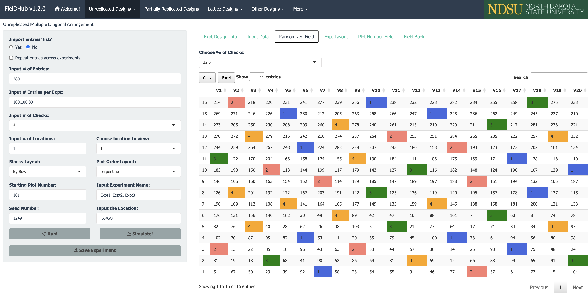
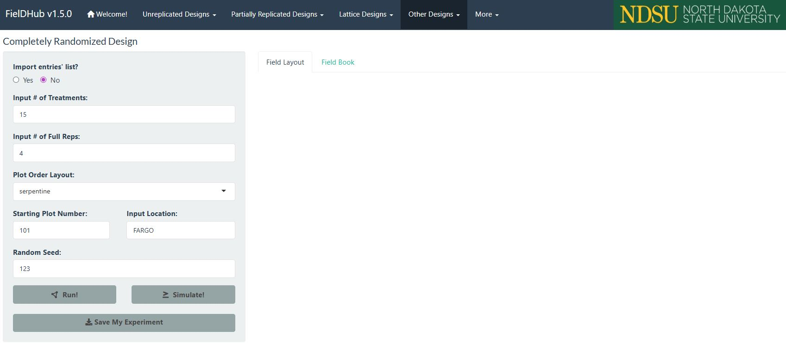
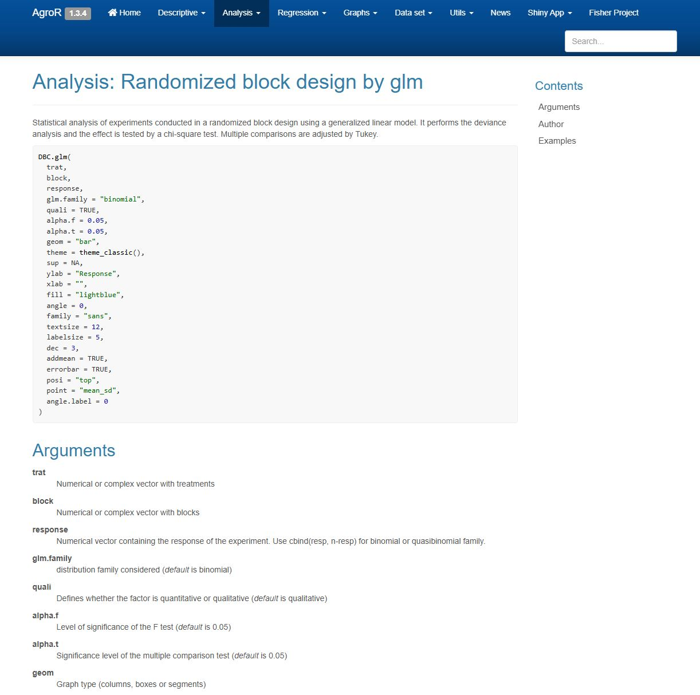
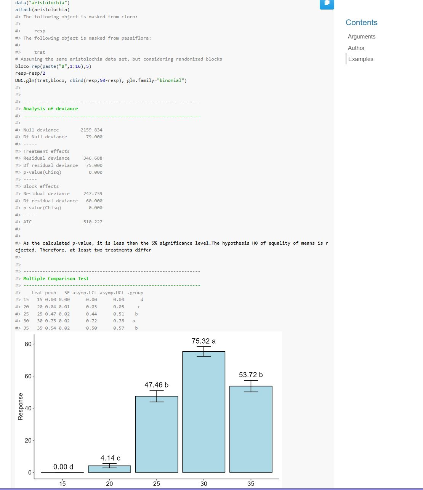
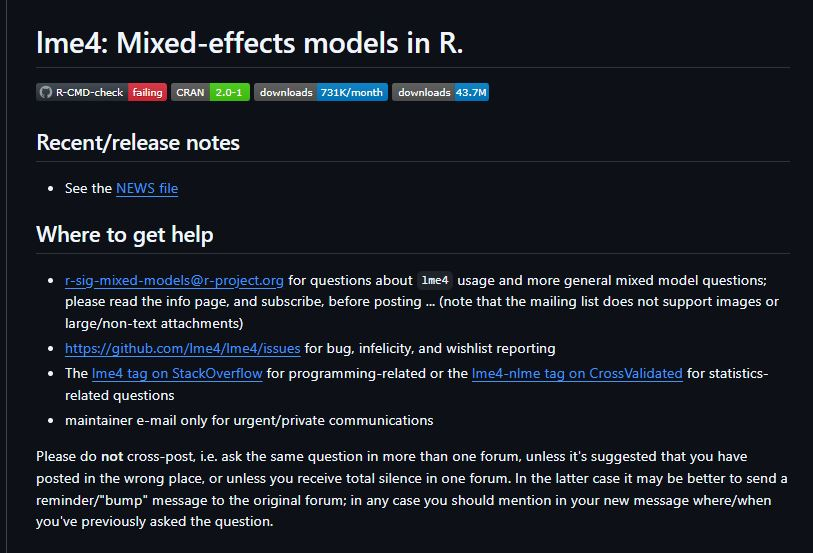
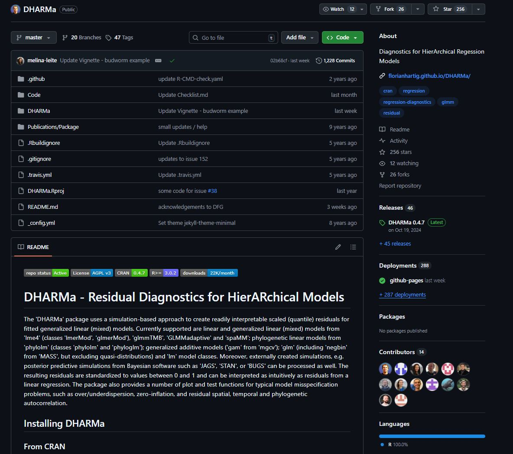
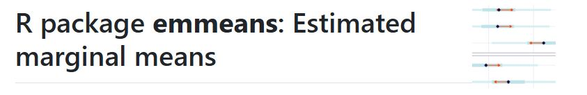
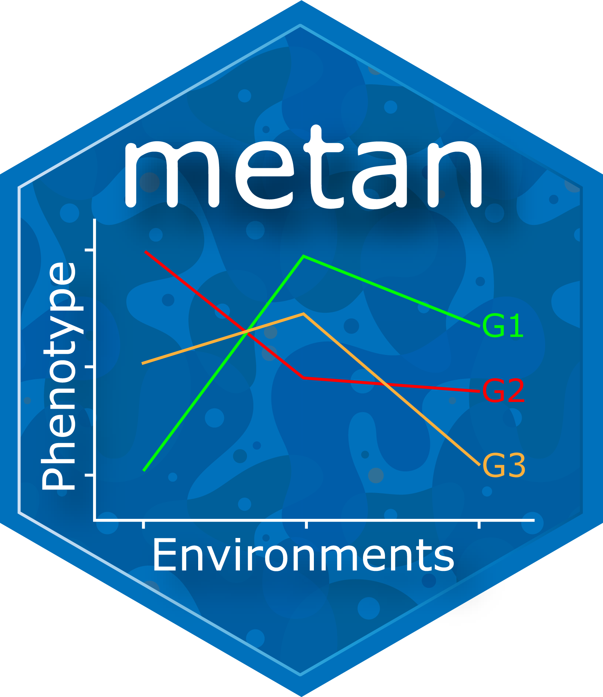

## Acompanhe o Café com R

{fig-align="center" style="border: 3px solid #6B4F4F; border-radius: 12px; padding: 6px;" width="422"}

## EM BREVE - NO YOUTUBE

{fig-align="center" width="568"}

**Inscreva-se já no [Link](https://www.youtube.com/@jennifercafecomr/featured).**

# Visão geral

## Os 14 pacotes desta aula

| Categoria                 | Pacotes                                     |
|---------------------------|---------------------------------------------|
| Planejamento experimental | `FielDHub`                                  |
| Análise clássica          | `AgroR`, `ExpDes.pt`, `dsfair`, `agricolae` |
| Modelos mistos            | `lme4`, `nlme`                              |
| Diagnóstico e inferência  | `DHARMa`, `emmeans`, `multcomp`, `car`      |
| Ensaios multi-ambientais  | `metan`                                     |
| Ferramentas gerais        | `MASS`, `ggplot2`                           |

## Pipeline de análise

```         
Planejamento        Coleta         Análise
FielDHub       →   dados      →   AgroR / ExpDes.pt
                                  lme4 / nlme

Diagnóstico        Inferência     Comunicação
DHARMa         →   emmeans    →   ggplot2
car                multcomp       Quarto
```

## Guia rápido de seleção

| Situação                              | Pacote indicado        |
|---------------------------------------|------------------------|
| Planejar layout de campo              | `FielDHub`             |
| DIC ou DBC simples                    | `AgroR` ou `ExpDes.pt` |
| Fatorial com muitos níveis            | `ExpDes.pt`            |
| Efeitos aleatórios presentes          | `lme4`                 |
| Diagnóstico de resíduos               | `DHARMa`               |
| Médias ajustadas e contrastes         | `emmeans`              |
| Comparações múltiplas                 | `multcomp`             |
| Dados desbalanceados                  | `car`                  |
| Ensaios multi-ambientais              | `metan`                |
| Testes clássicos (Tukey, Scott-Knott) | `agricolae`            |

## Referências avançadas

-   Dois pacotes voltados para melhoramento genético e estruturas de covariância complexas são citados como referência:

-   **`ASReml-R`:** padrão da indústria para modelos mistos em melhoramento genético. Software pago com licença acadêmica disponível. Documentação em [vsni.co.uk](https://www.vsni.co.uk/software/asreml-r)

-   **`sommer`:** alternativa gratuita ao ASReml-R. Ajusta modelos mistos com estruturas de covariância para dados de melhoramento genético. Documentação em [CRAN sommer](https://cran.r-project.org/package=sommer)

# FielDHub

[{fig-align="center" width="332"}](https://didiermurillof.github.io/FielDHub/)

## O que é

-   **`FielDHub`** é um pacote com aplicativo Shiny interativo para geração de delineamentos experimentais.

-   Suporta delineamentos tradicionais e avançados com visualização do layout de campo.

{fig-align="center" width="593"}

## Funções principais

| Função                   | Descrição                             |
|--------------------------|---------------------------------------|
| `run_app()`              | Abre interface Shiny interativa       |
| `RCBD()`                 | Delineamento em blocos casualizados   |
| `CRD()`                  | Delineamento inteiramente casualizado |
| `partially_replicated()` | Delineamento p-rep                    |
| `diagonal_arrangement()` | Arranjo diagonal com testemunhas      |

**Documentação:** [didiermurillof.github.io/FielDHub](https://didiermurillof.github.io/FielDHub/)

``` r
install.packages("FielDHub") 
library(FielDHub)
```

## Exemplo mínimo - rodando app Shiny

{fig-align="center" width="643"}

::: callout-tip
**Run the Shiny Application**

**library (FielDHub)**

**run_app ()**
:::

## Exemplo mínimo

``` r
library(FielDHub)

experimento <- RCBD(
  t           = 10,
  r           = 4,
  plotNumber  = 101,
  seed        = 2024)

head(experimento$fieldBook)
```

## Output

```         
  ID  PLOT REP TREATMENT
1  1   101   1        T6
2  2   102   1        T3
3  3   103   1        T9
```

``` r
plot(experimento)
```

::: callout-tip
O método `plot()` gera a visualização do layout de campo com numeração de parcelas e identificação dos tratamentos por cor.
:::

# AgroR

{fig-align="center"}

## O que é

-   **`AgroR`** é um pacote integrado para análise de experimentos agrícolas com funções para:

-   **DIC**, **DBC**, **DQL**, **fatoriais** e **parcelas subdivididas**, incluindo **testes de comparação de médias** e gráficos prontos para publicação.

**Documentação:** [agronomiar.github.io/AgroR_package](https://agronomiar.github.io/AgroR_package/)

``` r
install.packages("AgroR")
library(AgroR)
```

## Funções principais

| Função      | Descrição                             |
|-------------|---------------------------------------|
| `DIC()`     | Delineamento inteiramente casualizado |
| `DBC()`     | Delineamento em blocos casualizados   |
| `DQL()`     | Delineamento quadrado latino          |
| `FAT2DBC()` | Fatorial duplo em DBC                 |
| `PSUBDBC()` | Parcelas subdivididas em DBC          |

## Exemplo mínimo

``` r
library(AgroR)
data(corn)

with(corn,
  DBC(
    trat  = varieties,
    bloco = block,
    resp  = weight,
    mcomp = "tukey"))
```

## Exemplos completos no site

[{fig-align="center" width="462"}](https://agronomiar.github.io/AgroR_package/reference/DBC.glm.html)

## Output

```         
Análise de variância
CV(%): 8.42   QMresiduo: 12.34

Teste de Tukey (5%)
varieties  media  grupo
V3         62.4   a
V1         58.7   ab
V2         55.1   b
```

::: callout-tip
**O `AgroR` gera automaticamente o teste de normalidade de Shapiro-Wilk e o teste de homogeneidade de Bartlett antes da ANOVA.**
:::

## Output

{fig-align="center" width="481"}

# ExpDes.pt

## O que é

-   **`ExpDes.pt`** é um pacote com interface completamente em português para análise de DIC, DBC, DQL e experimentos fatoriais com até quatro fatores, incluindo análise de regressão para fatores quantitativos.

**Documentação:** [CRAN ExpDes.pt](https://cran.r-project.org/package=ExpDes.pt)

``` r
install.packages("ExpDes.pt")
library(ExpDes.pt)
```

## Funções principais

| Função        | Descrição                    |
|---------------|------------------------------|
| `dic()`       | DIC com testes de médias     |
| `dbc()`       | DBC com testes de médias     |
| `fat2.dbc()`  | Fatorial duplo em DBC        |
| `fat3.dbc()`  | Fatorial triplo em DBC       |
| `psub2.dbc()` | Parcelas subdivididas em DBC |

## Exemplo mínimo

``` r
library(ExpDes.pt)

with(dados,
  dbc(
    trat  = tratamento,
    bloco = bloco,
    resp  = producao,
    quali = TRUE,
    mcomp = "tukey"))
```

## Output

```         
Quadro da análise de variância
CV(%): 9.21

Teste de Tukey a 5% de probabilidade
Tratamentos com médias seguidas de mesma letra não diferem entre si.
```

::: callout-tip
**O `ExpDes.pt` é especialmente indicado para quem está aprendendo análise de experimentos, pois todas as saídas são em português e o código é direto.**
:::

# dsfair

{fig-align="center" width="396"}

## O que é

-   **`dsfair`** não é um pacote no sentido tradicional.

-   É um portal de tutoriais estruturados para análise de dados experimentais usando `lme4`, `emmeans` e `multcomp` com boas práticas estatísticas e código reprodutível.

**Documentação:** [schmidtpaul.github.io/dsfair_quarto](https://schmidtpaul.github.io/dsfair_quarto/)

::: callout-tip
**O `dsfair` é um recurso de referência para quem quer aprender a estrutura correta de análise com modelos mistos, com exemplos reais e código limpo para cada tipo de experimento.**
:::

## Abordagem do dsfair

**A metodologia do dsfair segue o pipeline:**

1.  Ajuste do modelo com `lme4`
2.  Verificação dos pressupostos com gráficos de resíduos
3.  Médias marginais com `emmeans`
4.  Comparações com `multcomp`
5.  Visualização com `ggplot2`

``` r
library(lme4)
library(emmeans)
library(multcomp)

modelo  <- lmer(producao ~ tratamento + (1|bloco), data = dados)
medias  <- emmeans(modelo, ~ tratamento)
cld(medias, Letters = letters)
```

# agricolae

## O que é

-   **`agricolae`** é um pacote clássico em agronomia com funções para testes de comparação de médias, análise de estabilidade, análise de trilha e planejamento de experimentos. Muito citado em artigos brasileiros da área.

**Documentação:** [CRAN agricolae](https://cran.r-project.org/package=agricolae)

``` r
install.packages("agricolae")
library(agricolae)
```

## Funções principais

| Função            | Descrição                                     |
|-------------------|-----------------------------------------------|
| `HSD.test()`      | Teste de Tukey (HSD)                          |
| `duncan.test()`   | Teste de Duncan                               |
| `SNK.test()`      | Teste de Student-Newman-Keuls                 |
| `LSD.test()`      | Teste de Fisher (LSD)                         |
| `kruskal()`       | Teste não paramétrico de Kruskal-Wallis       |
| `stability.par()` | Análise de estabilidade de Eberhart e Russell |

## Exemplo mínimo

``` r
library(agricolae)

modelo <- aov(producao ~ tratamento + bloco, data = dados)

tukey <- HSD.test(
  y       = modelo,
  trt     = "tratamento",
  group   = TRUE,
  console = TRUE)
```

## Output

```         
Grupos de Tukey (5%)
tratamento  média   grupo
dose_alta   3650    a
dose_media  3520    ab
dose_baixa  3350    b
controle    3200    c
```

::: callout-tip
**O `agricolae` também calcula o teste de Scott-Knott via o pacote `ScottKnott`, muito utilizado no Brasil para agrupamento de médias em grandes experimentos.**
:::

# lme4

[{fig-align="center" width="565"}](https://github.com/lme4/lme4/?tab=readme-ov-file)

## O que é

-   **`lme4`** é o pacote de referência para ajuste de modelos lineares mistos e modelos lineares mistos generalizados em R.

-   Suporta estruturas hierárquicas, medidas repetidas e dados desbalanceados.

**Documentação:** [CRAN lme4](https://cran.r-project.org/package=lme4)

``` r
install.packages("lme4")
library(lme4)
```

## Funções principais

| Função      | Descrição                               |
|-------------|-----------------------------------------|
| `lmer()`    | Modelo linear misto (LMM)               |
| `glmer()`   | Modelo linear misto generalizado (GLMM) |
| `fixef()`   | Extrai efeitos fixos                    |
| `ranef()`   | Extrai efeitos aleatórios               |
| `VarCorr()` | Componentes de variância                |

## Sintaxe de efeitos aleatórios

| Sintaxe                | Significado                        |
|------------------------|------------------------------------|
| **`(1\|bloco)`**       | Intercepto aleatório por bloco     |
| **`(1\|local/bloco)`** | Bloco aninhado em local            |
| **`(tempo\|parcela)`** | Inclinação e intercepto aleatórios |

## Exemplo mínimo

``` r
library(lme4)

modelo <- lmer(
  producao ~ tratamento + (1|bloco),
  data = dados)

summary(modelo)
fixef(modelo)
```

## Output

```         
Fixed effects:
              Estimate Std. Error
(Intercept)    3200.4      45.2
tratamentodose_baixa  150.3    38.1

Random effects:
 Groups   Variance Std.Dev.
 bloco     812.4    28.5
```

::: callout-important
**No `lme4`, efeitos fixos são os preditores de interesse direto (tratamento, dose, tempo). Efeitos aleatórios são fontes de variação amostradas de uma população maior (bloco, localidade, ano).**
:::

# nlme

## O que é

-   **`nlme`** é um pacote para modelos lineares mistos com suporte a estruturas de correlação serial e modelagem de heterocedasticidade.

-   Indicado quando há medidas repetidas com correlação no tempo ou espaço.

**Documentação:** [CRAN nlme](https://cran.r-project.org/package=nlme)

``` r
install.packages("nlme")
library(nlme)
```

## Funções principais

| Função        | Descrição                              |
|---------------|----------------------------------------|
| `lme()`       | Modelo linear misto                    |
| `corAR1()`    | Estrutura de correlação AR(1)          |
| `corExp()`    | Correlação exponencial espacial        |
| `varIdent()`  | Variância heterogênea por grupo        |
| `intervals()` | Intervalos de confiança dos parâmetros |

## Exemplo mínimo

``` r
library(nlme)

modelo <- lme(
  altura ~ dias + tratamento,
  random      = ~1|planta,
  correlation = corAR1(form = ~dias|planta),
  data        = dados_crescimento)

summary(modelo)
```

## Output

```         
Correlation structure: AR(1)
Parameter estimate: 0.73

Fixed effects: altura ~ dias + tratamento
              Value  Std.Error
(Intercept)   12.4     0.84
dias           0.38    0.02
```

## lme4 x nlme: quando usar cada um

| Situação                           | Pacote     |
|------------------------------------|------------|
| Estrutura hierárquica simples      | **`lme4`** |
| GLMM (Poisson, Binomial, Beta)     | **`lme4`** |
| Correlação serial no tempo         | **`nlme`** |
| Correlação espacial entre parcelas | **`nlme`** |
| Variância heterogênea entre grupos | **`nlme`** |
| Dados desbalanceados               | **`lme4`** |

# DHARMa

[{fig-align="center" width="492"}](https://github.com/florianhartig/DHARMa)

## O que é

-   **`DHARMa`** é um pacote para diagnóstico de resíduos em modelos hierárquicos (mistos) por simulação.

-   Gera resíduos quantílicos padronizados que devem seguir distribuição uniforme em \[0, 1\] quando o modelo está corretamente especificado.

**Documentação:** [florianhartig.github.io/DHARMa](http://florianhartig.github.io/DHARMa/)

``` r
install.packages("DHARMa")
library(DHARMa)
```

## Funções principais

| Função                         | Descrição                       |
|--------------------------------|---------------------------------|
| `simulateResiduals()`          | Simula resíduos do modelo       |
| `plot()`                       | QQ-plot e resíduos vs ajustados |
| `testDispersion()`             | Testa sobre e subdispersão      |
| `testZeroInflation()`          | Testa excesso de zeros          |
| `testSpatialAutocorrelation()` | Testa autocorrelação espacial   |

## Exemplo mínimo

``` r
library(DHARMa)
library(lme4)

modelo <- lmer(producao ~ tratamento + (1|bloco), data = dados)

simulacao <- simulateResiduals(modelo, n = 500)
plot(simulacao)
```

## Output

::: callout-tip
**O `plot()` gera dois painéis: o QQ-plot dos resíduos simulados (deve ter pontos próximos à diagonal) e o gráfico de resíduos versus valores ajustados (deve ser uniforme sem padrões). Desvios indicam má especificação do modelo.**
:::

``` r
testDispersion(simulacao)
```

```         
DHARMa nonparametric dispersion test
dispersion = 1.02, p-value = 0.84
```

::: callout-important
O `DHARMa` é compatível com `lme4`, `glmmTMB`, `glm` e outros modelos. É o método recomendado para diagnóstico de resíduos em GLMMs, pois resíduos brutos não seguem distribuição uniforme mesmo quando o modelo está correto.
:::

# emmeans

[{fig-align="center" width="566"}](https://rvlenth.github.io/emmeans/)

## O que é

-   **`emmeans`** calcula médias marginais estimadas (EMMs), também conhecidas como médias ajustadas ou médias dos mínimos quadrados, a partir de modelos ajustados.

-   Permite contrastes, comparações pareadas e intervalos de confiança.

**Documentação:** [rvlenth.github.io/emmeans](https://rvlenth.github.io/emmeans/)

``` r
install.packages("emmeans")
library(emmeans)
```

## Funções principais

| Função       | Descrição                          |
|--------------|------------------------------------|
| `emmeans()`  | Calcula médias marginais estimadas |
| `contrast()` | Define e testa contrastes          |
| `pairs()`    | Comparações pareadas entre médias  |
| `cld()`      | Agrupamento de médias com letras   |
| `plot()`     | Visualização das médias com IC     |

## Exemplo mínimo

``` r
library(emmeans)

modelo <- lmer(producao ~ tratamento + (1|bloco), data = dados)

medias <- emmeans(modelo, specs = ~ tratamento, type = "response")
print(medias)
```

## Output

```         
tratamento   emmean    SE  lower.CL  upper.CL
controle      3200    42     3117      3283
dose_baixa    3350    42     3267      3433
dose_media    3520    42     3437      3603
dose_alta     3650    42     3567      3733
```

``` r
pairs(medias, adjust = "tukey")
cld(medias, Letters = letters)
```

::: callout-tip
**As médias marginais do `emmeans` controlam os efeitos de bloco e covariáveis, sendo comparações mais precisas do que as médias brutas calculadas diretamente dos dados.**
:::

# multcomp

## O que é

-   **`multcomp`** realiza comparações múltiplas e testes simultâneos após ajuste de modelos lineares e mistos.

-   Controla o erro tipo I inflado quando múltiplas comparações são feitas ao mesmo tempo.

**Documentação:** [CRAN multcomp](https://cran.r-project.org/package=multcomp)

``` r
install.packages("multcomp")
library(multcomp)
```

## Funções principais

| Função      | Descrição                          |
|-------------|------------------------------------|
| `glht()`    | Hipóteses lineares gerais          |
| `mcp()`     | Define comparações múltiplas       |
| `summary()` | Resultados com p-valores ajustados |
| `confint()` | Intervalos de confiança ajustados  |
| `cld()`     | Agrupamento com letras             |

## Métodos de ajuste disponíveis

| Método         | Quando usar                                   |
|----------------|-----------------------------------------------|
| `"tukey"`      | Todas as comparações pareadas                 |
| `"dunnett"`    | Comparações somente contra o controle         |
| `"bonferroni"` | Conservador, qualquer conjunto de hipóteses   |
| `"holm"`       | Alternativa ao Bonferroni, menos conservadora |

## Exemplo mínimo

``` r
library(multcomp)

modelo <- lm(producao ~ tratamento + bloco, data = dados)

comparacoes <- glht(
  model  = modelo,
  linfct = mcp(tratamento = "Tukey"))

summary(comparacoes)
```

## Output

```         
Linear Hypotheses (Tukey):
                           Estimate p value
dose_baixa - controle       150.3   0.002 **
dose_media - controle       320.1  <0.001 ***
dose_alta - controle        450.2  <0.001 ***
dose_media - dose_baixa     169.8   0.001 **
```

::: callout-tip
**Use `cld(comparacoes, Letters = letters)` para obter o agrupamento de médias com letras para incluir em tabelas de resultados.**
:::

# car

## O que é

-   **`car`** (Companion to Applied Regression) fornece funções para ANOVA do tipo III, testes de hipóteses, diagnóstico de modelos e transformações.

-   É essencial quando os dados são desbalanceados e a ANOVA padrão produz resultados incorretos.

**Documentação:** [CRAN car](https://cran.r-project.org/package=car)

``` r
install.packages("car")
library(car)
```

## Funções principais

| Função             | Descrição                            |
|--------------------|--------------------------------------|
| `Anova()`          | ANOVA tipo II e III                  |
| `leveneTest()`     | Teste de homogeneidade de variâncias |
| `outlierTest()`    | Teste de Bonferroni para outliers    |
| `vif()`            | Fator de inflação da variância       |
| `powerTransform()` | Transformações Box-Cox generalizadas |

## Por que ANOVA tipo III

-   Em experimentos balanceados, os tipos I, II e III produzem o mesmo resultado.

-   Em dados desbalanceados (parcelas perdidas, observações faltantes), apenas o tipo III é correto pois testa cada efeito controlando todos os demais.

``` r
library(lme4)
library(car)

modelo <- lmer(producao ~ tratamento * tempo + (1|bloco), data = dados)
Anova(modelo, type = "III")
```

## Output

```         
Analysis of Deviance Table (Type III Wald chisquare tests)

                    Chisq Df Pr(>Chisq)
(Intercept)        845.2  1    <0.001 ***
tratamento          38.4  3    <0.001 ***
tempo               22.1  2    <0.001 ***
tratamento:tempo     8.3  6     0.216
```

::: callout-important
**Sempre use `Anova()` do pacote `car` com tipo III quando o experimento tiver dados desbalanceados. A função `anova()` do R base usa tipo I por padrão, o que produz resultados dependentes da ordem dos termos no modelo.**
:::

# metan

{fig-align="center" width="344"}

## O que é

-   **`metan`** é um pacote para análise de ensaios multi-ambientais com mais de 20 métodos de estabilidade, análise AMMI, GGE Biplot, seleção multi-característica e integração com `tidyverse`.

**Documentação:** [tiagoolivoto.github.io/metan](https://tiagoolivoto.github.io/metan/)

``` r
install.packages("metan")
library(metan)
```

## Funções principais

| Função            | Descrição                              |
|-------------------|----------------------------------------|
| `performs_ammi()` | Análise AMMI                           |
| `gge()`           | GGE Biplot                             |
| `waasb()`         | Estabilidade baseada em BLUP           |
| `ge_stats()`      | Múltiplos índices de estabilidade      |
| `mtsi()`          | Índice de seleção multi-característica |

## Exemplo mínimo: AMMI

``` r
library(metan)
data(data_ge)

ammi <- performs_ammi(
  data_ge,
  env  = ENV,
  gen  = GEN,
  rep  = REP,
  resp = GY)

plot(ammi, type = 1)
```

## Output AMMI

::: callout-tip
**O `type = 1` gera o biplot AMMI1 com a média dos genótipos no eixo x e o primeiro componente de interação (IPC1) no eixo y. Genótipos próximos ao eixo x têm comportamento mais estável.**
:::

## Exemplo mínimo: índices de estabilidade

``` r
estabilidade <- ge_stats(
  data_ge,
  env  = ENV,
  gen  = GEN,
  resp = GY)

print(estabilidade, which = "GY")
```

## Output ge_stats

```         
Genótipo   Wricke   Shukla   Lin_Binns
G1          8.42     6.31      12.4
G2          3.21     2.18       5.8
G3         15.67    11.23      22.1
```

::: callout-tip
**O `ge_stats()` calcula simultaneamente mais de 20 índices de estabilidade. Use `which` para especificar a variável quando o modelo tiver múltiplas respostas.**
:::

# MASS

## O que é

-   **`MASS`** (Modern Applied Statistics with S) é um pacote com ferramentas estatísticas gerais incluindo regressão robusta, seleção de modelos por AIC, transformações Box-Cox e GLMs com distribuição binomial negativa.

**Documentação:** [CRAN MASS](https://cran.r-project.org/package=MASS)

``` r
install.packages("MASS")
library(MASS)
```

## Funções principais

| Função      | Descrição                    |
|-------------|------------------------------|
| `stepAIC()` | Seleção de variáveis por AIC |
| `boxcox()`  | Transformação Box-Cox        |
| `rlm()`     | Regressão linear robusta     |
| `glm.nb()`  | GLM com binomial negativa    |
| `lda()`     | Análise discriminante linear |

## Exemplo mínimo: seleção de modelo

``` r
library(MASS)

modelo_cheio <- lm(
  producao ~ N + P + K + N:P + N:K + P:K,
  data = dados_adubacao)

modelo_final <- stepAIC(modelo_cheio, direction = "both")
summary(modelo_final)
```

## Output stepAIC

```         
Step: AIC = 284.3
producao ~ N + K + N:K

Coefficients:
            Estimate Std.Error
(Intercept)  3100.2     42.1
N              85.4     12.3
K              62.1     10.8
N:K            18.7      4.2
```

## Exemplo mínimo: Box-Cox

``` r
modelo <- lm(producao ~ tratamento, data = dados)
boxcox(modelo)
```

::: callout-tip
**O gráfico do `boxcox()` mostra o intervalo de confiança para o parâmetro lambda. Se o intervalo incluir lambda = 1, não é necessária transformação. Se incluir lambda = 0, use transformação logarítmica.**
:::

# ggplot2

{fig-align="center"}

## O que é

-   **`ggplot2`** é o pacote de visualização de dados do **tidyverse**.

-   Em experimentação agrícola, é usado para criar gráficos de barras com letras de comparação, boxplots por tratamento, gráficos de médias com intervalos de confiança e biplots.

**Documentação:** [ggplot2.tidyverse.org](https://ggplot2.tidyverse.org/)

``` r
install.packages("ggplot2")
library(ggplot2)
```

## Gráfico de médias com IC

``` r
library(ggplot2)
library(emmeans)

medias_df <- as.data.frame(
  emmeans(modelo, ~ tratamento, type = "response"))

ggplot(medias_df, aes(x = tratamento, y = emmean, fill = tratamento)) +
  geom_col(alpha = 0.85, width = 0.6) +
  geom_errorbar(aes(ymin = lower.CL, ymax = upper.CL),
                width = 0.2, linewidth = 0.7) +
  scale_fill_manual(values = c("#224573", "#6B4F4F", "#4A6FA5", "#E5D3B3")) +
  labs(x = "Tratamento", y = "Produtividade estimada (kg/ha)") +
  theme_classic(base_size = 13) +
  theme(legend.position = "none")
```

## Boxplot por tratamento

``` r
ggplot(dados, aes(x = tratamento, y = producao, fill = tratamento)) +
  geom_boxplot(alpha = 0.85, outlier.size = 1.5) +
  scale_fill_manual(values = c("#224573", "#6B4F4F", "#4A6FA5", "#E5D3B3")) +
  labs(x = "Tratamento", y = "Produtividade (kg/ha)") +
  theme_classic(base_size = 13) +
  theme(legend.position = "none",
        axis.text.x     = element_text(angle = 20, hjust = 1))
```

::: callout-tip
**Use sempre `theme_classic()` para gráficos de artigos científicos. O fundo branco sem grid facilita a leitura e atende aos padrões da maioria dos periódicos.**
:::

# Boas práticas

## Checklist pré-análise

Antes de rodar qualquer modelo, confirme:

-   Os dados estão organizados em formato tidy (uma linha por observação)
-   As variáveis categóricas estão como `factor` com níveis na ordem correta
-   Os efeitos fixos e aleatórios estão corretamente identificados
-   Não há valores ausentes não tratados
-   O delineamento experimental está claramente documentado

## Verificação dos pressupostos

``` r
library(DHARMa)
library(car)

# Diagnóstico de resíduos simulados (GLMM e LMM)
sim <- simulateResiduals(modelo, n = 500)
plot(sim)

# Homogeneidade de variâncias
leveneTest(producao ~ tratamento, data = dados)

# Normalidade dos resíduos (modelos lineares simples)
shapiro.test(residuals(modelo))
```

## Dados faltantes

-   Modelos mistos com `lme4` são robustos a dados desbalanceados e tratam dados faltantes de forma automática, diferente da ANOVA clássica que exige dados completos.

``` r
# lme4: roda normalmente com NA
modelo <- lmer(producao ~ tratamento + (1|bloco), data = dados)

# ANOVA clássica: precisa remover NA antes
dados_limpo <- na.omit(dados)
modelo_aov  <- aov(producao ~ tratamento + bloco, data = dados_limpo)
```

::: callout-important
**Nunca remova observações com dados faltantes sem justificativa. Documente sempre o motivo da ausência e avalie se o padrão de missing é aleatório ou sistemático antes de decidir como tratar.**
:::

## Fluxograma de decisão

```         
Efeitos aleatórios presentes?
|
|- NAO: Experimento simples?
|       |- SIM: AgroR ou ExpDes.pt
|       |- NAO: Fatorial complexo?
|               |- SIM: ExpDes.pt
|               |- NAO: lm() + car + multcomp
|
|- SIM: Multi-ambiental?
        |- SIM: metan
        |- NAO: lme4 + DHARMa + emmeans + multcomp
```

# Instalação

## Instalar todos os pacotes

``` r
pacotes <- c(
  "FielDHub",
  "AgroR",
  "ExpDes.pt",
  "agricolae",
  "lme4",
  "nlme",
  "DHARMa",
  "emmeans",
  "multcomp",
  "car",
  "metan",
  "MASS",
  "ggplot2")

install.packages(pacotes)
```

## Carregar os pacotes

``` r
library(FielDHub)
library(AgroR)
library(ExpDes.pt)
library(agricolae)
library(lme4)
library(nlme)
library(DHARMa)
library(emmeans)
library(multcomp)
library(car)
library(metan)
library(MASS)
library(ggplot2)
```

## Acompanhe o Café com R

{fig-align="center" style="border: 3px solid #6B4F4F; border-radius: 12px; padding: 6px;" width="422"}

## EM BREVE - NO YOUTUBE

{fig-align="center" width="568"}

**Inscreva-se já no [Link](https://www.youtube.com/@jennifercafecomr/featured).**
