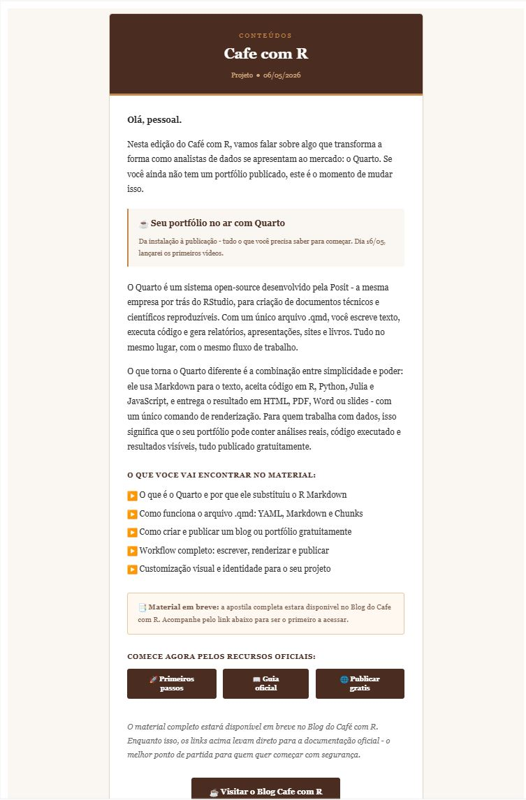

## Democratização

> Esta aula foi construída para que você possa automatizar o envio de relatórios e e-mails diretamente do R, integrando análise e comunicação em um único fluxo.

{fig-align="center" width="478"}

------------------------------------------------------------------------

## Acompanhe o Café com R

[{fig-align="center" style="border: 3px solid #6B4F4F; border-radius: 12px; padding: 6px;" width="417"}](https://jenniferlopes.quarto.pub/portifolio/)

## Projeto no Youtube - Lançamento dia 16/05

{fig-align="center"}

**Inscreva-se já no canal [Link](https://www.youtube.com/@jennifercafecomr/featured).**

------------------------------------------------------------------------

## Objetivos da aula

::: incremental
-   Compreender o que é o pacote **blastula** e por que ele é relevante
-   Instalar e configurar o ambiente de envio
-   Compor e-mails com Markdown, imagens e gráficos
-   Configurar credenciais SMTP com segurança
-   Enviar e-mails via SMTP e via RStudio Connect
-   Aplicar boas práticas e identificar erros comuns
:::

------------------------------------------------------------------------

## Eu uso bastante pessoal, esse é um exemplo

{fig-align="center"}

::: {style="text-align: center; padding-top: 180px;"}
# O pacote blastula
:::

------------------------------------------------------------------------

## O que é o blastula?

**blastula** é um pacote R desenvolvido pela Posit que permite compor e enviar e-mails HTML responsivos diretamente do R.

-   Criado por **Richard Iannone** e **Joe Cheng**
-   Disponível no CRAN desde 2019
-   Versão atual: **0.3.2**
-   Repositório: [github.com/rstudio/blastula](https://github.com/rstudio/blastula)
-   Documentação: [pkgs.rstudio.com/blastula](https://pkgs.rstudio.com/blastula)

------------------------------------------------------------------------

## blastula

[{fig-align="center" width="542"}](https://rstudio.github.io/blastula/)

------------------------------------------------------------------------

## Por que usar o blastula?

O envio de e-mails é um passo natural no final de um pipeline de análise. Com o blastula você elimina a necessidade de copiar resultados manualmente para um cliente de e-mail.

-   O e-mail é composto com **Markdown** e HTML dentro do R
-   Gráficos `ggplot2` são inseridos diretamente no corpo da mensagem
-   O HTML gerado é compatível com os principais clientes de e-mail
-   O envio pode ser automatizado com agendamento

------------------------------------------------------------------------

## Três formas de envio

| Método              | Quando usar                                         |
|---------------------|-----------------------------------------------------|
| **SMTP**            | Envio via servidor de e-mail próprio ou corporativo |
| **RStudio Connect** | Relatórios agendados com R Markdown                 |
| **Mailgun API**     | Envio em escala via serviço externo                 |

------------------------------------------------------------------------

## Estrutura do e-mail no blastula

Um e-mail composto com blastula tem três áreas de conteúdo:

-   **header:** cabeçalho, título ou identificação visual
-   **body:** corpo principal com texto, imagens e gráficos
-   **footer:** rodapé com informações de assinatura ou data

Cada área aceita **Markdown**, fragmentos HTML e objetos R.

## Etapas do fluxo no blastula

1.  **Instalar e carregar pacotes**

2.  **Configurar credencial SMTP**

3.  **Criar template com `compose_email()`**

4.  **Personalizar texto com `glue()`**

5.  **Visualizar o e-mail no Viewer**

6.  **Enviar com `smtp_send()`**

7.  **Testar com seu próprio e-mail**

8.  **Depois automatizar por lista ou agendamento**

------------------------------------------------------------------------

##  {background-color="#E5D3B3"}

::: {style="text-align: center; padding-top: 180px;"}
# Instalação e Configuração
:::

------------------------------------------------------------------------

## Instalação

``` r
# Instalar do CRAN (versão estável)
install.packages("blastula")

# Instalar a versão de desenvolvimento do GitHub
install.packages("devtools")
devtools::install_github("rstudio/blastula")
```

------------------------------------------------------------------------

## Pacotes complementares

``` r
# Pacotes utilizados nesta aula
library(blastula)
library(glue)       # interpolação de strings
library(ggplot2)    # geração de gráficos para inserção no e-mail
library(dplyr)      # manipulação de dados
```

`glue` é usado para interpolar variáveis R dentro do texto do e-mail. O blastula depende dele internamente para construir o conteúdo dinâmico.

------------------------------------------------------------------------

##  {background-color="#E5D3B3"}

::: {style="text-align: center; padding-top: 180px;"}
# Compondo o E-mail
:::

------------------------------------------------------------------------

## Função principal: compose_email()

A função `compose_email()` é o ponto central do blastula. Ela recebe o conteúdo das três áreas e retorna um objeto de e-mail que pode ser visualizado e enviado.

``` r
email <- compose_email(
  header = md("..."),
  body   = md("..."),
  footer = md("..."))
```

O argumento `md()` indica que o conteúdo será interpretado como Markdown.

------------------------------------------------------------------------

## Primeiro e-mail: código

``` r
library(blastula)
library(glue)

# Registro da data e hora atual no formato legível
data_envio <- add_readable_time()

# Composição do e-mail
email <- compose_email(
  body = md(glue(
    "Olá,

    Este é um e-mail enviado diretamente do R com o pacote **blastula**.

    Data de envio: {data_envio}.")),
  footer = md("Jennifer Lopes | Café com R"))
```

------------------------------------------------------------------------

## Visualizando antes de enviar

Após compor o e-mail, chame o objeto no console. O RStudio abre uma pré-visualização no painel **Viewer**.

``` r
# Visualizar o e-mail no painel Viewer do RStudio
email
```

Sempre visualize antes de enviar. Erros de formatação aparecem nessa etapa sem custo nenhum.

------------------------------------------------------------------------

## Inserindo imagens no corpo

``` r
# Caminho para a imagem local
caminho_imagem <- "graficos/resultado_mensal.png"

# Converter a imagem para string HTML incorporada
imagem_html <- add_image(file = caminho_imagem)

# Usar no corpo do e-mail
email <- compose_email(
  body = md(glue(
    "Segue o resultado da análise mensal:

    {imagem_html}
    "
  )))
```

`add_image()` converte a imagem para base64 e a incorpora diretamente no HTML do e-mail, dispensando hospedagem externa.

------------------------------------------------------------------------

## Inserindo gráficos ggplot2

``` r
library(ggplot2)

# Criar o gráfico
grafico <- ggplot(mtcars, aes(x = wt, y = mpg)) +
  geom_point(color = "#224573") +
  labs(
    title   = "Relação entre peso e consumo",
    x       = "Peso (1000 lbs)",
    y       = "Milhas por galão",
    caption = "Fonte: mtcars | Café com R") +
  theme_classic()
```

------------------------------------------------------------------------

## Inserindo gráficos ggplot2 no e-mail

``` r
# Converter o gráfico para string HTML incorporada
grafico_html <- add_ggplot(
  plot_object = grafico,
  width       = 6,
  height      = 4)

# Compor o e-mail com o gráfico
email <- compose_email(
  body = md(glue(
    "Segue a análise desta semana:

    {grafico_html}
    "
  )),
  footer = md(glue("Enviado em {add_readable_time()}.")))
```

------------------------------------------------------------------------

## add_readable_time()

`add_readable_time()` retorna a data e hora atual em formato legível para humanos. Útil para registrar quando o e-mail foi gerado.

``` r
# Exemplo de saída
add_readable_time()
# [1] "Friday, May 8, 2026 at 10:30 AM"
```

O formato pode ser ajustado com os argumentos `use_tz` e `locale` para adaptação ao contexto brasileiro.

------------------------------------------------------------------------

## Blocos de conteúdo: block_text() e block_spacer()

O blastula oferece funções para construir o corpo do e-mail em blocos estruturados:

``` r
email <- compose_email(
  body = blocks(
    block_text("Relatório semanal de análise de dados."),
    block_spacer(),
    block_text(
      md("Os resultados completos estão disponíveis no [portfólio](https://jenniferlopes.quarto.pub/portifolio)."))))
```

`blocks()` combina múltiplos blocos em sequência. `block_spacer()` insere espaçamento visual entre seções.

------------------------------------------------------------------------

##  {background-color="#E5D3B3"}

::: {style="text-align: center; padding-top: 180px;"}
# Configurando Credenciais SMTP
:::

------------------------------------------------------------------------

## O que é SMTP?

**SMTP** (Simple Mail Transfer Protocol) é o protocolo padrão para envio de e-mails. Para enviar pelo blastula via SMTP, você precisa:

-   Endereço do servidor SMTP
-   Porta de conexão (geralmente 465 ou 587)
-   E-mail e senha ou token de autenticação

O blastula oferece duas formas de armazenar essas credenciais com segurança.

------------------------------------------------------------------------

## Método 1: arquivo de credenciais

``` r
# Criar arquivo de credenciais (executar uma vez)
create_smtp_creds_file(
  file     = "credenciais_email",
  user     = "jennifer@exemplo.com",
  provider = "gmail")
```

O arquivo é criado na pasta do projeto. Nunca versione esse arquivo. Adicione ao `.gitignore`:

```         
credenciais_email
```

------------------------------------------------------------------------

## Método 2: chave no sistema operacional

``` r
# Armazenar credenciais no gerenciador de chaves do SO
create_smtp_creds_key(
  id       = "gmail_jeni",
  user     = "jennifer@exemplo.com",
  provider = "gmail")
```

Este método armazena as credenciais no sistema operacional (Keychain no macOS, Credential Manager no Windows), sem gravar nada em arquivo no projeto.

------------------------------------------------------------------------

## Provedores suportados

| Provedor          | Argumento `provider`          |
|-------------------|-------------------------------|
| Gmail             | `"gmail"`                     |
| Outlook / Hotmail | `"office365"`                 |
| SendGrid          | `"sendgrid"`                  |
| Personalizado     | omitir e usar `host` e `port` |

------------------------------------------------------------------------

## Configuração manual para servidor personalizado

``` r
create_smtp_creds_key(
  id       = "servidor_corporativo",
  user     = "usuario@empresa.com.br",
  host     = "smtp.empresa.com.br",
  port     = 587,
  use_ssl  = TRUE)
```

Use esta forma quando a empresa possui servidor SMTP próprio e o provedor não está na lista padrão.

------------------------------------------------------------------------

## Atenção: Gmail e autenticação em dois fatores

::: callout-important
O Gmail exige uma **senha de aplicativo** quando a autenticação em dois fatores está ativada. A senha da conta não funciona diretamente via SMTP.

Para gerar a senha de aplicativo: **Conta Google \> Segurança \> Senhas de app**.
:::

------------------------------------------------------------------------

##  {background-color="#E5D3B3"}

::: {style="text-align: center; padding-top: 180px;"}
# Enviando o E-mail
:::

------------------------------------------------------------------------

## smtp_send(): código

``` r
# Enviar com arquivo de credenciais
email |>
  smtp_send(
    to          = "destinatario@exemplo.com",
    from        = "jennifer@exemplo.com",
    subject     = "Relatório semanal - Café com R",
    credentials = creds_file("credenciais_email"))
```

------------------------------------------------------------------------

## smtp_send(): com chave do sistema

``` r
# Enviar com chave armazenada no sistema operacional
email |>
  smtp_send(
    to          = "destinatario@exemplo.com",
    from        = "jennifer@exemplo.com",
    subject     = "Relatório semanal - Café com R",
    credentials = creds_key("gmail_jeni"))
```

------------------------------------------------------------------------

## Enviando para múltiplos destinatários

``` r
email |>
  smtp_send(
    to          = c(
      "analista1@empresa.com",
      "analista2@empresa.com",
      "gestor@empresa.com"),
    from        = "jennifer@exemplo.com",
    subject     = "Relatório mensal de produtividade",
    credentials = creds_key("gmail_jeni"))
```

------------------------------------------------------------------------

##  {background-color="#E5D3B3"}

::: {style="text-align: center; padding-top: 180px;"}
# Automação com R Markdown e RStudio Connect
:::

------------------------------------------------------------------------

## blastula + R Markdown

O blastula se integra com R Markdown para enviar relatórios renderizados automaticamente via **RStudio Connect**.

O fluxo tem dois arquivos:

-   **Relatório principal (.Rmd):** executa a análise e define o e-mail a ser enviado
-   **Relatório de e-mail (.Rmd):** define o conteúdo e o layout do e-mail

------------------------------------------------------------------------

## Relatório de e-mail (.Rmd): YAML

``` yaml
---
title: "Relatório Semanal"
output: blastula::blastula_email
---
```

O output `blastula::blastula_email` instrui o R Markdown a gerar um objeto de e-mail em vez de um HTML convencional.

------------------------------------------------------------------------

## Relatório principal: código de envio

``` r
# No relatório principal (.Rmd), após a análise:
render_connect_email(
  input = "email_relatorio.Rmd") |>
  attach_connect_email(
    subject = "Relatório semanal - automático")
```

`render_connect_email()` renderiza o arquivo de e-mail. `attach_connect_email()` vincula o e-mail renderizado ao relatório principal para envio via RStudio Connect.

------------------------------------------------------------------------

## Automação com agendamento

No RStudio Connect, o relatório principal pode ser agendado para executar periodicamente:

-   Toda segunda-feira às 8h
-   No primeiro dia de cada mês
-   Após a conclusão de outro processo

Cada execução agendada gera e envia o e-mail automaticamente, sem intervenção manual.

------------------------------------------------------------------------

##  {background-color="#E5D3B3"}

::: {style="text-align: center; padding-top: 180px;"}
# Boas Práticas e Erros Comuns
:::

------------------------------------------------------------------------

## Boas práticas

-   **Nunca versione arquivos de credenciais.** Adicione ao `.gitignore` qualquer arquivo criado com `create_smtp_creds_file()`
-   **Use variáveis de ambiente** para armazenar senhas quando o projeto for colaborativo
-   **Visualize o e-mail antes de enviar** chamando o objeto no console
-   **Teste com envio para você mesmo** antes de enviar para a lista completa
-   **Documente o fluxo de envio** no README do projeto

------------------------------------------------------------------------

## Boas práticas: .Renviron para credenciais

``` r
# No arquivo .Renviron (nunca versionar):
EMAIL_SENHA=sua_senha_aqui

# No script R:
create_smtp_creds_key(
  id       = "gmail_jeni",
  user     = "jennifer@exemplo.com",
  password = Sys.getenv("EMAIL_SENHA"),
  provider = "gmail")
```

------------------------------------------------------------------------

## Erros comuns - Parte 1

| Erro | Causa | Solução |
|----|----|----|
| `Authentication failed` | Senha incorreta ou 2FA ativo | Usar senha de aplicativo no Gmail |
| `Connection refused` | Porta bloqueada pelo firewall | Verificar porta 465 ou 587 com TI |
| `SSL error` | Configuração de SSL incorreta | Ajustar `use_ssl = TRUE` ou `FALSE` |

------------------------------------------------------------------------

## Erros comuns - Parte 2

| Erro | Causa | Solução |
|----|----|----|
| Imagem não aparece | Caminho do arquivo incorreto | Usar `here::here()` para caminhos |
| E-mail na caixa de spam | Domínio sem SPF/DKIM configurado | Verificar configuração do domínio |
| Gráfico distorcido | Dimensões incorretas em `add_ggplot()` | Ajustar `width` e `height` |

------------------------------------------------------------------------

## Conexão com o mercado

O blastula é amplamente utilizado em contextos onde relatórios precisam ser distribuídos de forma recorrente e automatizada:

-   **Monitoramento de KPIs:** envio diário ou semanal de indicadores para gestores
-   **Alertas de anomalias:** e-mail disparado quando um indicador ultrapassa um limite
-   **Relatórios de modelos:** distribuição automática de resultados de modelos em produção
-   **Pipelines de dados:** notificação de conclusão ou falha em etapas do pipeline

------------------------------------------------------------------------

## Resumo das funções principais

| Função                     | O que faz                                      |
|----------------------------|------------------------------------------------|
| `compose_email()`          | Compõe o e-mail com body, header e footer      |
| `add_image()`              | Insere imagem local no corpo do e-mail         |
| `add_ggplot()`             | Insere gráfico ggplot2 no corpo do e-mail      |
| `add_readable_time()`      | Retorna data e hora formatada                  |
| `create_smtp_creds_file()` | Cria arquivo de credenciais SMTP               |
| `create_smtp_creds_key()`  | Armazena credenciais no sistema operacional    |
| `smtp_send()`              | Envia o e-mail via SMTP                        |
| `render_connect_email()`   | Renderiza e-mail a partir de R Markdown        |
| `attach_connect_email()`   | Vincula e-mail ao relatório no RStudio Connect |

------------------------------------------------------------------------

## Referências

-   Documentação oficial: [pkgs.rstudio.com/blastula](https://pkgs.rstudio.com/blastula)
-   Repositório GitHub: [github.com/rstudio/blastula](https://github.com/rstudio/blastula)
-   Artigo SMTP: [pkgs.rstudio.com/blastula/articles/sending_using_smtp.html](https://pkgs.rstudio.com/blastula/articles/sending_using_smtp.html)
-   Blog post Posit: [blog.rstudio.com/2019/12/05/emails-from-r-blastula-0-3](https://blog.rstudio.com/2019/12/05/emails-from-r-blastula-0-3/)
-   Exemplos com RStudio Connect: [solutions.rstudio.com/r/blastula](https://solutions.rstudio.com/r/blastula/)

------------------------------------------------------------------------

## Obrigada!

{fig-align="center" width="450"}

**Continue praticando e explorando!**

*Esta apresentação é parte do projeto Café com R. É open source. Use, compartilhe e adapte.*

------------------------------------------------------------------------

## Siga o Café com R

**Fique por dentro das aulas, conteúdos e newsletter.**

> -   Que cada gole desperte uma nova ideia.
>
> -   Que cada script abra uma nova conversa.
>
> -   Que o Café com R se torne um ponto de encontro nosso.

[{fig-align="center" style="border: 3px solid #6B4F4F; border-radius: 12px; padding: 6px;" width="296"}](https://jenniferlopes.quarto.pub/portifolio/)
