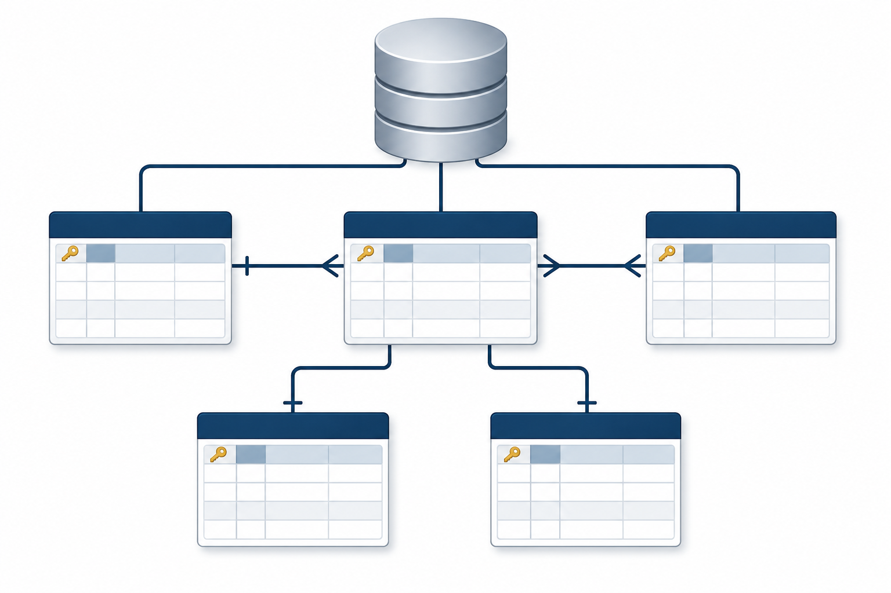

```{r}
#| label: setup
#| include: false

library(DBI)
library(dbplyr)
library(RSQLite)
library(tidyverse)
library(nycflights13)

cores_cafe <- c(
  azul_escuro = "#224573",
  marrom      = "#6B4F4F",
  azul_claro  = "#4A6FA5",
  bege        = "#E5D3B3")

tema <- theme_classic(base_size = 13) +
  theme(
    plot.title    = element_text(face = "bold", color = "#224573", size = 13),
    plot.subtitle = element_text(color = "#5A5A5A", size = 11),
    plot.caption  = element_text(color = "#888888", size = 9),
    legend.position = "bottom")
```

------------------------------------------------------------------------

## Democratização

> Esta aula foi construída para que você entenda como conectar o R a bancos de dados relacionais, consultar dados sem carregá-los na memória e gerar SQL automaticamente a partir do código dplyr que você já conhece.

{fig-align="center" width="393"}

------------------------------------------------------------------------

## Acompanhe o Café com R

SITE OFICIAL\> <https://jenniferlopes.github.io/meu_site/>

------------------------------------------------------------------------

## Aulas do Café com R para apoio

**Aula 5. Do SQL para o R com dbplyr - [Link](https://jenniferlopes.github.io/meu_site/apresenta%C3%A7%C3%B5es/posts/sql.html#/title-slide)**

**Aula 5.1. SQL x R (dbplyr) - cheat sheet com as funções** - [**Link**](https://jenniferlopes.github.io/meu_site/apresenta%C3%A7%C3%B5es/posts/sql_comandos.html#/title-slide)

**Aula 14. R e RStudio \| 14 integrações que você precisa conhecer - [Link](https://jenniferlopes.github.io/meu_site/apresenta%C3%A7%C3%B5es/posts/aula14_integracoes_r.html#/title-slide)**

## Objetivos da aula

::: incremental
- Compreender o que é um **banco de dados relacional** e quando usar
- Entender a diferença entre **OLTP e OLAP**
- Dominar o pacote **DBI**: a interface unificada do R para qualquer banco
- Usar o pacote **dbplyr** para gerar SQL a partir do dplyr
- Criar e operar um banco **SQLite** localmente
- Conectar ao **PostgreSQL** com autenticação segura
- Aplicar **boas práticas** de segurança e organização de conexões
:::

------------------------------------------------------------------------

## Instalação

```{r}
#| eval: false

install.packages(c("DBI", "dbplyr", "RSQLite",
                   "RPostgres", "nycflights13", "pool"))
```

```{r}
#| eval: false

library(DBI)
library(dbplyr)
library(RSQLite)
library(tidyverse)
library(nycflights13)
```

------------------------------------------------------------------------

# Bloco 1

::: {style="text-align: center; padding-top: 160px;"}
## Fundamentos de Banco de Dados Relacional
:::

------------------------------------------------------------------------

## O que é um banco de dados relacional

Um **banco de dados relacional** é um sistema de armazenamento organizado em **tabelas**, estruturas com linhas e colunas, onde cada linha é um registro e cada coluna é um atributo.

O que torna esse banco **relacional** é a capacidade de **relacionar tabelas** entre si por meio de chaves. Uma tabela de voos se relaciona com uma tabela de aeroportos pela coluna `origin`.

## O que é um banco de dados relacional

- Uma tabela de pedidos se relaciona com uma tabela de clientes pela coluna `id_cliente`.

- Esse modelo foi proposto por **Edgar F. Codd** em 1970 e é a base de praticamente todos os bancos de dados empresariais até hoje.

{fig-align="center" width="421"}

------------------------------------------------------------------------

## Por que usar banco relacional em vez de CSV ou Parquet

| Situação | CSV/Parquet | Banco relacional |
|------------------------|------------------------|------------------------|
| Dados compartilhados entre múltiplos usuários | Conflitos de escrita | Controle de concorrência nativo |
| Atualizações frequentes em registros específicos | Reescrever o arquivo inteiro | `UPDATE` em uma linha |
| Integridade entre tabelas | Manual e frágil | Chaves estrangeiras e constraints |
| Consultas ad hoc por analistas | Requer R ou Python | SQL direto no banco |
| Auditoria e histórico de mudanças | Ausente | Transações e logs |

------------------------------------------------------------------------

## OLTP e OLAP

**Dois perfis distintos de banco de dados, com propósitos opostos:**

**OLTP, Online Transaction Processing:** otimizado para **escrever e atualizar** registros individuais com rapidez e segurança. Usado em sistemas operacionais: e-commerce, ERP, sistemas de saúde, aplicações web.

- **Exemplos: PostgreSQL, MySQL, Oracle, SQL Server.**

**OLAP, Online Analytical Processing:** otimizado para **ler e agregar** grandes volumes de dados. Usado em análise de dados, BI e data warehouse.

- **Exemplos: DuckDB, BigQuery, Redshift, Snowflake, ClickHouse.**

::: callout-tip
O R se conecta aos dois tipos com a mesma interface **`DBI`**. A diferença está no uso: você usa **OLTP** para buscar dados operacionais e **OLAP** para análise de grandes volumes.
:::

------------------------------------------------------------------------

## O que é SQL

**SQL** (**Structured Query Language**) é a linguagem padrão para comunicação com bancos de dados relacionais. Foi padronizada pela ISO e é compreendida por praticamente todos os bancos relacionais.

**As operações mais comuns:**

``` sql
-- Selecionar dados
SELECT origin, dest, arr_delay
FROM flights
WHERE month = 6 AND arr_delay > 0

-- Agregar
SELECT origin, AVG(arr_delay) AS atraso_medio
FROM flights
GROUP BY origin

-- Juntar tabelas
SELECT f.flight, a.name AS companhia
FROM flights f
LEFT JOIN airlines a ON f.carrier = a.carrier
```

- O `dbplyr` traduz código dplyr para SQL automaticamente. Você não precisa escrever SQL, mas entender SQL ajuda a depurar o que o **`dbplyr`** gera.

------------------------------------------------------------------------

## O que é o pacote DBI

**DBI** (**DataBase Interface**) é o pacote R que define uma **interface unificada** para comunicação com qualquer banco de dados relacional.

- Ele define as funções padrão, como `dbConnect()`, `dbDisconnect()`, `dbReadTable()`, `dbWriteTable()` e `dbExecute()`, mas **não implementa** a comunicação com nenhum banco específico.

## Cada banco tem seu próprio **driver**, um pacote separado que implementa a interface DBI para aquele banco:

| Banco           | Driver R               |
|-----------------|------------------------|
| SQLite          | `RSQLite`              |
| PostgreSQL      | `RPostgres`            |
| MySQL / MariaDB | `RMySQL` ou `RMariaDB` |
| SQL Server      | `odbc`                 |
| BigQuery        | `bigrquery`            |
| DuckDB          | `duckdb`               |

------------------------------------------------------------------------

## O que é o pacote dbplyr

**dbplyr** é um backend do `dplyr` que traduz operações dplyr para SQL e as executa diretamente no banco de dados.

**O que isso significa na prática:**

- Você escreve o mesmo código `dplyr` que usa para `data.frames`
- O `dbplyr` traduz para SQL e envia ao banco
- O banco executa a consulta e retorna apenas o resultado
- Os dados nunca saem do banco até você chamar `collect()`

Isso é **fundamental** para dados grandes: você pode agregar 100 milhões de linhas no banco e trazer para o R apenas uma tabela com 10 linhas de resultado.

------------------------------------------------------------------------

::: {style="text-align: center; padding-top: 160px;"}
# Bloco 2

## SQLite: Banco Local sem Servidor
:::

------------------------------------------------------------------------

## O que é o SQLite

**SQLite** é um banco de dados relacional **embutido**: não precisa de servidor, não requer configuração e armazena todo o banco em um único arquivo **`.sqlite`** no disco.

**Características:**

- Zero configuração: instala o pacote e já funciona
- Banco inteiro em um único arquivo, fácil de versionar, copiar e compartilhar
- Suporta SQL padrão completo
- Usado internamente por Firefox, Android, iOS e centenas de aplicações
- **Não é adequado** para múltiplos usuários escrevendo simultaneamente: para isso, PostgreSQL

::: callout-tip
SQLite é perfeito para projetos locais, prototipagem e compartilhamento de dados estruturados em um único arquivo. Para ambientes de produção com múltiplos usuários, use **PostgreSQL**.
:::

------------------------------------------------------------------------

## Código: criar e conectar a um banco SQLite

```{r}
#| label: sqlite-conectar-codigo
#| eval: false

library(DBI)
library(RSQLite)

# Criar um banco SQLite em disco
# Se o arquivo não existir, ele é criado automaticamente
con <- dbConnect(
  drv    = SQLite(),
  dbname = "dados_aula/voos.sqlite")

# Banco em memória, temporário, não persiste no disco
con_mem <- dbConnect(
  drv    = SQLite(),
  dbname = ":memory:")

# Verificar a conexão
con
```

------------------------------------------------------------------------

## Output: objeto de conexão

```{r}
#| label: sqlite-conectar-output
#| echo: false

con <- dbConnect(
  drv    = SQLite(),
  dbname = ":memory:")

con
```

> O objeto de conexão é uma referência ao banco. Todas as operações subsequentes usam esse objeto para se comunicar com o banco. A conexão deve ser sempre encerrada com **`dbDisconnect()`** ao final do trabalho.

------------------------------------------------------------------------

## Código: escrever tabelas no banco

```{r}
#| label: sqlite-escrever-codigo
#| eval: false

# Escrever múltiplas tabelas do nycflights13 no banco
dbWriteTable(con, "flights",  nycflights13::flights)
dbWriteTable(con, "airlines", nycflights13::airlines)
dbWriteTable(con, "airports", nycflights13::airports)
dbWriteTable(con, "planes",   nycflights13::planes)
dbWriteTable(con, "weather",  nycflights13::weather)

# Listar as tabelas disponíveis no banco
dbListTables(con)
```

------------------------------------------------------------------------

## Output: tabelas no banco

```{r}
#| label: sqlite-escrever-output
#| echo: false

dbWriteTable(con, "flights",  nycflights13::flights,  overwrite = TRUE)
dbWriteTable(con, "airlines", nycflights13::airlines, overwrite = TRUE)
dbWriteTable(con, "airports", nycflights13::airports, overwrite = TRUE)
dbWriteTable(con, "planes",   nycflights13::planes,   overwrite = TRUE)
dbWriteTable(con, "weather",  nycflights13::weather,  overwrite = TRUE)

dbListTables(con)
```

------------------------------------------------------------------------

## Código: inspecionar uma tabela

```{r}
#| label: sqlite-inspecionar-codigo
#| eval: false

# Listar as colunas de uma tabela
dbListFields(con, "flights")

# Ler as primeiras linhas diretamente
dbReadTable(con, "airlines")
```

------------------------------------------------------------------------

## Output: colunas da tabela flights

```{r}
#| label: sqlite-inspecionar-colunas
#| echo: false

tibble(colunas = dbListFields(con, "flights"))
```

------------------------------------------------------------------------

## Output: tabela airlines

```{r}
#| label: sqlite-inspecionar-airlines
#| echo: false

dbReadTable(con, "airlines") |>
  as_tibble()
```

------------------------------------------------------------------------

## Código: executar SQL diretamente

```{r}
#| label: sqlite-sql-codigo
#| eval: false

# dbGetQuery() executa SQL e retorna um data.frame
resultado_sql <- dbGetQuery(con, "
  SELECT origin,
         COUNT(*)          AS total_voos,
         AVG(arr_delay)    AS atraso_medio,
         AVG(dep_delay)    AS atraso_partida
  FROM   flights
  WHERE  arr_delay IS NOT NULL
  GROUP  BY origin
  ORDER  BY atraso_medio DESC")

resultado_sql
```

------------------------------------------------------------------------

## Output: consulta SQL direta

```{r}
#| label: sqlite-sql-output
#| echo: false

dbGetQuery(con, "
  SELECT origin,
         COUNT(*)          AS total_voos,
         AVG(arr_delay)    AS atraso_medio,
         AVG(dep_delay)    AS atraso_partida
  FROM   flights
  WHERE  arr_delay IS NOT NULL
  GROUP  BY origin
  ORDER  BY atraso_medio DESC") |>
  as_tibble() |>
  mutate(across(where(is.double), ~ round(.x, 3)))
```

------------------------------------------------------------------------

::: {style="text-align: center; padding-top: 160px;"}
# Bloco 3

## dbplyr: dplyr que Vira SQL
:::

------------------------------------------------------------------------

## tbl(): acessar uma tabela remota

**`tbl()`** cria uma referência a uma tabela no banco sem carregar os dados. O resultado é um objeto **`tbl_SQLiteConnection`**, uma tabela lazy que vive no banco, não na memória do R.

```{r}
#| label: tbl-codigo
#| eval: false

# Criar referência à tabela flights no banco
flights_db <- tbl(con, "flights")

# Inspecionar o objeto sem carregar os dados
flights_db
```

------------------------------------------------------------------------

## Output: objeto tbl remoto

```{r}
#| label: tbl-output
#| echo: false

flights_db <- tbl(con, "flights")
flights_db
```

- O **`??`** nas dimensões indica que o número exato de linhas não foi contado: o **`dbplyr`** evita **`COUNT(*)`** desnecessários. Os dados ainda estão no banco.

------------------------------------------------------------------------

## Código: pipeline dplyr sobre tabela remota

```{r}
#| label: dbplyr-pipeline-codigo
#| eval: false

# Todo esse pipeline é executado no banco, não no R
consulta <- flights_db |>
  filter(!is.na(arr_delay), month %in% c(6, 7, 8)) |>
  group_by(origin, month) |>
  summarise(
    total_voos    = n(),
    atraso_medio  = mean(arr_delay, na.rm = TRUE),
    prop_atrasado = mean(arr_delay > 0, na.rm = TRUE),
    .groups = "drop") |>
  arrange(month, desc(atraso_medio))

# Nenhum dado foi carregado ainda
consulta
```

------------------------------------------------------------------------

## Output: plano de execução lazy

```{r}
#| label: dbplyr-pipeline-output
#| echo: false

flights_db |>
  filter(!is.na(arr_delay), month %in% c(6, 7, 8)) |>
  group_by(origin, month) |>
  summarise(
    total_voos    = n(),
    atraso_medio  = mean(arr_delay, na.rm = TRUE),
    prop_atrasado = mean(arr_delay > 0, na.rm = TRUE),
    .groups = "drop") |>
  arrange(month, desc(atraso_medio))
```

- O **`dbplyr`** mostra a fonte (**`flights`**) e as operações registradas. A consulta ainda não foi enviada ao banco.

------------------------------------------------------------------------

## show_query(): ver o SQL gerado

```{r}
#| label: show-query-codigo
#| eval: false

# show_query() exibe o SQL que o dbplyr vai enviar ao banco
flights_db |>
  filter(!is.na(arr_delay), month %in% c(6, 7, 8)) |>
  group_by(origin, month) |>
  summarise(
    total_voos    = n(),
    atraso_medio  = mean(arr_delay, na.rm = TRUE),
    prop_atrasado = mean(arr_delay > 0, na.rm = TRUE),
    .groups = "drop") |>
  arrange(month, desc(atraso_medio)) |>
  show_query()
```

------------------------------------------------------------------------

## Output: SQL gerado pelo dbplyr

```{r}
#| label: show-query-output
#| echo: false

flights_db |>
  filter(!is.na(arr_delay), month %in% c(6, 7, 8)) |>
  group_by(origin, month) |>
  summarise(
    total_voos    = n(),
    atraso_medio  = mean(arr_delay, na.rm = TRUE),
    prop_atrasado = mean(arr_delay > 0, na.rm = TRUE),
    .groups = "drop") |>
  arrange(month, desc(atraso_medio)) |>
  show_query()
```

**`show_query()`** é uma ferramenta de aprendizado e depuração. Use para entender o SQL gerado, verificar se está correto e aprender SQL a partir do dplyr que você já conhece.

------------------------------------------------------------------------

## collect(): trazer o resultado para o R

```{r}
#| label: collect-codigo
#| eval: false

# collect() executa a consulta e traz os dados para o R
resultado <- flights_db |>
  filter(!is.na(arr_delay), month %in% c(6, 7, 8)) |>
  group_by(origin, month) |>
  summarise(
    total_voos    = n(),
    atraso_medio  = mean(arr_delay, na.rm = TRUE),
    .groups = "drop") |>
  arrange(month, desc(atraso_medio)) |>
  collect()

resultado
```

------------------------------------------------------------------------

## Output: dados no R após collect()

```{r}
#| label: collect-output
#| echo: false

flights_db |>
  filter(!is.na(arr_delay), month %in% c(6, 7, 8)) |>
  group_by(origin, month) |>
  summarise(
    total_voos   = n(),
    atraso_medio = mean(arr_delay, na.rm = TRUE),
    .groups      = "drop") |>
  arrange(month, desc(atraso_medio)) |>
  collect() |>
  mutate(atraso_medio = round(atraso_medio, 3))
```

------------------------------------------------------------------------

## Código: joins entre tabelas do banco

```{r}
#| label: join-codigo
#| eval: false

airlines_db <- tbl(con, "airlines")

# left_join é traduzido para LEFT JOIN em SQL
flights_db |>
  left_join(airlines_db, by = "carrier") |>
  filter(!is.na(arr_delay)) |>
  group_by(name) |>
  summarise(
    voos         = n(),
    atraso_medio = mean(arr_delay, na.rm = TRUE),
    .groups = "drop") |>
  arrange(desc(atraso_medio)) |>
  collect()
```

------------------------------------------------------------------------

## Output: join entre voos e companhias

```{r}
#| label: join-output
#| echo: false

airlines_db <- tbl(con, "airlines")

flights_db |>
  left_join(airlines_db, by = "carrier") |>
  filter(!is.na(arr_delay)) |>
  group_by(name) |>
  summarise(
    voos         = n(),
    atraso_medio = mean(arr_delay, na.rm = TRUE),
    .groups      = "drop") |>
  arrange(desc(atraso_medio)) |>
  collect() |>
  mutate(atraso_medio = round(atraso_medio, 3))
```

------------------------------------------------------------------------

## Código: visualização a partir de dados do banco

```{r}
#| label: grafico-codigo
#| eval: false

flights_db |>
  left_join(airlines_db, by = "carrier") |>
  filter(!is.na(arr_delay)) |>
  group_by(name) |>
  summarise(
    voos = n(),
    atraso_medio = mean(arr_delay, na.rm = TRUE),
    .groups = "drop") |>
  collect() |>
  mutate(name = str_remove(name, " Inc\\.| Co\\.| LLC| Airlines?")) |>
  ggplot(aes(x = reorder(name, atraso_medio),
             y = atraso_medio,
             fill = atraso_medio > 0)) +
  geom_col(width = 0.7, alpha = 0.9) +
  coord_flip() +
  scale_fill_manual(values = c(
    "TRUE"  = cores_cafe["marrom"],
    "FALSE" = cores_cafe["azul_claro"])) +
  labs(
    title = "Atraso médio de chegada por companhia aérea",
    subtitle = "Valores positivos = atraso, negativos = adiantamento",
    x = NULL,
    y = "Atraso médio (minutos)",
    caption = "Jennifer Lopes | Café com R") +
  tema +
  theme(legend.position = "none")
```

------------------------------------------------------------------------

## Gráfico: atraso por companhia aérea

```{r}
#| label: grafico-output
#| echo: false
#| fig-height: 4.5

flights_db |>
  left_join(airlines_db, by = "carrier") |>
  filter(!is.na(arr_delay)) |>
  group_by(name) |>
  summarise(
    voos = n(),
    atraso_medio = mean(arr_delay, na.rm = TRUE),
    .groups      = "drop") |>
  collect() |>
  mutate(name = str_remove(name, " Inc\\.| Co\\.| LLC| Airlines?")) |>
  ggplot(aes(x = reorder(name, atraso_medio),
             y = atraso_medio,
             fill = atraso_medio > 0)) +
  geom_col(width = 0.7, alpha = 0.9) +
  coord_flip() +
  scale_fill_manual(values = c(
    "TRUE"  = cores_cafe["marrom"],
    "FALSE" = cores_cafe["azul_claro"])) +
  labs(
    title = "Atraso médio de chegada por companhia aérea",
    subtitle = "Valores positivos = atraso, negativos = adiantamento",
    x = NULL,
    y = "Atraso médio (minutos)",
    caption = "Jennifer Lopes | Café com R") +
  tema +
  theme(legend.position = "none")
```

------------------------------------------------------------------------

::: {style="text-align: center; padding-top: 160px;"}
# Bloco 4

## Escrita, Atualização e Transações
:::

------------------------------------------------------------------------

## Operações de escrita no banco

```{r}
#| label: escrita-codigo
#| eval: false

# Criar uma tabela de resumo analítico no banco
resumo_mensal <- flights_db |>
  filter(!is.na(arr_delay)) |>
  group_by(month, origin) |>
  summarise(
    total_voos   = n(),
    atraso_medio = round(mean(arr_delay, na.rm = TRUE), 2),
    .groups = "drop") |>
  collect()

# Escrever o resumo de volta ao banco
dbWriteTable(
  conn      = con,
  name      = "resumo_mensal",
  value     = resumo_mensal,
  overwrite = TRUE)

dbListTables(con)
```

------------------------------------------------------------------------

## Output: nova tabela no banco

```{r}
#| label: escrita-output
#| echo: false

resumo_mensal <- flights_db |>
  filter(!is.na(arr_delay)) |>
  group_by(month, origin) |>
  summarise(
    total_voos = n(),
    atraso_medio = round(mean(arr_delay, na.rm = TRUE), 2),
    .groups = "drop") |>
  collect()

dbWriteTable(con, "resumo_mensal", resumo_mensal, 
             overwrite = TRUE)
dbListTables(con)
```

------------------------------------------------------------------------

## Código: dbExecute() para SQL de modificação

```{r}
#| label: execute-codigo
#| eval: false

# dbExecute() executa SQL que modifica dados: UPDATE, DELETE, INSERT
# Retorna o número de linhas afetadas

# Adicionar uma coluna calculada
dbExecute(con, "
  ALTER TABLE resumo_mensal
  ADD COLUMN categoria TEXT")

# Atualizar com base em condição
dbExecute(con, "
  UPDATE resumo_mensal
  SET    categoria = CASE
           WHEN atraso_medio > 15 THEN 'Alto'
           WHEN atraso_medio > 0  THEN 'Moderado'
           ELSE 'Baixo'
         END")

# Verificar o resultado
dbGetQuery(con, "SELECT * FROM resumo_mensal LIMIT 6")
```

------------------------------------------------------------------------

## Output: tabela após UPDATE

```{r}
#| label: execute-output
#| echo: false

dbExecute(con, "ALTER TABLE resumo_mensal ADD COLUMN categoria TEXT")
dbExecute(con, "
  UPDATE resumo_mensal
  SET    categoria = CASE
           WHEN atraso_medio > 15 THEN 'Alto'
           WHEN atraso_medio > 0  THEN 'Moderado'
           ELSE 'Baixo'
         END")

dbGetQuery(con, "SELECT * FROM resumo_mensal LIMIT 6") |>
  as_tibble()
```

------------------------------------------------------------------------

## Transações: garantindo integridade

- Uma **transação** é um conjunto de operações que deve ser executado de forma **atômica**: ou todas as operações são aplicadas, ou nenhuma é.

- Isso garante que o banco nunca fique em um estado inconsistente se algo falhar no meio do processo.

```{r}
#| label: transacao-codigo
#| eval: false

dbBegin(con)

tryCatch({
  dbExecute(con, "INSERT INTO resumo_mensal
                  VALUES (13, 'JFK', 0, 0, 'Baixo')")
  dbExecute(con, "UPDATE resumo_mensal
                  SET total_voos = total_voos + 1
                  WHERE month = 13")
  dbCommit(con)

}, error = function(e) {
  dbRollback(con)
  message("Transação desfeita: ", e$message)
})
```

------------------------------------------------------------------------

## Quando usar transações

::: callout-important
Use transações sempre que executar múltiplas operações de escrita que dependem umas das outras.

Exemplos que exigem transação:

- Inserir um pedido e atualizar o estoque simultaneamente
- Transferir valores entre duas contas bancárias
- Registrar uma entrada e criar o log correspondente

Se a segunda operação falhar sem transação, o banco fica em estado inconsistente. Com transação, o `dbRollback()` desfaz tudo automaticamente.
:::

------------------------------------------------------------------------

::: {style="text-align: center; padding-top: 160px;"}
# Bloco 5

## PostgreSQL e Autenticação Segura
:::

------------------------------------------------------------------------

## O que é o PostgreSQL

**PostgreSQL** é um banco de dados relacional de código aberto, considerado o banco relacional mais avançado disponível livremente. É o padrão em ambientes corporativos e acadêmicos quando se precisa de:

- Múltiplos usuários lendo e escrevendo simultaneamente
- Controle de acesso por usuário e esquema
- Tipos de dados avançados: JSON, arrays, geometria
- Alta disponibilidade e replicação
- Volume de dados de produção

**Diferente do SQLite, o PostgreSQL roda como um `servidor separado` que precisa estar ativo para receber conexões.**

------------------------------------------------------------------------

## Conectar ao PostgreSQL

```{r}
#| label: postgres-codigo
#| eval: false

library(RPostgres)

# NUNCA coloque senha diretamente no código
# Use variáveis de ambiente armazenadas no .Renviron

# No arquivo .Renviron (nunca versionar):
# PG_HOST=localhost
# PG_PORT=5432
# PG_DBNAME=meu_banco
# PG_USER=meu_usuario
# PG_PASSWORD=minha_senha

con_pg <- dbConnect(
  drv      = Postgres(),
  host     = Sys.getenv("PG_HOST"),
  port     = as.integer(Sys.getenv("PG_PORT")),
  dbname   = Sys.getenv("PG_DBNAME"),
  user     = Sys.getenv("PG_USER"),
  password = Sys.getenv("PG_PASSWORD"))

con_pg
```

------------------------------------------------------------------------

## Por que usar .Renviron para credenciais

::: callout-important
Nunca coloque senhas, tokens ou chaves de API diretamente no código R. Se o script for versionado no GitHub, as credenciais ficam expostas publicamente.

O arquivo `.Renviron` armazena variáveis de ambiente que o R carrega automaticamente ao iniciar. Ele deve estar no `.gitignore`.

``` r
# Criar ou abrir o .Renviron
usethis::edit_r_environ()

# Adicionar as credenciais
PG_HOST=localhost
PG_PASSWORD=minha_senha_segura

# Após salvar, reiniciar o R
# CTRL + SHIFT + F10
```
:::

------------------------------------------------------------------------

## O código dplyr não muda

A maior vantagem do `DBI` e do `dbplyr` é que **o código dplyr é idêntico** independente do banco:

```{r}
#| label: codigo-identico-codigo
#| eval: false

# Com SQLite
tbl(con, "flights") |>
  filter(month == 6) |>
  group_by(origin) |>
  summarise(n = n()) |>
  collect()

# Com PostgreSQL: exatamente o mesmo código
tbl(con_pg, "flights") |>
  filter(month == 6) |>
  group_by(origin) |>
  summarise(n = n()) |>
  collect()
```

**Apenas a string de conexão muda. Todo o pipeline de análise permanece o mesmo.**

------------------------------------------------------------------------

::: {style="text-align: center; padding-top: 160px;"}
# Bloco 6

## Boas Práticas e Padrões
:::

------------------------------------------------------------------------

## Sempre feche a conexão

```{r}
#| label: fechar-conexao-codigo
#| eval: false

# dbDisconnect() libera os recursos da conexão
dbDisconnect(con)

# Em scripts que podem falhar, use on.exit() para garantir
# que a conexão seja fechada mesmo em caso de erro
minha_funcao <- function() {
  con <- dbConnect(SQLite(), "banco.sqlite")
  on.exit(dbDisconnect(con), add = TRUE)

  resultado <- tbl(con, "flights") |>
    filter(month == 1) |>
    collect()

  resultado
}
```

::: callout-tip
**`on.exit()`** garante que **`dbDisconnect()`** será chamado quando a função terminar, mesmo que ocorra um erro. É o equivalente ao `finally` de outras linguagens.
:::

------------------------------------------------------------------------

## Pool de conexões com o pacote pool

Em aplicações Shiny ou scripts que abrem e fecham conexões frequentemente, o `pool` gerencia um conjunto de conexões reutilizáveis:

```{r}
#| label: pool-codigo
#| eval: false

library(pool)

pool_con <- dbPool(
  drv     = SQLite(),
  dbname  = "dados_aula/voos.sqlite",
  minSize = 1,
  maxSize = 5)

tbl(pool_con, "flights") |>
  filter(month == 1) |>
  count(origin) |>
  collect()

poolClose(pool_con)
```

------------------------------------------------------------------------

## Prevenindo injeção de SQL

**Injeção de SQL** ocorre quando um valor fornecido pelo usuário é inserido diretamente em uma query SQL, podendo alterar a lógica da consulta.

```{r}
#| label: sql-seguro-codigo
#| eval: false

# INSEGURO: valor do usuário concatenado diretamente
origem_usuario <- "JFK"
dbGetQuery(con, paste0(
  "SELECT * FROM flights WHERE origin = '", origem_usuario, "'"))

# SEGURO: usar parâmetros com ?
# O ? indica um parâmetro que será sanitizado automaticamente
dbGetQuery(
  con,
  "SELECT * FROM flights WHERE origin = ?",
  params = list(origem_usuario))
```

------------------------------------------------------------------------

## Funções que o dbplyr não traduz

**Algumas funções R não têm equivalente SQL e geram erro no modo lazy:**

```{r}
#| label: nao-suportado-codigo
#| eval: false

# Isso gera erro: median() não tem equivalente SQL padrão
tbl(con, "flights") |>
  group_by(origin) |>
  summarise(mediana = median(arr_delay)) |>
  collect()

# Solução: collect() antes da operação não suportada
tbl(con, "flights") |>
  filter(!is.na(arr_delay)) |>
  collect() |>
  group_by(origin) |>
  summarise(mediana = median(arr_delay))
```

::: callout-tip
Quando o **`dbplyr`** não consegue traduzir uma função, o erro indica `no translation available`. A solução quase sempre é **`collect()`** antes da operação não suportada.
:::

------------------------------------------------------------------------

## Resumo das funções principais

| Função           | O que faz                                           |
|------------------|-----------------------------------------------------|
| `dbConnect()`    | Abre a conexão com o banco                          |
| `dbDisconnect()` | Fecha a conexão                                     |
| `dbListTables()` | Lista tabelas disponíveis                           |
| `dbListFields()` | Lista colunas de uma tabela                         |
| `dbWriteTable()` | Escreve um data.frame no banco                      |
| `dbReadTable()`  | Lê uma tabela inteira para o R                      |
| `dbGetQuery()`   | Executa SQL e retorna data.frame                    |
| `dbExecute()`    | Executa SQL de modificação (UPDATE, INSERT, DELETE) |
| `tbl()`          | Cria referência lazy a uma tabela remota            |
| `show_query()`   | Exibe o SQL gerado pelo dbplyr                      |
| `collect()`      | Executa a consulta e traz o resultado para o R      |

------------------------------------------------------------------------

## Quando usar cada abordagem

| Situação                             | Abordagem                          |
|------------------------------------|------------------------------------|
| Análise exploratória em dados locais | CSV ou Parquet com `arrow`         |
| Dados compartilhados entre analistas | Banco relacional (PostgreSQL)      |
| Banco local sem servidor             | SQLite                             |
| Consultas repetidas em dados grandes | Banco relacional com índices       |
| Agregar antes de trazer para o R     | `tbl()` com dplyr e `collect()`    |
| Operações não suportadas pelo dbplyr | `collect()` com dplyr convencional |

------------------------------------------------------------------------

## Erros comuns: parte 1

| Situação | Causa | Solução |
|------------------------|------------------------|------------------------|
| `no translation available` | Função R sem equivalente SQL | `collect()` antes da função |
| `table not found` | Nome da tabela incorreto | Verificar com `dbListTables()` |
| `unable to open database` | Caminho do arquivo SQLite errado | Verificar com `file.exists()` |

------------------------------------------------------------------------

## Erros comuns: parte 2

| Situação | Causa | Solução |
|------------------------|------------------------|------------------------|
| Credenciais no código | Senha exposta no script | Usar `.Renviron` com `Sys.getenv()` |
| Conexão não fechada | `dbDisconnect()` esquecido | Usar `on.exit(dbDisconnect(con))` |
| Banco em estado inconsistente | Escrita sem transação falhou | Envolver operações em `dbBegin()` e `dbCommit()` |

------------------------------------------------------------------------

## Referências

- Documentação `DBI`: [dbi.r-dbi.org](https://dbi.r-dbi.org)
- Documentação `dbplyr`: [dbplyr.tidyverse.org](https://dbplyr.tidyverse.org)
- Documentação `RSQLite`: [rsqlite.r-dbi.org](https://rsqlite.r-dbi.org)
- Documentação `RPostgres`: [rpostgres.r-dbi.org](https://rpostgres.r-dbi.org)
- R for Data Science, Databases: [r4ds.hadley.nz/databases](https://r4ds.hadley.nz/databases)
- Pacote `pool`: [rstudio.github.io/pool](https://rstudio.github.io/pool)

------------------------------------------------------------------------

```{r}
#| label: encerrar
#| include: false

dbDisconnect(con)
```

------------------------------------------------------------------------

## Obrigada!

{fig-align="center" width="488"}

**Continue praticando e explorando.**

*Esta aula é parte do projeto Café com R. É open source. Use, compartilhe e adapte.*

------------------------------------------------------------------------

## Siga o Café com R

> - Que cada gole desperte uma nova ideia.
>
> - Que cada script abra uma nova conversa.
>
> - Que o Café com R se torne um ponto de encontro nosso.

SITE OFICIAL\> <https://jenniferlopes.github.io/meu_site/>
