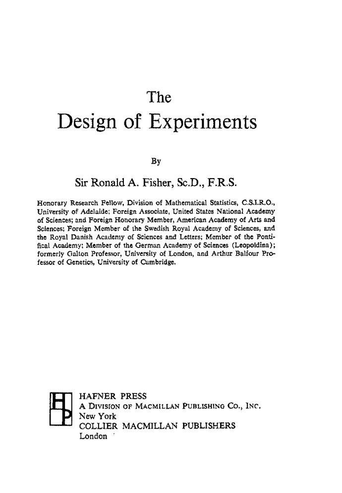

::: {style="background:#EFEBE9; border-left: 4px solid #A1887F; padding: 16px 20px; border-radius: 4px; margin-bottom: 24px;"}
-   *Que cada **gole** desperte uma nova ideia.*
-   *Que cada **script** abra uma nova conversa.*
-   *Que o **Café com R** se torne um ponto de encontro nosso.*
:::

 

## O gole da semana

 

**Pessoal, aqui no Café com R a senhora tomaria café. ksksksks, só porque eu gosto muito mesmo!!!**

Mas a história que quero contar começa com chá. E com uma mulher que insistia numa coisa que os cientistas ao redor dela achavam impossível de verificar.

> **Era uma tarde de verão em Cambridge, no final dos anos 1920. Uma mulher afirmou que conseguia distinguir o sabor do chá dependendo de como a mistura havia sido feita: se o leite fora colocado antes ou depois do chá na xícara.**

As cabeças científicas ao redor riram. Qual seria a diferença química? A mistura era a mesma.

Um homem de estatura baixa, magro, de óculos grossos e cavanhaque começando a ficar grisalho não riu. Disse: **vamos testar.**

> **Esse homem era Ronald Aylmer Fisher. E o que aconteceu naquela tarde mudou a forma como a ciência produz conhecimento.**

 

------------------------------------------------------------------------

## A resenha

 

### O livro

*Uma senhora toma chá* foi escrito por David Salsburg e publicado originalmente em inglês em 2001, com o título *The Lady Tasting Tea: How Statistics Revolutionized Science in the Twentieth Century*. A edição brasileira foi publicada pela Zahar em 2009.

**Salsburg não escreveu um manual de estatística. Escreveu uma história sobre as pessoas que construíram a estatística moderna ao longo do século XX**, os conflitos entre elas, as descobertas que fizeram, os contextos históricos em que viveram e trabalharam.

Ele era estatístico e trabalhou durante décadas na indústria farmacêutica. Conheceu pessoalmente muitos dos personagens que descreve. Esse acesso dá ao livro uma qualidade de memória viva que um texto puramente acadêmico não teria.

::: callout-note
O capítulo 1 começa exatamente onde o título promete: com uma senhora tomando chá. E termina com uma pergunta que todo analista de dados deveria carregar: **o experimento que estou desenhando consegue separar o que quero medir do que está no caminho?**

E agora?
:::

 

### A cena de Cambridge

Fisher tinha 30 e poucos anos naquela tarde. Ainda não era o SENHOR Ronald Fisher. Ainda não havia publicado ***The Design of Experiments***. Mas já era alguém que reconhecia uma pergunta genuína onde os outros viam apenas conversa de tarde.

A proposta que ele fez na hora era simples: preparar uma sequência de xícaras, algumas com o leite servido antes do chá, outras com o chá servido antes do leite, e apresentá-las à senhora sem que ela pudesse ver a ordem da preparação.

> **Entusiasmados, o grupo se envolveu. Em poucos minutos estavam preparando as xícaras. Fisher registrava as respostas sem comentários.**

Salsburg ouviu essa história no final dos anos 1960, contada por Hugh Smith, um dos presentes naquela tarde. Essa cadeia de transmissão, de Fisher para Smith, de Smith para Salsburg, de Salsburg para nós, diz algo sobre como o conhecimento científico se preserva: não apenas em artigos e livros, mas em histórias contadas por quem esteve lá.

Que incrível, né?

 

### A natureza cooperativa da ciência

**Salsburg usa essa cadeia para introduzir algo que atravessa todo o livro: a ciência não é feita por gênios isolados. É feita em conversa.**

Trabalhando na Pfizer, ele percebeu que poucas pesquisas científicas podem ser desenvolvidas por uma só pessoa. Os erros aparecem em todos os lugares: no modelo matemático que pode ser inadequado, na premissa incorreta sobre a situação, na derivação que tomou o ramo errado de uma equação, no cálculo simples que falhou.

Naquela tarde em Cambridge, a ciência funcionou exatamente assim. Fisher não trabalhou sozinho. O grupo participou, discutiu, preparou as xícaras, acompanhou o experimento.

> **A pergunta era da senhora. O método era de Fisher. O experimento era de todos.**

::: callout-tip
Pessoal, eu penso muito nisso quando trabalho com dados. A análise que não passou por outra pessoa tem um risco que a análise discutida não tem. Não porque a outra pessoa vá encontrar o erro sempre. Mas porque o ato de explicar o que você fez força uma clareza que o trabalho solitário não exige.
:::

 

### O desenho experimental

Em 1935, Fisher publicou ***The Design of Experiments*****.** No segundo capítulo, descreveu o experimento da senhora como problema hipotético e analisou os vários modos de planejá-lo.

{fig-align="center" width="409"}

**O problema que o experimento revelava era preciso:**

-   Se a senhora recebe uma única xícara, ela tem 50% de chance de acertar mesmo sem distinguir nada.
-   Se recebe duas xícaras preparadas de formas diferentes, pode acertar completamente ou errar completamente.

> **Quantas xícaras seriam necessárias?**
>
> **Em que ordem?**
>
> **Quais resultados indicariam que ela realmente distinguia, e não estava apenas acertando por acaso?**

**Essas perguntas não são sobre chá. São sobre como construir um teste que produza evidência, não apenas achismo.**

Fisher havia chegado a esse problema anos antes, em Rothamsted, a estação agrícola experimental onde trabalhou no início do século XX. Rothamsted acumulava dados de experimentos agrícolas havia quase noventa anos quando Fisher chegou. **E havia proplemas: nenhum resultado era conclusivo porque os experimentos não haviam sido desenhados para separar os efeitos que se queria medir dos efeitos que existiam no ambiente.**

::: callout-important
**Fisher examinou os índices de fertilidade que as estações usavam para corrigir os resultados.** Reduzidos à álgebra elementar, dois índices que os cientistas defendiam com vigor faziam exatamente a mesma correção. Em 1921, publicou um artigo demonstrando isso e encerrando mais de vinte anos de disputa científica com uma página de matemática.

Depois disso, examinou noventa anos de dados e concluiu que as diferenças de clima entre os anos eram muito maiores do que qualquer efeito dos fertilizantes testados. Os dois fatores estavam **confundidos**. Não havia forma de separá-los com aqueles dados.

**Noventa anos de experimentação representavam, nas palavras de Salsburg, um desperdício quase completo.**
:::

Foi esse diagnóstico que levou Fisher a pensar sistematicamente sobre o que é um experimento bem desenhado.

> **A senhora não era apenas a protagonista de uma anedota. Era a primeira instância documentada de um experimento randomizado controlado.**

 

### O que não estava nos dados de Mendel

Há um detalhe no capítulo que não passa despercebido a quem trabalha com dados.

No século XIX, os cientistas raramente publicavam os resultados completos de seus experimentos. Descreviam suas conclusões e selecionavam os dados que as ilustravam. **Gregor Mendel**, ao descrever seus experimentos com ervilhas, escreveu:

> *"Os primeiros dez membros de ambas as séries de experiências podem servir de ilustração."*

**Nos anos 1940, Fisher examinou esses dados ilustrativos de Mendel. E encontrou algo estranho: os dados eram bons demais para ser verdade.** Não apresentavam o grau de variação aleatória que teria ocorrido de fato num experimento. Mendel havia selecionado os dados que confirmavam a teoria, descartando os que não confirmavam.

::: callout-warning
Salsburg não desenvolve esse ponto no capítulo 1. Mas ele está lá, numa frase, como advertência:

**Dados que confirmam perfeitamente uma teoria merecem mais desconfiança, não menos.**

Pessoal, eu penso nessa frase toda vez que uma análise sai exatamente como eu esperava. Eu faço, refaço e essa frase faz muito sentido para mim.
:::

 

### O que aconteceu com a senhora

Fisher não descreveu o resultado do experimento naquela tarde de verão em Cambridge. *The Design of Experiments* trata a cena como problema hipotético e não menciona o desfecho.

**Mas Hugh Smith, que esteve lá, contou a Salsburg:**

> **Ela identificou com precisão cada uma das xícaras.**

A senhora estava certa. Os cientistas que riram estavam errados. E Fisher, que não riu, havia desenhado um experimento capaz de distinguir as duas possibilidades.

 

------------------------------------------------------------------------

## O que estou acompanhando

 

**Uma senhora toma chá - David Salsburg:** Para quem quer entender estatística através das pessoas que a construíram.

**The Design of Experiments - R.A. Fisher:** O livro original de 1935 onde Fisher formalizou o desenho experimental. Disponível gratuitamente em versões digitais para quem quiser ir à fonte: [archive.org](https://archive.org/details/in.ernet.dli.2015.502684)

 

------------------------------------------------------------------------

::: {style="background:#EFEBE9; border:1px solid #A1887F; padding:20px 24px; border-radius:4px; margin-top:32px; text-align:center;"}
**Próxima edição - 08 de junho**

Capítulo 2 - As distribuições assimétricas

O capítulo 2 conta a história de Francis Galton e Karl Pearson, dois homens que, a partir de uma pergunta aparentemente simples sobre a altura dos filhos de pais altos, construíram os fundamentos da estatística moderna...........................................................
:::

 

::: {style="background:#EFEBE9; border:1px solid #A1887F; padding:20px 24px; border-radius:4px; margin-top:16px; text-align:center;"}
**Gostou desta edição?**

Assine o Café com R e receba conteúdo de R, Estatística e Ciência de Dados toda semana.

[**Clique aqui**](https://cafecomr-conteudos.lovable.app/)
:::