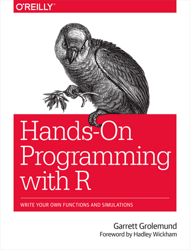

------------------------------------------------------------------------

> **Esta página reúne os recursos mais relevantes para quem deseja aprender R com base sólida. O conteúdo foi selecionado com critério técnico e está organizado por categoria para facilitar a navegação.**
>
> **`Ainda estou adicionando imagens aos poucos.`**

------------------------------------------------------------------------

# Por que aprender R?

R é uma linguagem **projetada para análise de dados**, criada para pessoas de diversas disciplinas, com uma comunidade global ativa e completamente gratuita.

| Característica | Detalhe |
|------------------------------------|------------------------------------|
| **Gratuito** | Linguagem de código aberto, sem custos de licença |
| **Reproduzível** | Todo o processo de análise fica registrado em código, auditável e reutilizável |
| **Ecossistema maduro** | Mais de 20.000 pacotes no CRAN para as mais diversas aplicações |
| **Comunidade ativa** | Conferências, grupos, fóruns e materiais em múltiplos idiomas |
| **Integração** | Conecta com Python, SQL, APIs, bancos de dados e sistemas de publicação |

::: callout-tip
## Planilhas não escalam. Código escala.

Excel é uma ferramenta legítima para exploração inicial. O problema é quando ele se torna o único instrumento de análise. Código é auditável, versionável, reutilizável e automatizável.
:::

------------------------------------------------------------------------

# Instalação: por onde começar

Três ferramentas formam a base obrigatória.

| Ferramenta | Descrição | Link |
|------------------------|------------------------|------------------------|
| **R** | Motor da linguagem. Deve ser instalado primeiro. | [cran.r-project.org](https://cran.r-project.org/) |
| **RStudio** | IDE mais popular para R. Interface completa com console, editor, ambiente e painel de plots. | [posit.co/download/rstudio-desktop](https://posit.co/download/rstudio-desktop/) |
| **Positron** | Nova IDE da Posit, com suporte nativo a R e Python. Alternativa moderna ao RStudio. | [posit.co/products/ide/positron](https://posit.co/products/ide/positron/) |
| **Quarto** | Sistema de publicação científica e técnica. Integra código, texto e resultados. | [quarto.org](https://quarto.org/) |

::: callout-note
## Ordem correta de instalação

Instale sempre nesta sequência: **R primeiro**, depois **RStudio ou Positron**, depois **Quarto**. O RStudio detecta automaticamente a versão do R instalada no sistema.
:::

::: callout-tip
## Alternativa sem instalação

Você pode usar R diretamente no navegador via [Posit Cloud](https://posit.cloud), sem instalar nada. É gratuito para uso básico e ideal para os primeiros experimentos.
:::

------------------------------------------------------------------------

# Trilha de Aprendizado

Esta trilha segue uma progressão técnica estruturada. Cada etapa prepara para a próxima.

## Fundamentos da Linguagem

Antes de trabalhar com dados, é necessário entender como R funciona como linguagem.

| Conceito | O que aprender | Onde consultar |
|------------------------|------------------------|------------------------|
| **Interface RStudio** | Painéis, console, editor, ambiente e atalhos | [Documentação RStudio](https://docs.posit.co/ide/user/) |
| **Projetos** | Como organizar o trabalho com projetos R | [R for Data Science - cap. 6](https://r4ds.hadley.nz/workflow-scripts.html) |
| **Operações básicas** | Tipos de dados, operações aritméticas e lógicas | [Hands-On Programming with R](https://rstudio-education.github.io/hopr/) |
| **Vetores** | Sequências de dados, o objeto fundamental do R | [Hands-On Programming with R - cap. 2](https://rstudio-education.github.io/hopr/basics.html) |
| **Funções** | Como funções recebem dados e retornam resultados | [R for Data Science - cap. 25](https://r4ds.hadley.nz/functions.html) |
| **Pipe** | Encadeamento de operações com `\|>` e `%>%` | [R for Data Science - cap. 4](https://r4ds.hadley.nz/workflow-style.html) |

``` r
# Conceitos fundamentais em R

# Atribuição de valores
x <- 10
y <- 25

# Vetor: sequência de dados
idades <- c(22, 35, 28, 41, 19)

# Função aplicada a um vetor
mean(idades)     # média
sum(idades)      # soma
length(idades)   # quantidade de elementos

# Pipe: encadeamento lógico de operações
idades |>
  mean() |>
  round(digits = 1)
```

------------------------------------------------------------------------

## Trabalhando com Dados

Manipulação de tabelas com o pacote `dplyr`, o principal verbo da análise de dados em R.

| Operação | Função | O que faz |
|------------------------|------------------------|------------------------|
| **Explorar** | `glimpse()`, `head()`, `summary()` | Inspeciona a estrutura e conteúdo da tabela |
| **Filtrar linhas** | `filter()` | Extrai subconjuntos de linhas por condição |
| **Selecionar colunas** | `select()` | Escolhe quais colunas manter ou remover |
| **Criar variáveis** | `mutate()` | Calcula novas colunas a partir das existentes |
| **Resumir** | `group_by()` + `summarise()` | Agrega dados por grupo |
| **Cruzar tabelas** | `left_join()` | Une duas tabelas por uma coluna em comum |
| **Pivotar** | `pivot_longer()` / `pivot_wider()` | Transforma entre formatos largo e longo |
| **Limpar** | `drop_na()`, `distinct()`, `rename()` | Remove duplicatas, ausentes e renomeia |

Documentações oficiais:

- [Documentação do dplyr](https://dplyr.tidyverse.org/)
- [Documentação do tidyr](https://tidyr.tidyverse.org/)
- [R for Data Science - Transformação de dados](https://r4ds.hadley.nz/data-transform.html)
- [R for Data Science - Joins](https://r4ds.hadley.nz/joins.html)
- [R for Data Science - Dados organizados](https://r4ds.hadley.nz/data-tidy.html)

------------------------------------------------------------------------

## Programação Básica

Etapa opcional mas recomendada. Funções, condicionais e loops permitem automatizar trabalho.

| Conceito | O que aprender | Onde consultar |
|------------------------|------------------------|------------------------|
| **Funções** | Como criar funções reutilizáveis | [R for Data Science - cap. 25](https://r4ds.hadley.nz/functions.html) |
| **Condicionais** | `if`, `else`, `ifelse()`, `case_when()` | [R for Data Science - cap. 25](https://r4ds.hadley.nz/functions.html) |
| **Loops** | `for`, `while` e alternativas com `purrr` | [R for Data Science - cap. 26](https://r4ds.hadley.nz/iteration.html) |

------------------------------------------------------------------------

## Visualização de Dados

`ggplot2` é a biblioteca de visualização mais expressiva e completa disponível em R.

| Recurso | Link |
|------------------------------------|------------------------------------|
| Documentação oficial do ggplot2 | [ggplot2.tidyverse.org](https://ggplot2.tidyverse.org/) |
| R for Data Science - Visualização | [r4ds.hadley.nz/data-visualize.html](https://r4ds.hadley.nz/data-visualize.html) |
| ggplot2: Elegant Graphics for Data Analysis | [ggplot2-book.org](https://ggplot2-book.org) |
| R Graphics Cookbook | [r-graphics.org](https://r-graphics.org) |
| Galeria de tipos de gráfico | [r-graph-gallery.com](https://r-graph-gallery.com) |
| Documentação do patchwork | [patchwork.data-imaginist.com](https://patchwork.data-imaginist.com/) |

------------------------------------------------------------------------

## Trilha resumida por etapas

| Etapa | Conteúdo | Material principal |
|------------------------|------------------------|------------------------|
| **1** | Instalação e interface do RStudio | [Documentação RStudio](https://docs.posit.co/ide/user/) |
| **2** | Tipos de dados, vetores e data frames | [Hands-On Programming with R](https://rstudio-education.github.io/hopr/) |
| **3** | Importação de arquivos CSV e Excel | [Documentação readr](https://readr.tidyverse.org/) |
| **4** | Manipulação com dplyr | [R for Data Science - cap. 3 a 5](https://r4ds.hadley.nz/data-transform.html) |
| **5** | Visualização com ggplot2 | [R for Data Science - cap. 9 a 11](https://r4ds.hadley.nz/data-visualize.html) |
| **6** | Organização de dados com tidyr | [R for Data Science - cap. 6](https://r4ds.hadley.nz/data-tidy.html) |
| **7** | Funções e programação funcional | [R for Data Science - cap. 25 a 27](https://r4ds.hadley.nz/functions.html) |
| **8** | Relatórios reproduzíveis com Quarto | [Documentação oficial do Quarto](https://quarto.org/docs/guide/) |
| **9** | Controle de versão com Git e GitHub | [Happy Git with R](https://happygitwithr.com/) |
| **10** | Modelagem com tidymodels | [Tidy Modeling with R](https://www.tmwr.org/) |

------------------------------------------------------------------------

# Livros e Documentações Oficiais

## Livros para começar

------------------------------------------------------------------------

### R para Ciência de Dados

**Autores:** Hadley Wickham, Mine Çetinkaya-Rundel e Garrett Grolemund

O livro central para aprender a usar R. Cobre toda a cadeia de análise: importação, transformação, visualização, modelagem e comunicação de resultados.

- Versão em inglês (2ª edição): [r4ds.hadley.nz](https://r4ds.hadley.nz/)

- Versão em espanhol traduzida pela comunidade: [es.r4ds.hadley.nz](https://es.r4ds.hadley.nz)

  {width="330"}

------------------------------------------------------------------------

### Hands-On Programming with R

**Autor:** Garrett Grolemund

Foco na base da linguagem: objetos, vetores, funções e estruturas de controle. Ideal para quem precisa entender o R antes de partir para o Tidyverse.

- Disponível gratuitamente: [rstudio-education.github.io/hopr](https://rstudio-education.github.io/hopr/)

  

------------------------------------------------------------------------

### Fundamentos de Ciência de Dados com R

Parte do básico e avança por temas como estatística, modelagem, dados espaciais e redes neurais.

- Disponível gratuitamente: [cdr-book.github.io](https://cdr-book.github.io)

------------------------------------------------------------------------

### Advanced R

**Autor:** Hadley Wickham

Para quem quer aprofundar o entendimento da linguagem: ambientes, metaprogramação, programação funcional e orientação a objetos. Não indicado para iniciantes.

- Disponível gratuitamente: [adv-r.hadley.nz](https://adv-r.hadley.nz/)

------------------------------------------------------------------------

### Tidy Modeling with R

**Autores:** Max Kuhn e Julia Silge

Introdução ao ecossistema `tidymodels` para modelagem estatística e machine learning em R.

- Disponível gratuitamente: [tmwr.org](https://www.tmwr.org/)
- 

------------------------------------------------------------------------

### Mastering Shiny

**Autor:** Hadley Wickham

Guia completo para desenvolver aplicações web interativas com R, do básico ao avançado.

- Disponível gratuitamente: [mastering-shiny.org](https://mastering-shiny.org)

------------------------------------------------------------------------

### The R Inferno

**Autor:** Patrick Burns

Livro sobre as dificuldades e curiosidades de R como linguagem de programação. Recomendado após dominar o básico.

- Disponível gratuitamente: [burns-stat.com/documents/books/the-r-inferno](https://www.burns-stat.com/documents/books/the-r-inferno/)

------------------------------------------------------------------------

### O Grande Livro de R - Big Book of R

**Organizador:** Oscar Baruffa

Repositório curado com mais de 300 livros gratuitos sobre R organizados por tema.

- Acesse em: [bigbookofr.com](https://www.bigbookofr.com/)

------------------------------------------------------------------------

## Livros de Visualização

| Livro | Descrição | Link |
|------------------------|------------------------|------------------------|
| **ggplot2: Elegant Graphics for Data Analysis** | Teoria da Grammar of Graphics que fundamenta o ggplot2 | [ggplot2-book.org](https://ggplot2-book.org) |
| **R Graphics Cookbook** | Mais de 150 receitas para criar gráficos com R | [r-graphics.org](https://r-graphics.org) |

------------------------------------------------------------------------

## Documentações e Fontes de Referência

| Recurso | Descrição | Link |
|------------------------|------------------------|------------------------|
| **CRAN** | Repositório oficial de pacotes R | [cran.r-project.org](https://cran.r-project.org/) |
| **CRAN Task Views** | Pacotes organizados por área temática | [cran.r-project.org/web/views](https://cran.r-project.org/web/views/) |
| **Tidyverse** | Documentação oficial do ecossistema | [tidyverse.org](https://www.tidyverse.org/) |
| **Posit Docs** | Documentação de produtos Posit | [docs.posit.co](https://docs.posit.co/) |
| **Quarto** | Documentação oficial do sistema de publicação | [quarto.org/docs](https://quarto.org/docs/guide/) |
| **R-bloggers** | Agrega posts técnicos de usuários de R | [r-bloggers.com](https://www.r-bloggers.com/) |
| **R Weekly** | Curadoria semanal de notícias e posts sobre R | [rweekly.org](https://rweekly.org) |
| **RWorks** | Curadoria de funcionalidades e pacotes de R | [rworks.dev](https://rworks.dev/) |

------------------------------------------------------------------------

# Pacotes Essenciais com Links

## Importação de Dados

| Pacote | Função principal | Documentação |
|------------------------|------------------------|------------------------|
| `readr` | Importação de CSV e arquivos de texto | [readr.tidyverse.org](https://readr.tidyverse.org/) |
| `readxl` | Importação de arquivos Excel | [readxl.tidyverse.org](https://readxl.tidyverse.org/) |
| `haven` | Importação de SPSS, Stata e SAS | [haven.tidyverse.org](https://haven.tidyverse.org/) |
| `httr2` | Requisições HTTP e consumo de APIs | [httr2.r-lib.org](https://httr2.r-lib.org/) |
| `jsonlite` | Leitura e escrita de JSON | [CRAN: jsonlite](https://cran.r-project.org/package=jsonlite) |

------------------------------------------------------------------------

## Manipulação de Dados

| Pacote | Função principal | Documentação |
|------------------------|------------------------|------------------------|
| `dplyr` | Manipulação de tabelas com verbos consistentes | [dplyr.tidyverse.org](https://dplyr.tidyverse.org/) |
| `tidyr` | Organização e pivotagem de dados | [tidyr.tidyverse.org](https://tidyr.tidyverse.org/) |
| `stringr` | Manipulação de texto e expressões regulares | [stringr.tidyverse.org](https://stringr.tidyverse.org/) |
| `lubridate` | Manipulação de datas e horários | [lubridate.tidyverse.org](https://lubridate.tidyverse.org/) |
| `forcats` | Manipulação de variáveis categóricas | [forcats.tidyverse.org](https://forcats.tidyverse.org/) |
| `purrr` | Programação funcional e iteração | [purrr.tidyverse.org](https://purrr.tidyverse.org/) |
| `janitor` | Limpeza de nomes e dados | [CRAN: janitor](https://cran.r-project.org/package=janitor) |
| `skimr` | Resumo estatístico rápido de data frames | [docs.ropensci.org/skimr](https://docs.ropensci.org/skimr/) |
| `data.table` | Manipulação de grandes volumes com alta performance | [rdatatable.gitlab.io/data.table](https://rdatatable.gitlab.io/data.table/) |
| `pointblank` | Validação e verificação da qualidade dos dados | [CRAN: pointblank](https://cran.r-project.org/package=pointblank) |

------------------------------------------------------------------------

## Visualização de Dados

| Pacote | Função principal | Documentação |
|------------------------|------------------------|------------------------|
| `ggplot2` | Visualização por camadas (Grammar of Graphics) | [ggplot2.tidyverse.org](https://ggplot2.tidyverse.org/) |
| `plotly` | Gráficos interativos a partir de ggplot2 | [plotly.com/r](https://plotly.com/r/) |
| `ggiraph` | Gráficos ggplot2 interativos com tooltips e cliques | [davidgohel.github.io/ggiraph](https://davidgohel.github.io/ggiraph/) |
| `patchwork` | Combinação de múltiplos gráficos ggplot2 | [patchwork.data-imaginist.com](https://patchwork.data-imaginist.com/) |
| `ggthemes` | Temas adicionais para ggplot2 | [CRAN: ggthemes](https://cran.r-project.org/package=ggthemes) |
| `gt` | Tabelas estáticas e formatadas para publicação | [gt.rstudio.com](https://gt.rstudio.com/) |
| `DT` | Tabelas interativas com filtros e busca | [rstudio.github.io/DT](https://rstudio.github.io/DT/) |
| `sf` | Dados espaciais e geográficos, mapas e operações geométricas | [r-spatial.github.io/sf](https://r-spatial.github.io/sf) |

------------------------------------------------------------------------

## Modelagem e Estatística

| Pacote | Função principal | Documentação |
|------------------------|------------------------|------------------------|
| `tidymodels` | Framework completo para machine learning tidy | [tidymodels.org](https://www.tidymodels.org/) |
| `broom` | Organiza resultados de modelos em tibbles | [broom.tidymodels.org](https://broom.tidymodels.org/) |
| `easystats` | Ecossistema para análise e comunicação de modelos | [easystats.github.io/easystats](https://easystats.github.io/easystats/) |
| `infer` | Inferência estatística com sintaxe tidy | [infer.tidymodels.org](https://infer.tidymodels.org/) |
| `lme4` | Modelos mistos e hierárquicos | [CRAN: lme4](https://cran.r-project.org/package=lme4) |
| `survival` | Análise de sobrevivência | [CRAN: survival](https://cran.r-project.org/package=survival) |

------------------------------------------------------------------------

## Publicação e Reprodutibilidade

| Pacote | Função principal | Documentação |
|------------------------|------------------------|------------------------|
| `rmarkdown` | Documentos reproduzíveis com código R | [rmarkdown.rstudio.com](https://rmarkdown.rstudio.com/) |
| `knitr` | Motor de execução de blocos de código | [yihui.org/knitr](https://yihui.org/knitr/) |
| `renv` | Controle de versão de pacotes por projeto | [rstudio.github.io/renv](https://rstudio.github.io/renv/) |
| `here` | Gerenciamento de caminhos relativos | [here.r-lib.org](https://here.r-lib.org/) |
| `usethis` | Automação de tarefas de criação de projetos | [usethis.r-lib.org](https://usethis.r-lib.org/) |

------------------------------------------------------------------------

## Aplicações e Dashboards

| Pacote | Função principal | Documentação |
|------------------------|------------------------|------------------------|
| `shiny` | Criação de aplicações web interativas com R | [shiny.posit.co](https://shiny.posit.co) |
| `bslib` | Temas modernos e componentes UI para Shiny | [rstudio.github.io/bslib](https://rstudio.github.io/bslib/) |
| `plumber` | Criação de APIs REST com R | [rplumber.io](https://www.rplumber.io/) |

------------------------------------------------------------------------

## Dados Brasileiros

| Pacote | Função principal | Documentação |
|------------------------|------------------------|------------------------|
| `sidrar` | Acesso direto a tabelas do SIDRA/IBGE | [CRAN: sidrar](https://cran.r-project.org/package=sidrar) |
| `basedosdados` | Acesso a dados públicos tratados | [basedosdados.org](https://basedosdados.org/) |
| `BETS` | Séries temporais do Banco Central | [CRAN: BETS](https://cran.r-project.org/package=BETS) |
| `electionsBR` | Dados eleitorais do TSE | [CRAN: electionsBR](https://cran.r-project.org/package=electionsBR) |
| `microdatasus` | Microdados do SUS (DATASUS) | [CRAN: microdatasus](https://cran.r-project.org/package=microdatasus) |

::: callout-note
## Como instalar pacotes em R

``` r
# Instalação de um pacote do CRAN
install.packages("dplyr")

# Instalação de múltiplos pacotes de uma vez
install.packages(c("tidyverse", "renv", "here"))

# Instalação via pacman (recomendado para projetos)
install.packages("pacman")
pacman::p_load(tidyverse, renv, here)
```
:::

------------------------------------------------------------------------

# Cheatsheets e Folhas de Referência

::: callout-tip
## Como usar cheatsheets

Use como material de consulta **durante** a prática, não como leitura linear. Mantenha abertas em uma segunda tela enquanto escreve código.
:::

Todas as cheatsheets oficiais estão disponíveis em: [posit.co/resources/cheatsheets](https://posit.co/resources/cheatsheets/)

| Cheatsheet         | Conteúdo                                           |
|--------------------|----------------------------------------------------|
| **Base R**         | Conceitos básicos para usar R na prática           |
| **RStudio IDE**    | Aspectos principais do ambiente de desenvolvimento |
| **dplyr**          | filter, select, mutate, group_by, summarise, joins |
| **ggplot2**        | geoms, aes, scales, themes, facets                 |
| **tidyr**          | pivot_longer, pivot_wider, unnest, separate        |
| **Importar dados** | CSV, Excel e Google Drive                          |
| **forcats**        | Variáveis categóricas                              |
| **stringr**        | Manipulação de texto e regex                       |
| **lubridate**      | Dados em formato data e hora                       |
| **purrr**          | map, map2, walk, imap, reduce                      |
| **R Markdown**     | YAML, chunks, código inline, formatos de saída     |
| **Quarto**         | Estrutura de documentos, chunks, YAML, formatos    |
| **Shiny**          | Desenvolvimento de aplicações web interativas      |
| **tidymodels**     | recipe, parsnip, workflow, tune                    |

------------------------------------------------------------------------

# Cursos Gratuitos

| Curso | Descrição | Nível | Link |
|------------------|------------------|------------------|------------------|
| **Café com R** | Aulas abertas em Quarto cobrindo R do básico ao avançado, com dados brasileiros | Básico a avançado | [Acessar](https://jenniferlopes.github.io/meu_site/) |
| **posit::conf(2025)** | Mais de 100 palestras e workshops da conferência anual da Posit | Intermediário a avançado | [Acessar](https://posit.co/blog/talks-and-workshops-from-posit-conf-2025/) |

## Aulas do Café com R

Todo o material é aberto, produzido em Quarto, com código reproduzível e disponível no GitHub.

| Aula | Tópico | Link |
|------------------------|------------------------|------------------------|
| Primeiros passos com R | Estruturas, objetos e operações fundamentais | [Acessar](https://jenniferlopes.github.io/meu_site/apresentações/posts/guia_inicial.html) |
| Funções em R | Como criar e usar funções reutilizáveis | [Acessar](https://jenniferlopes.github.io/meu_site/apresentações/posts/funções_jeni.html) |
| Manipulação de dados com dplyr | Verbos principais do Tidyverse | [Acessar](https://jenniferlopes.github.io/meu_site/apresentações/posts/manipulacao.html) |
| Atualizações do dplyr | Novidades da versão mais recente, incluindo `across()` | [Acessar](https://jenniferlopes.github.io/meu_site/apresentações/posts/dplyr_atualizacoes.html) |
| Visualização com ggplot2 | Grammar of Graphics na prática | [Acessar](https://jenniferlopes.github.io/meu_site/apresentações/posts/visualizacao.html) |
| Como fazer tabelas profissionais no R | gtsummary para tabelas descritivas e de regressão | [Acessar](https://jenniferlopes.github.io/meu_site/apresentações/posts/aula22_gtsummary.html) |
| Como limpar seus dados no R em 9 passos | Limpeza de dados com janitor | [Acessar](https://jenniferlopes.github.io/meu_site/apresentações/posts/aula21_janitor.html) |
| Tidy data e análise exploratória | Estrutura e exploração de dados | [Acessar](https://jenniferlopes.github.io/meu_site/apresentações/posts/apresentacao_tidy_eda.html) |
| Estatística com R | Descritiva e inferencial | [Acessar](https://jenniferlopes.github.io/meu_site/apresentações/posts/estatistica_basica.html) |
| Estatística Descritiva | Medidas de posição, dispersão e distribuição | [Acessar](https://jenniferlopes.github.io/meu_site/apresentações/posts/aula16_estatistica_descritiva.html) |
| SQL para R com dbplyr | Consultas SQL dentro do R | [Acessar](https://jenniferlopes.github.io/meu_site/apresentações/posts/sql.html) |
| SQL x R: comparativo de comandos | Equivalências entre SQL e dplyr | [Acessar](https://jenniferlopes.github.io/meu_site/apresentações/posts/sql_comandos.html) |
| Consumo de APIs RESTful no R | httr2 e autenticação | [Acessar](https://jenniferlopes.github.io/meu_site/apresentações/posts/api_R.html) |
| Tidymodels para regressão | Machine learning com sintaxe tidy | [Acessar](https://jenniferlopes.github.io/meu_site/apresentações/posts/tidymodels.html) |
| Documentação: Tidymodels para regressão | Material de referência complementar | [Acessar](https://jenniferlopes.github.io/meu_site/apresentações/posts/tidymodels_documentacao.html) |
| R e Python para iniciantes | Comparação e estratégia de aprendizado | [Acessar](https://jenniferlopes.github.io/meu_site/apresentações/posts/aula_r_python_iniciantes.html) |
| Integração R e Python com Reticulate | Combinando os dois mundos | [Acessar](https://jenniferlopes.github.io/meu_site/apresentações/posts/apresentacao_r_python.html) |
| 14 integrações do R e RStudio | Ferramentas e conexões do ecossistema | [Acessar](https://jenniferlopes.github.io/meu_site/apresentações/posts/aula14_integracoes_r.html) |
| Git e GitHub no RStudio | Controle de versão integrado | [Acessar](https://jenniferlopes.github.io/meu_site/apresentações/posts/aula15_git_github_rstudio.html) |
| GitHub Actions para projetos de dados | Automação de pipelines em R | [Acessar](https://jenniferlopes.github.io/meu_site/apresentações/posts/aula18_github_actions_para_dados_em_R.html) |
| Docker para pesquisadores e analistas | Reprodutibilidade com containers | [Acessar](https://jenniferlopes.github.io/meu_site/apresentações/posts/aula17_docker_para_dados_em_R.html) |
| Envio de e-mails com blastula | Automação de relatórios por e-mail | [Acessar](https://jenniferlopes.github.io/meu_site/apresentações/posts/aula20_blastula.html) |
| Pacotes R para Experimentação Agrícola | Análise de experimentos com R | [Acessar](https://jenniferlopes.github.io/meu_site/apresentações/posts/aula19_pacotes_experimentacao_agricola.html) |

## Newsletter Café com R

Edições com reflexões, tutoriais e novidades do universo R e da estatística.

| Edição | Tema | Link |
|------------------------|------------------------|------------------------|
| Dose 3 | Desmistificando o valor-p | [Acessar](https://jenniferlopes.github.io/meu_site/cafecomr/posts/25_11_dose3.html) |
| Dose 10 | O que colocar no lugar do p-valor: tamanho do efeito e IC | [Acessar](https://jenniferlopes.github.io/meu_site/cafecomr/posts/dose10_2505.html) |
| Resenha | Quando a ciência aprende a perguntar | [Acessar](https://jenniferlopes.github.io/meu_site/cafecomr/posts/18_11-resenhalivro.html) |
| Tutorial | Como automatizei minha newsletter do zero (n8n + Google Sheets + Gmail) | [Acessar](https://jenniferlopes.github.io/meu_site/cafecomr/posts/09_03_tutorial_newsletter_automacao.html) |
| Dose 6 | Boas práticas em projetos de R | [Acessar](https://jenniferlopes.github.io/meu_site/cafecomr/posts/06_01_dose6.html) |
| Dose 9 | across() no dplyr: quando você para de escrever código e começa a pensar em código | [Acessar](https://jenniferlopes.github.io/meu_site/cafecomr/posts/dose9_1905.html) |

------------------------------------------------------------------------

# Explorando as Possibilidades de R

Após dominar os fundamentos, R abre um conjunto amplo de especializações.

## Gráficos e Visualização

- [Documentação oficial do ggplot2](https://ggplot2.tidyverse.org/)
- [Galeria de tipos de gráfico com instruções](https://r-graph-gallery.com)
- [ggplot2: Elegant Graphics for Data Analysis](https://ggplot2-book.org)
- [Documentação do patchwork](https://patchwork.data-imaginist.com/)
- [Documentação do ggiraph](https://davidgohel.github.io/ggiraph/)

## Mapas e Dados Espaciais

- [Documentação do pacote sf](https://r-spatial.github.io/sf/)
- [Tutoriais de mapas - R Graph Gallery](https://r-graph-gallery.com/map.html)

## Tabelas

- [Documentação do pacote gt](https://gt.rstudio.com/)
- [Galeria de tabelas - competição Posit 2025](https://posit.co/blog/2025-table-contest-winners/)
- [Tutoriais de tabelas em R - R Graph Gallery](https://r-graph-gallery.com/table.html)

## Relatórios e Publicação

- [Documentação oficial do Quarto](https://quarto.org/docs/guide/)
- [Quarto - relatórios parametrizados](https://quarto.org/docs/computations/parameters.html)
- [Quarto - sites e blogs](https://quarto.org/docs/websites/)
- [Happy Git with R - publicar no GitHub](https://happygitwithr.com/)

## Aplicações Shiny

- [Documentação oficial do Shiny](https://shiny.posit.co/)
- [Galeria de apps Shiny - ganhadores 2024](https://posit.co/blog/winners-of-the-2024-shiny-contest/)
- [Shiny Assistant - criação de apps com IA](https://shiny.posit.co/blog/posts/shiny-assistant/)

## Web Scraping

- [Documentação do pacote rvest](https://rvest.tidyverse.org/)
- [R for Data Science - Web scraping](https://r4ds.hadley.nz/webscraping.html)

## Inteligência Artificial e LLMs

- [Documentação do pacote ellmer](https://ellmer.tidyverse.org/)
- [Machine learning com tidymodels](https://www.tidymodels.org/)
- [Tidy Modeling with R](https://www.tmwr.org/)

## Processamento Avançado

- [Documentação do pacote targets](https://docs.ropensci.org/targets/)
- [Documentação do pacote renv](https://rstudio.github.io/renv/)
- [Documentação do pacote arrow](https://arrow.apache.org/docs/r/)

------------------------------------------------------------------------

# Comunidades e Fóruns

## Comunidades Brasileiras

| Comunidade | Descrição | Acesso |
|------------------------|------------------------|------------------------|
| **Café com R** | Projeto de democratização do R com aulas abertas e newsletter | [jenniferlopes.github.io/meu_site](https://jenniferlopes.github.io/meu_site/) |
| **R-Ladies Brasil** | Rede global com capítulos em São Paulo, Goiânia, BH, Vitória, Porto Alegre e mais | [rladies.org](https://rladies.org/) |
| **Latin R** | Conferência latino-americana de R com apresentações em português e espanhol | [latinr.org](https://latinr.org) |

## Comunidades Internacionais

| Comunidade | Descrição | Acesso |
|------------------------|------------------------|------------------------|
| **Posit Community** | Fórum oficial da Posit com alta qualidade técnica | [community.rstudio.com](https://community.rstudio.com/) |
| **Stack Overflow - R** | Maior repositório de perguntas e respostas técnicas | [stackoverflow.com/questions/tagged/r](https://stackoverflow.com/questions/tagged/r) |
| **R for Data Science Community** | Comunidade ligada ao livro R4DS, com grupos de estudo | [rfordatasci.com](https://www.rfordatasci.com/) |
| **rainbowR** | Comunidade de usuários LGBTIQ+ de R | [rainbowr.org](https://rainbowr.org) |

## Newsletters para Acompanhar

| Newsletter | Link |
|------------------------------------|------------------------------------|
| **R-bloggers** | [r-bloggers.com](https://www.r-bloggers.com/) |
| **R Weekly** | [rweekly.org](https://rweekly.org) |
| **R for the Rest of Us** | [rfortherestofus.com](https://rfortherestofus.com/whatsnew/) |
| **posit::glimpse** | [posit.co](https://posit.co/about/subscription-management/) |

------------------------------------------------------------------------

# Datasets para Praticar

::: callout-tip
## Critério de escolha

Escolha um dataset com relevância para a sua área de atuação. Dados sem contexto dificultam a interpretação dos resultados.
:::

## Dados Nativos do R

``` r
# Listar todos os datasets disponíveis no R base
data()

# Principais datasets para iniciantes
data(mtcars)     # Carros: consumo, cilindros, potência
data(iris)       # Medições de flores: referência clássica em classificação

# Pacote gapminder: população e expectativa de vida por país
install.packages("gapminder")
library(gapminder)

# Pacote dados: datasets traduzidos para o português/espanhol
install.packages("dados")
library(dados)
```

------------------------------------------------------------------------

## Dados Brasileiros

| Fonte | Descrição | Acesso |
|------------------------|------------------------|------------------------|
| **IBGE - SIDRA** | Censo, PNAD, produção agrícola e mais | [sidra.ibge.gov.br](https://sidra.ibge.gov.br/) |
| **IBGE - API** | Acesso programático via API REST | [servicodados.ibge.gov.br/api/docs](https://servicodados.ibge.gov.br/api/docs/) |
| **Base dos Dados** | Mais de 1.100 conjuntos de dados brasileiros tratados | [basedosdados.org](https://basedosdados.org/) |
| **Portal da Transparência** | Gastos, servidores e contratos federais | [portaldatransparencia.gov.br](https://portaldatransparencia.gov.br/) |
| **DATASUS** | Saúde pública: SIM, SINASC, SIHSUS | [datasus.saude.gov.br](https://datasus.saude.gov.br/) |
| **Banco Central** | IPCA, SELIC, câmbio e séries temporais | [bcb.gov.br/estatisticas](https://www.bcb.gov.br/estatisticas) |
| **TSE** | Candidatos, resultados e financiamento eleitoral | [dadosabertos.tse.jus.br](https://dadosabertos.tse.jus.br/) |
| **ANS** | Dados do setor de saúde suplementar | [ans.gov.br/anstabnet](https://www.ans.gov.br/anstabnet/) |

------------------------------------------------------------------------

## Repositórios Internacionais

| Fonte | Descrição | Acesso |
|------------------------|------------------------|------------------------|
| **TidyTuesday** | Desafio semanal com dados reais. Mais de 200 datasets documentados | [github.com/rfordatascience/tidytuesday](https://github.com/rfordatascience/tidytuesday) |
| **Kaggle Datasets** | Milhares de conjuntos de dados em diversas áreas | [kaggle.com/datasets](https://www.kaggle.com/datasets) |
| **Our World in Data** | Dados globais: saúde, economia, educação e meio ambiente | [ourworldindata.org](https://ourworldindata.org/) |
| **World Bank Open Data** | Indicadores econômicos e sociais por país | [data.worldbank.org](https://data.worldbank.org/) |
| **UCI Machine Learning Repository** | Datasets clássicos de machine learning | [archive.ics.uci.edu](https://archive.ics.uci.edu/) |

------------------------------------------------------------------------

> **Esta página é parte do projeto Café com R. O conteúdo é aberto e pode ser compartilhado livremente com a devida referência.**
>
> **Jennifer Lopes \| Café com R**
